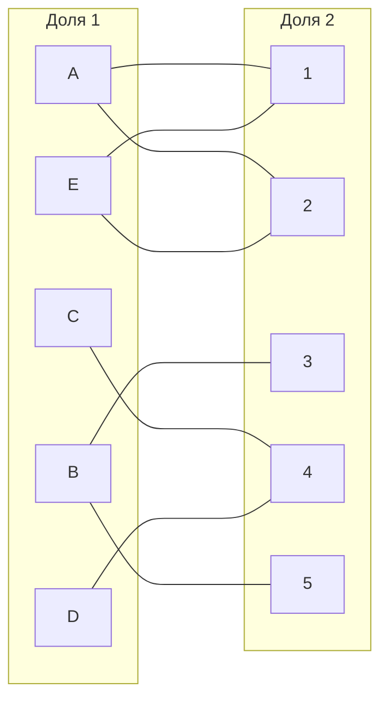
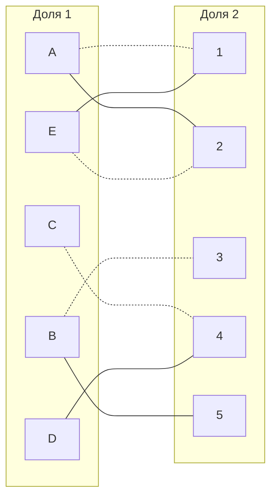
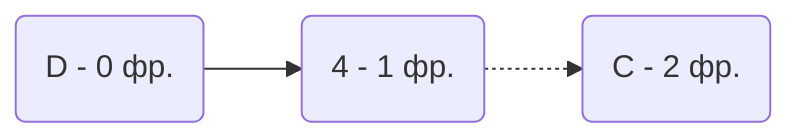
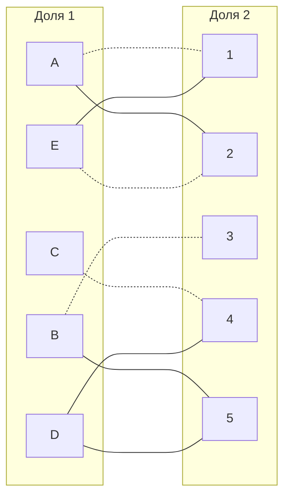
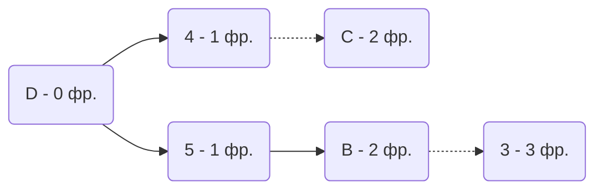
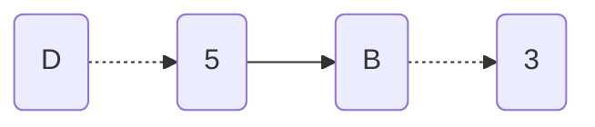

# Задача о назначениях. Венгерский алгоритм.

### Commit_IT:

|       | **1** | **2** | **3** | **4** | **5** |
|-------|:-----:|:-----:|:-----:|:-----:|:-----:|
| **A** |   7   |   6   |  12   |  12   |  10   |
| **B** |  10   |  10   |   6   |  15   |   6   |
| **C** |  15   |  11   |  11   |   7   |  12   |
| **D** |  14   |   9   |  12   |   6   |   7   |
| **E** |   9   |   8   |  14   |  14   |  11   |

## 1. Редуцирование матрицы затрат для упрощения поиска оптимального решения.
### 1.1 Редукция матрицы по строкам.
Вычтем из каждой строки минимальное значение, представленное в этой строке.

|       | **1** | **2** | **3** | **4** | **5** | Min |  
|-------|:-----:|:-----:|:-----:|:-----:|:-----:|:---:|
| **A** |   1   |   0   |   6   |   6   |   4   | -6  |
| **B** |   4   |   4   |   0   |   9   |   0   | -6  |
| **C** |   8   |   4   |   4   |   0   |   5   | -7  |
| **D** |   8   |   3   |   6   |   0   |   1   | -6  |
| **E** |   1   |   0   |   6   |   6   |   3   | -8  |

### 1.2 Редукция матрицы по столбцам.
Затем такую же операцию редукции проводим по столбцам, для чего в каждом столбце находим минимальный элемент.
_Прим. Совершать редуцирование матрицы стоит только с первым столбцом данной матрицы, так как минимальный элемент всех
остальных столбцов равен 0._

|       | **1** | **2** | **3** | **4** | **5** |  
|-------|:-----:|:-----:|:-----:|:-----:|:-----:|
| **A** |   0   |   0   |   6   |   6   |   4   |
| **B** |   3   |   4   |   0   |   9   |   0   |
| **C** |   7   |   4   |   4   |   0   |   5   |
| **D** |   7   |   3   |   6   |   0   |   1   |
| **E** |   0   |   0   |   6   |   6   |   3   |
| Min   |  -1   |   0   |   0   |   0   |   0   |

## 2. Построение двудольного графа.

Построим двудольный граф, у которого первой доле принадлежит (A, B, C, D, E), а второй доле - (1, 2, 3, 4, 5).
Нулевые элементы редуцированной матрицы - рёбра между соответствующими вершинами двух долей.
_Прим. Вершины первой доли графа представляют задания, в то время как вершины второй доли - исполнителей._

 

## 3. Поиск допустимого решения.
Выберем произвольное паросочетание A -- 1, B -- 3, C -- 4, E -- 2 и
попытаемся построить совершенное паросочетание с помощью чередующихся деревьев.

**Построим двудольный граф с выбранным произвольным сочетанием для наглядности.**

Попытаемся построить граф из оставшейся непокрытой вершины D:

В построенном графе нет чередования относительно текущего паросочетания, цепь закончилась в покрытой вершине,
то есть в указанном графе нет совершенного паросочетания.

### 3.1 Проведем повторную редукцию матрицы затрат.

Во множество X выпишем все покрытые построенной цепью вершины первой доли графа,
во множество Y все покрытые построенной цепью вершины из второй доли графа.

X = {D, C}

Y = {4}

Необходимо найти минимальный элемент из строк, включенных во множество X и столбцов, не включенных во множество Y.
В нашем случае это будут строки D, C и столбец 4. Минимальный элемент = 1, расположенный в (D, 5).

|       | **1** | **2** | **3** | **4** | **5** |  
|-------|:-----:|:-----:|:-----:|:-----:|:-----:|
| **A** |   0   |   0   |   6   |   6   |   4   |
| **B** |   3   |   4   |   0   |   9   |   0   |
| **C** |   7   |   4   |   4   |   0   |   5   |
| **D** |   7   |   3   |   6   |   0   |  (1)  |
| **E** |   0   |   0   |   6   |   6   |   3   |

Вычтем найденное значение элемента из строк множества X {D, C} и прибавим к столбцам множества Y {4}:

|       | **1** | **2** | **3** | **4** | **5** | -  |  
|-------|:-----:|:-----:|:-----:|:-----:|:-----:|----|
| **A** |   0   |   0   |   6   |   7   |   4   |    |
| **B** |   3   |   4   |   0   |  10   |   0   |    |
| **C** |   6   |   3   |   3   |   0   |   4   | -1 |
| **D** |   6   |   2   |   5   |   0   |   0   | -1 |
| **E** |   0   |   0   |   6   |   7   |   3   |    |
| +     |       |       |       |  +1   |       |    |

В ячейке D5 появилось новое нулевое значение, добавим соответствующее ребро в двудольный граф.

### 3.2 Повторный поиск допустимого решения.
Попытаемся построить цепь из непокрытой вершины D.

"Перекрасим" найденную новую цепь из вершины D и проверим полученное паросочетание.

Полученное расписание **является совершенным**. Выпишем полученные назначения и их стоимости **из исходной матрицы**:

A1 - 7;
B3 - 6;
C4 - 7;
D5 - 7;
E2 - 8.

=> Минимальная стоимость затрат: 35.

Ответ: 35, A1 - 7;
B3 - 6;
C4 - 7;
D5 - 7;
E2 - 8.

<!---
**Построим двудольный граф с выбранным произвольным сочетанием для наглядности.**

### 3.1 Проводим модификацию редуцированной матрицы.

Вычеркиваем строки и столбцы с максимально большим количеством нулевых элементов: строку A, строку B, строку E, столбец 4
 и получаем сокращенную матрицу:

|       | **1** | **2** | **3** | -4- | **5** |  
|-------|:-----:|:-----:|:-----:|:---:|:-----:|
| -A-   |   0   |   0   |   6   |  6  |   4   |
| -B-   |   3   |   4   |   0   |  9  |   0   |
| **C** | **7** | **4** | **4** |  0  | **5** |
| **D** | **7** | **3** | **6** |  0  | **1** |
| -E-   |   0   |   0   |   6   |  6  |   3   |

Находим минимальный элемент в сокращенной матрице (= 1) и вычитаем его из всех элементов сокращенной матрицы.
Затем складываем минимальный элемент с элементами, расположенными на пересечениях вычеркнутых строк и столбцов.
Получаем матрицу:

|       | **1** | **2** | **3** | **4** | **5** |  
|-------|:-----:|:-----:|:-----:|:-----:|:-----:|
| **A** |   0   |   0   |   6   |   7   |   4   |
| **B** |   3   |   4   |   0   |  10   |   0   |
| **C** |   6   |   3   |   3   |   0   |   4   |
| **D** |   6   |   2   |   5   |   0   |   0   |
| **E** |   0   |   0   |   6   |   7   |   3   |

_Прим. Проводить повторное редуцирование матрицы затрат нет смысла, так как в каждой строке уже есть как минимум один нуль._

### 3.3 Повторный поиск допустимого решения (совершенного паросочетания).

Основываясь на предыдущем паросочетании, пытаемся построить совершенное паросочетание со всеми покрытыми вершинами:
A--1, B--3, C--4, D--5, E--2/

Получаем следующую матрицу:

|       | **1** | **2** | **3** | **4** | **5** |  
|-------|:-----:|:-----:|:-----:|:-----:|:-----:|
| **A** |  (0)  |  -0-  |   6   |   7   |   4   |
| **B** |   3   |   4   |  (0)  |  10   |  -0-  |
| **C** |   6   |   3   |   3   |  (0)  |   4   |
| **D** |   6   |   2   |   5   |  -0-  |  (0)  |
| **E** |  -0-  |  (0)  |   6   |   7   |   3   |

**Построим двудольный граф с выбранным произвольным сочетанием:**

Полученное расписание является совершенным. Выпишем полученные назначения и их стоимости из исходной матрицы:

A1 - 7;
B3 - 6;
C4 - 7;
D5 - 7;
E2 - 8.

=> Минимальная стоимость затрат: 35.

_Прим. Альтернативный вариант совершенного сочетания (a, b): (1;2), (2;3), (3;4), (4;5), (5;1), где a - задача,
b - исполнитель. Его минимальная стоимость затрат также равна 35._

_Прим. Наша команда также попробовала применить волновой метод для решения данной задачи, но, по нашему субъективному
мнению, метод независимых нулей оказался удобнее, а также легче для реализиации в программном коде._
-->