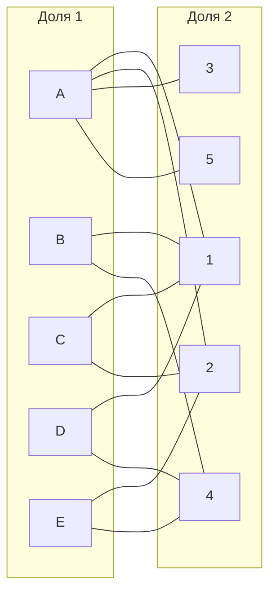
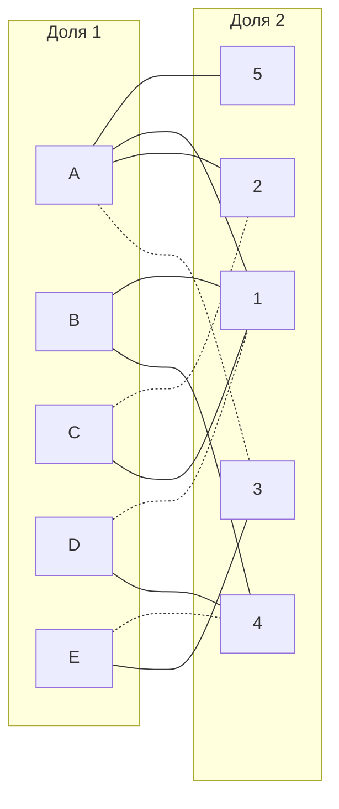
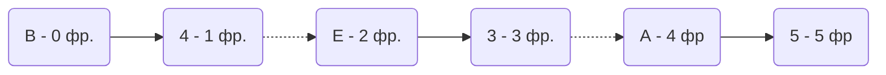
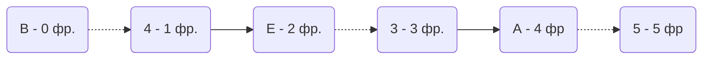
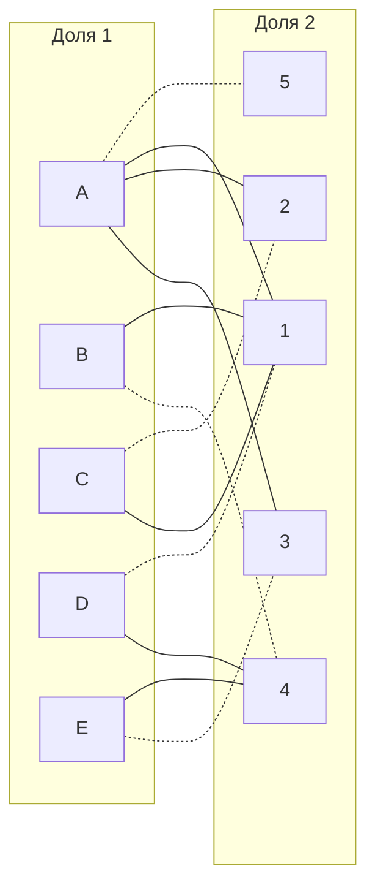

### Get Brains:

|       | **1** | **2** | **3** | **4** | **5** |
|-------|:-----:|:-----:|:-----:|:-----:|:-----:|
| **A** |  10   |  10   |  12   |  15   |  11   |
| **B** |   6   |   8   |  13   |   9   |  12   |
| **C** |   5   |   5   |   8   |  11   |   8   |
| **D** |   5   |   7   |  13   |   8   |  14   |
| **E** |   8   |   5   |  12   |   8   |  14   |

## Дана матрица затрат для задач A, B, C, D, E и исполнителей 1, 2, 3, 4, 5. Для того,чтобы решить задачу, нужно построить двудольны граф, для этого нам нужно получить нули в матрице.
1) Проведем редукцию матрицы затрат. Вычтем из каждой строки минимальное значение, представленное в этой строке.

|       | **1** | **2** | **3** | **4** | **5** | **Min** |
|-------|:-----:|:-----:|:-----:|:-----:|:-----:|:-------:|
| **A** |  10   |  10   |  12   |  15   |  11   |   -10   |
| **B** |   6   |   8   |  13   |   9   |  12   |   - 6   |
| **C** |   5   |   5   |   8   |  11   |   8   |   -5    |
| **D** |   5   |   7   |  13   |   8   |  14   |   -5    |
| **E** |   8   |   5   |  12   |   8   |  14   |   -5    | 

После чего вычтем из каждого столбца минимальное значение, представленное в этом столбце.

|       | **1** | **2** | **3** | **4** | **5** |  **Min** |
|-------|:-----:|:-----:|:-----:|:-----:|:-----:|:--------:|
| **A** |   0   |   0   |   2   |   5   |   1   |   -10   |
| **B** |   0   |   2   |   7   |   3   |   6   |   - 6   |
| **C** |   0   |   0   |   3   |   6   |   3   |   -5    |
| **D** |   0   |   2   |   8   |   3   |   9   |   -5    |
| **E** |   3   |   0   |   7   |   3   |   9   |   -5    | 
| **Min** |   0   |   0   |   2   |   3   |   1   |

Получим редуцированную матрицу, где нули обозначают наименее затратные варианты назначений.

|       | **1** | **2** | **3** | **4** | **5** |
|-------|:-----:|:-----:|:-----:|:-----:|:-----:|
| **A** |   0   |   0   |   0   |   2   |   0   |
| **B** |   0   |   2   |   5   |   0   |   5   |
| **C** |   0   |   0   |   1   |   3   |   2   |
| **D** |   0   |   2   |   6   |   0   |   8   |
| **E** |   3   |   0   |   5   |   0   |   8   |

2) Построим двудольный граф, вынесем на него те ребра, для которых в редуцированной матрице указаны нули.

Выберем произвольное паросочетание A --- 3, C --- 2, D --- 1, E --- 4 и попытаемся построить совершенное паросочетание с помощью чередующихся деревьев.

Попытаемся построить дерево из оставшейся непокрытой вершины B.

Нам повезло и наше построенное дерево содержит чередующуюся, относительно текущего паросочетания, цепь B4 - 4E - E3 - 3A - A5, цепь начинается и заканчивается в непокрытых вершинах, все ребра в цепи чередуются по вхождению в текущее паросочетание.

"Перекрасим" найденную цепь и проверим полученное паросочетание.

Полученное расписание является совершенным. Выпишем полученные назначения и их стоимости из исходной матрицы:
- A5 - 11
- B4 - 9
- C2 - 5
- D1 - 5
- E3 - 12

Общая стоимость затрат = 11 + 9 + 5 + 5 + 12 = 42.

## Ответ
Минимальная стоимость затрат 42.