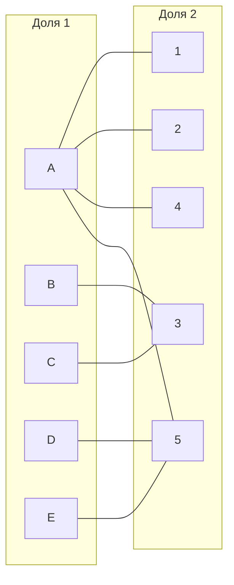

### Mongolian tomatoes:

|       | **1** | **2** | **3** | **4** | **5** |
|-------|:-----:|:-----:|:-----:|:-----:|:-----:|
| **A** |   7   |   7   |   9   |   7   |   7   |
| **B** |  13   |  12   |   9   |  11   |  13   |
| **C** |  15   |  10   |   5   |  14   |   9   |
| **D** |  12   |  15   |  11   |   9   |   6   |
| **E** |  15   |   8   |  11   |  11   |   6   |

## Дана матрица затрат для задач A, B, C, D, E и исполнителей 1, 2, 3, 4, 5. Для того,чтобы решить задачу, нужно построить двудольны граф, для этого нам нужно получить нули в матрице.
1) Проведем редукцию матрицы затрат. Вычтем из каждой строки минимальное значение, представленное в этой строке.

|       | **1** | **2** | **3** | **4** | **5** | **Min** |
|-------|:-----:|:-----:|:-----:|:-----:|:-----:|:-------:|
| **A** |   7   |   7   |   9   |   7   |   7   | -7 |
| **B** |  13   |  12   |   9   |  11   |  13   | - 9|
| **C** |  15   |  10   |   5   |  14   |   9   |-5|
| **D** |  12   |  15   |  11   |   9   |   6   |-6|
| **E** |  15   |   8   |  11   |  11   |   6   |  -6| 

После чего вычтем из каждого столбца минимальное значение, представленное в этом столбце. (В данном случае везде нули)
|       | **1** | **2** | **3** | **4** | **5** |
|-------|:-----:|:-----:|:-----:|:-----:|:-----:|
| **A** |   0   |   0   |   2   |   0   |   0   |
| **B** |  4   |  3   |   0   |  2   |  4   |
| **C** |  10   |  5   |   0   |  9   |   4   |
| **D** |  6   |  9   |  5   |   3   |   0   |
| **E** |  9   |   2   |  5   |  5   |   0   |
| **Min** |   0   |   0   |   0   |   0   |0|

2) Построим двудольный граф, вынесем на него те ребра, для которых в редуцированной матрице указаны нули.

