### Mongolian tomatoes:

|       | **1** | **2** | **3** | **4** | **5** |
|-------|:-----:|:-----:|:-----:|:-----:|:-----:|
| **A** |   7   |   7   |   9   |   7   |   7   |
| **B** |  13   |  12   |   9   |  11   |  13   |
| **C** |  15   |  10   |   5   |  14   |   9   |
| **D** |  12   |  15   |  11   |   9   |   6   |
| **E** |  15   |   8   |  11   |  11   |   6   |

## Дана матрица затрат для задач A, B, C, D, E и исполнителей 1, 2, 3, 4, 5. Для того,чтобы решить задачу, нужно построить двудольны граф, для этого нам нужно получить нули в матрице.
1) Проведем редукцию матрицы затрат. Вычтем из каждой строки минимальное значение, представленное в этой строке.

|       | **1** | **2** | **3** | **4** | **5** | **Min** |
|-------|:-----:|:-----:|:-----:|:-----:|:-----:|:-------:|
| **A** |   7   |   7   |   9   |   7   |   7   | -7 |
| **B** |  13   |  12   |   9   |  11   |  13   | - 9|
| **C** |  15   |  10   |   5   |  14   |   9   |-5|
| **D** |  12   |  15   |  11   |   9   |   6   |-6|
| **E** |  15   |   8   |  11   |  11   |   6   |  -6| 

После чего вычтем из каждого столбца минимальное значение, представленное в этом столбце. (В данном случае везде нули)
|       | **1** | **2** | **3** | **4** | **5** |
|-------|:-----:|:-----:|:-----:|:-----:|:-----:|
| **A** |   0   |   0   |   2   |   0   |   0   |
| **B** |  4   |  3   |   0   |  2   |      4   |
| **C** |  10   |  5   |   0   |  9   |   4     |
| **D** |  6   |  9   |  5   |   3   |   0      |
| **E** |  9   |   2   |  5   |  5   |   0      |
| **Min** |   0   |   0   |   0   |   0   |0|

2) Построим двудольный граф, вынесем на него те ребра, для которых в редуцированной матрице указаны нули.

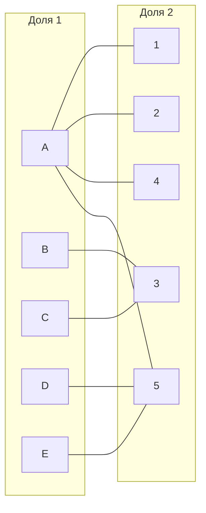
Выберем произвольное паросочетание A --- 1, B --- 3, D --- 5 и попытаемся построить совершенное паросочетание с помощью чередующихся деревьев.

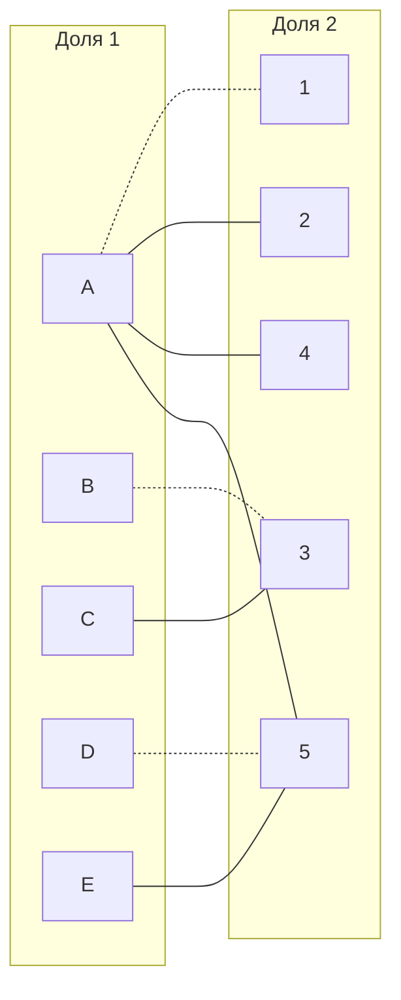

Попытаемся построить дерево из оставшейся непокрытой вершины C.

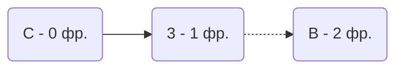
В построенном дереве нет цепей, чередующееся относительно текущего паросочетания, ветка закончилась в покрытых вершинах, то есть в указанном графе нет совершенного паросочетания.

3) Проведем повторную редукцию матрицы затрат.

Во множество X выпишем все **покрытые построенным деревом** вершины первой доли графа, во множество Y все **покрытые построенным деревом** вершины из второй доли графа.

X = \{C, B\}

Y = \{3\}

не Y = \{1,2,4,5\}

Необходимо найти минимальный элемент из строк, включенных во множество X и столбцов, не включенных во множество Y. В нашем случае это будут строки B, C и столбцы 1,2,4,5. Минимальный элемент 2, расположен в строке B и столбце 4. 

Вычтем найденное значение из строк множества X и прибавим к столбцам множества Y:

|       | **1** | **2** | **3** | **4** | **5** | |
|-------|:-----:|:-----:|:-----:|:-----:|:-----:| :-----:|
| **A** |   0   |   0   |   2   |   0   |   0   |  |
| **B** |  **4**   |  **3**   |   0   |  **2**   |     **4**   | -2|
| **C** |  **10**   |  **5**   |   0   |  **9**   |  **4**     | -2|
| **D** |  6   |  9   |  5   |   3   |   0      | |
| **E** |  9   |   2   |  5   |  5   |   0      | |
|       |      |       |+2|

## Редуцированная матрица:

|       | **1** | **2** | **3** | **4** | **5** |
|-------|:-----:|:-----:|:-----:|:-----:|:-----:|
| **A** |   0   |   0   |   4   |   0   |   0   |
| **B** |  2   |  1   |   0   |  0   |      2   |
| **C** |  8   |  3   |   0   |  7   |   2     |
| **D** |  6   |  9   |  7   |   3   |   0      |
| **E** |  9   |   2   |  7   |  5   |   0      |

В ячейке B4 появилось новое нулевое значение, добавим соответствующее ребро в двудольный граф.

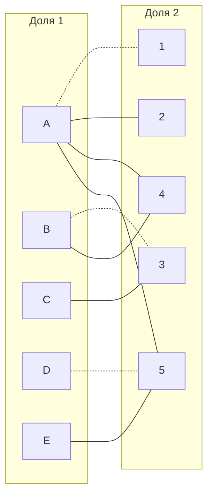
4) Попытаемся построить совершенное паросочетание с помощью чередующихся деревьев.

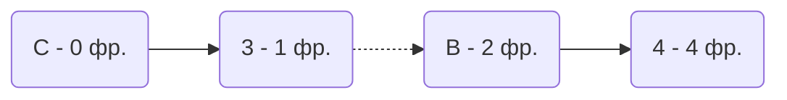

Построенное дерево содержит чередующуюся, относительно текущего паросочетания, цепь С3 - B4, цепь начинается и заканчивается в непокрытых вершинах, все ребра в цепи чередуются по вхождению в текущее паросочетание.

"Перекрасим" найденную цепь и проверим полученное паросочетание.

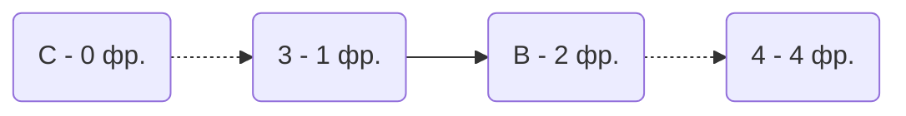
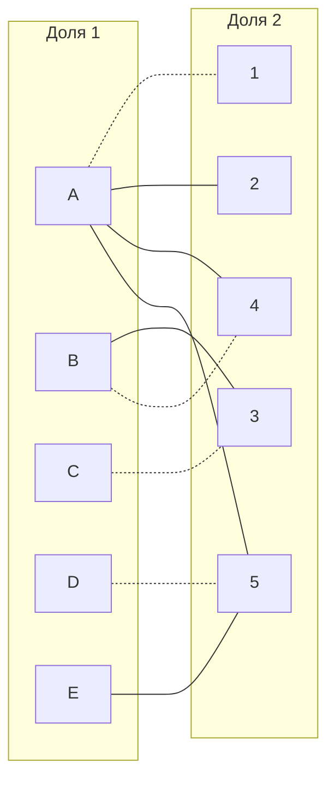

Попытаемся построить дерево из оставшейся непокрытой вершины E.

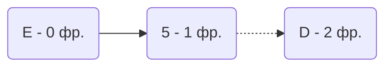
В построенном дереве нет цепей, чередующееся относительно текущего паросочетания, ветка закончилась в покрытых вершинах, то есть в указанном графе нет совершенного паросочетания.

5) Проведем повторную редукцию матрицы затрат.

Во множество X выпишем все **покрытые построенным деревом** вершины первой доли графа, во множество Y все **покрытые построенным деревом** вершины из второй доли графа.

X = \{E, D\}

Y = \{5\}

не Y = \{1,2,3,4\}

Необходимо найти минимальный элемент из строк, включенных во множество X и столбцов, не включенных во множество Y. В нашем случае это будут строки E, D и столбцы 1,2,3,4. Минимальный элемент 2, расположен в строке E и столбце 2. 

Вычтем найденное значение из строк множества X и прибавим к столбцам множества Y:

|       | **1** | **2** | **3** | **4** | **5** ||
|-------|:-----:|:-----:|:-----:|:-----:|:-----:| :-----:|
| **A** |   0   |   0   |   4   |   0   |   0   ||
| **B** |  2   |  1   |   0   |  0   |      2   ||
| **C** |  8   |  3   |   0   |  7   |   2     ||
| **D** |  **6**   |  **9**   |  **7**   |   **3**  |   **0**    | -2|
| **E** |  **9**   |  **2**   |  **7**   |  **5**   |   **0**    | -2|
|       |      |       |      |                      |+2||

## Редуцированная матрица:

|       | **1** | **2** | **3** | **4** | **5** |
|-------|:-----:|:-----:|:-----:|:-----:|:-----:|
| **A** |   0   |   0   |   4   |   0   |   2   |
| **B** |  2   |  1   |   0   |  0   |      4   |
| **C** |  8   |  3   |   0   |  7   |   4     |
| **D** |  4   |  7   |  5   |   1   |   0      |
| **E** |  7   |   0   |  5   |  3   |   0      |

В ячейке E2 появилось новое нулевое значение, добавим соответствующее ребро в двудольный граф.

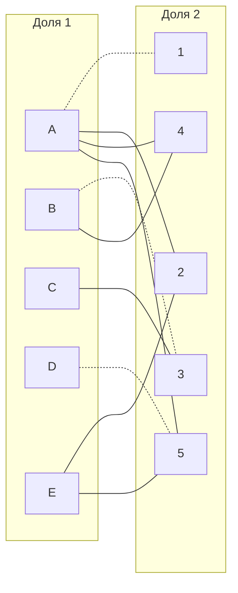
6) Попытаемся построить совершенное паросочетание с помощью чередующихся деревьев.

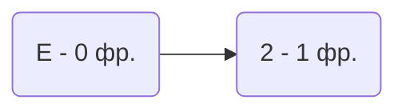

Построенное дерево содержит чередующуюся, относительно текущего паросочетания, цепь E2, цепь начинается и заканчивается в непокрытых вершинах, все ребра в цепи чередуются по вхождению в текущее паросочетание.

"Перекрасим" найденную цепь и проверим полученное паросочетание.

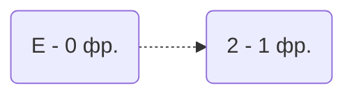
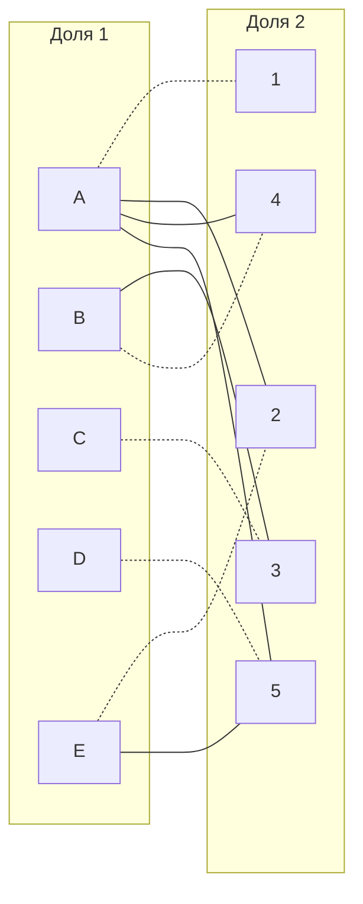
Тогда выделим паросочетания: A--1, B--4, C--3, D--5, E--2

И посчитаем минимальную сумму(взяв значения из исходной матрицы): 7 + 11 + 5 + 6 + 8 = 37

Ответ: {A1, B4, C3, D5, E2}, Sum = 37.
