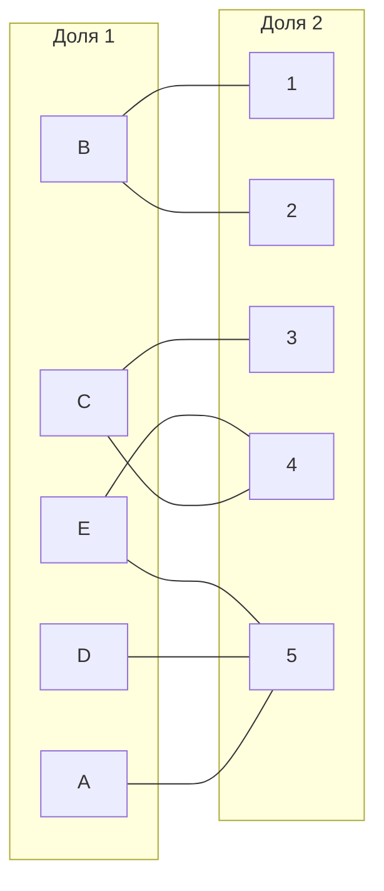
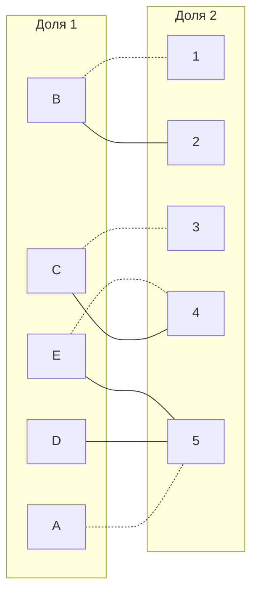
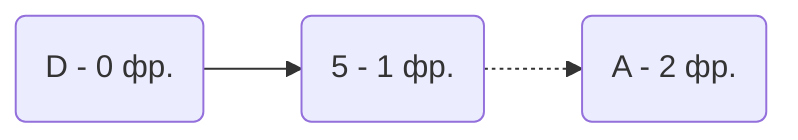
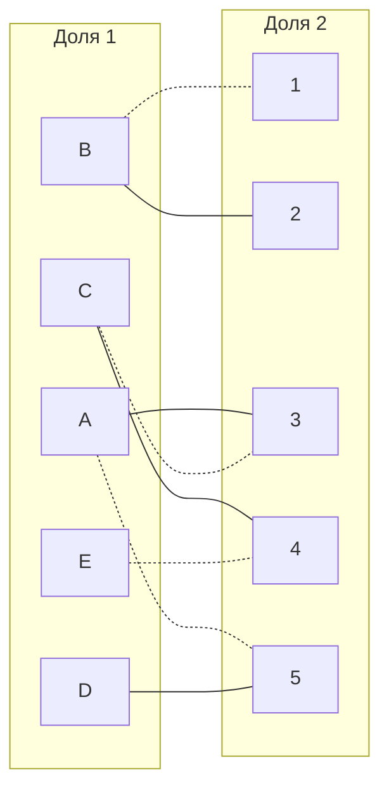
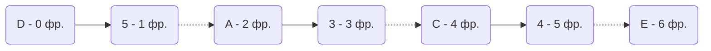
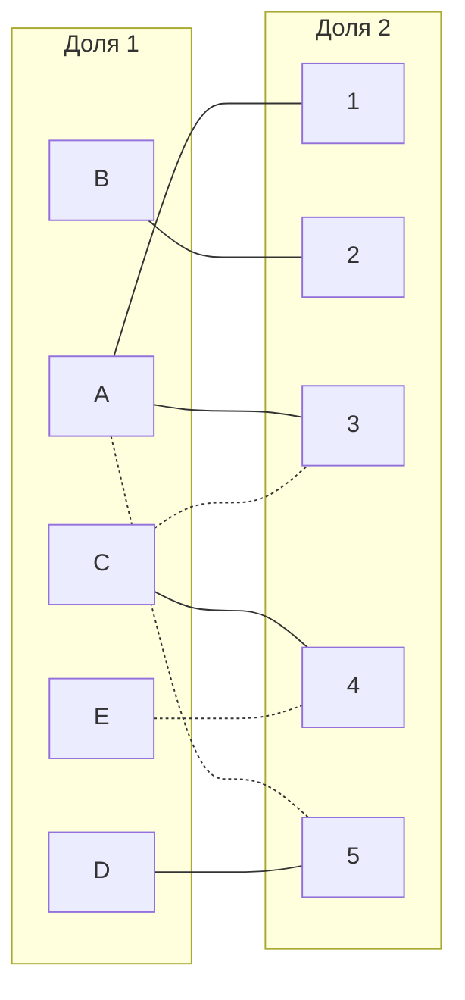
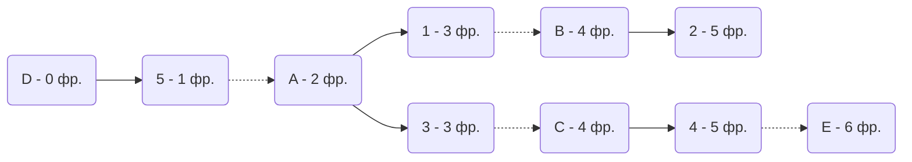
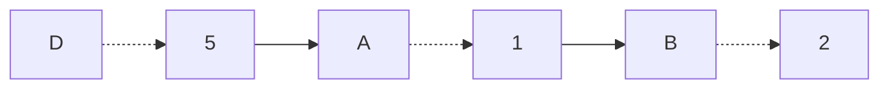
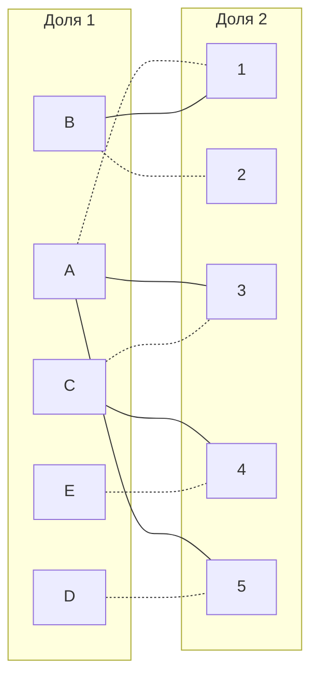

## Решение Mysterious

Дана матрица затрат для задач A, B, C, D, E и исполнителей 1, 2, 3, 4, 5:

|       | **1** | **2** | **3** | **4** | **5** |
|-------|:-----:|:-----:|:-----:|:-----:|:-----:|
| **A** |  10   |  12   |   9   |  10   |   5   |
| **B** |   7   |   6   |  15   |   7   |  11   |
| **C** |  15   |   8   |   7   |   6   |  12   |
| **D** |  15   |  14   |  12   |  15   |   7   |
| **E** |  11   |   9   |  14   |   6   |   6   |

1. Проведем редукцию матрицы затрат. Вычтем из каждой строки минимальное значение, представленное в этой строке.

|       | **1** | **2** | **3** | **4** | **5** | **Min** |
|-------|:-----:|:-----:|:-----:|:-----:|:-----:|:-------:|
| **A** |   5   |   7   |   4   |   5   |   0   |   -5    |
| **B** |   1   |   0   |   9   |   1   |   5   |   -6    |
| **C** |   9   |   2   |   1   |   0   |   6   |   -6    |
| **D** |   8   |   7   |   5   |   8   |   0   |   -7    |
| **E** |   5   |   3   |   8   |   0   |   0   |   -6    |

После чего вычтем из каждого столбца минимальное значение, представленное в этом столбце.

|         | **1** | **2** | **3** | **4** | **5** | **Min** |
|---------|:-----:|:-----:|:-----:|:-----:|:-----:|:-------:|
| **A**   |   4   |   7   |   3   |   5   |   0   |   -5    |
| **B**   |   0   |   0   |   8   |   1   |   5   |   -6    |
| **C**   |   8   |   2   |   0   |   0   |   6   |   -6    |
| **D**   |   7   |   7   |   4   |   8   |   0   |   -7    |
| **E**   |   4   |   3   |   7   |   0   |   0   |   -6    |
| **Min** |   1   |   0   |   1   |   0   |   0   |

Получим редуцированную матрицу, где нули обозначают наименее затратные варианты назначений.

|         | **1** | **2** | **3** | **4** | **5** | 
|---------|:-----:|:-----:|:-----:|:-----:|:-----:|
| **A**   |   4   |   7   |   3   |   5   |   0   |
| **B**   |   0   |   0   |   8   |   1   |   5   |
| **C**   |   8   |   2   |   0   |   0   |   6   |
| **D**   |   7   |   7   |   4   |   8   |   0   |
| **E**   |   4   |   3   |   7   |   0   |   0   |

2. Построим двудольный граф, вынесем на него те ребра, для которых в редуцированной матрице указаны нули.

Выберем произвольное паросочетание A --- 5, B --- 1, C --- 3, E --- 4 и попытаемся построить совершенное паросочетание с помощью чередующихся деревьев.

Попытаемся построить дерево из оставшейся непокрытой вершины D.

В построенном дереве нет цепи, чередующейся относительно текущего паросочетания, то есть в указанном графе нет совершенного паросочетания.

3. Проведем диагональную редукцию матрицы затрат.

Во множество X выпишем все **покрытые построенным деревом** вершины первой доли графа, во множество Y все **покрытые построенным деревом** вершины из второй доли графа.

$$ 
X = \{A, D\} Y = \{ 5 \} 
$$

Необходимо найти минимальный элемент из строк, включенных во множество X и столбцов, не включенных во множество Y. В нашем случае это будут строки A, D и столбцы 1, 2, 3, 4. Минимальный элемент 3, расположен в строке A и столбце 3. 

Вычтем найденное значение из строк множества X и прибавим к столбцам множества Y:

|         | **1** | **2** | **3** | **4** | **5** |       |
|---------|:-----:|:-----:|:-----:|:-----:|:-----:|:-----:|
| **A**   |   4   |   7   |   3   |   5   |   0   |  -3   |
| **B**   |   0   |   0   |   8   |   1   |   8   |       |
| **C**   |   8   |   2   |   0   |   0   |   6   |       |
| **D**   |   7   |   7   |   4   |   8   |   0   |  -3   |
| **E**   |   4   |   3   |   7   |   0   |   0   |       |
|         |       |       |       |       |  +3   |

Получаем:

|         | **1** | **2** | **3** | **4** | **5** |
|---------|:-----:|:-----:|:-----:|:-----:|:-----:|
| **A**   |   1   |   4   |   0   |   2   |   0   |
| **B**   |   0   |   0   |   8   |   1   |   8   |
| **C**   |   8   |   2   |   0   |   0   |   9   |
| **D**   |   4   |   4   |   1   |   5   |   0   |
| **E**   |   4   |   3   |   7   |   0   |   3   |

Построим двудольный граф с учетом новых "0".

Попытаемся построить совершенное паросочетание с помощью чередующихся деревьев.

Чередующаяся цепь не получена, так как волновой метод закончился на закрашенной вершине, то есть последнее ребро является закрашенным.

4. Еще раз проведем диагональную редукцию матрицы затрат.

Во множество X выпишем все **покрытые построенным деревом** вершины первой доли графа, во множество Y все **покрытые построенным деревом** вершины из второй доли графа.

$$
X = \{A, C, D, E\}Y = \{ 3, 4, 5 \}
$$

Необходимо найти минимальный элемент из строк, включенных во множество X и столбцов, не включенных во множество Y. В нашем случае это будут строки A, C, D, E и столбцы 1, 2. Минимальный элемент 1, расположен в строке A и столбце 1. 

|         | **1** | **2** | **3** | **4** | **5** |       |
|---------|:-----:|:-----:|:-----:|:-----:|:-----:|:-----:|
| **A**   |   1   |   4   |   0   |   2   |   0   |  -1   |
| **B**   |   0   |   0   |   8   |   1   |   8   |       |
| **C**   |   8   |   2   |   0   |   0   |   9   |  -1   |
| **D**   |   4   |   4   |   1   |   5   |   0   |  -1   |
| **E**   |   4   |   3   |   7   |   0   |   3   |  -1   |
|         |       |       |  +1   |   +1  |  +1   |

Получаем:

|         | **1** | **2** | **3** | **4** | **5** |
|---------|:-----:|:-----:|:-----:|:-----:|:-----:|
| **A**   |   0   |   3   |   0   |   2   |   0   |
| **B**   |   0   |   0   |   9   |   2   |   9   |
| **C**   |   7   |   1   |   0   |   0   |   9   |
| **D**   |   3   |   3   |   1   |   5   |   0   |
| **E**   |   3   |   2   |   7   |   0   |   3   |

Построим новый двудольный граф с учетом новых "0".

Заново строим совершенное паросочетание с помощью чередующихся деревьев.

Построенное дерево содержит чередующуюся, относительно текущего паросочетания, цепь D5 - 5A - A1 - 1B - B2, цепь начинается и заканчивается в непокрытых вершинах, все ребра в цепи чередуются по вхождению в текущее паросочетание.

"Перекрасим" найденную цепь и проверим полученное паросочетание.

Полученное расписание является совершенным. Выпишем полученные назначения и их стоимости из исходной матрицы:
- A1 - 10
- B2 - 6
- C3 - 7
- D5 - 7
- E4 - 6

Общая стоимость затрат = 10 + 6 + 7 + 7 + 6 = 36.

## Ответ
Минимальная стоимость затрат 36, при следующих назначениях:
- задача A, исполнитель 1,
- задача B, исполнитель 2,
- задача C, исполнитель 3,
- задача D, исполнитель 5,
- задача E, исполнитель 4,