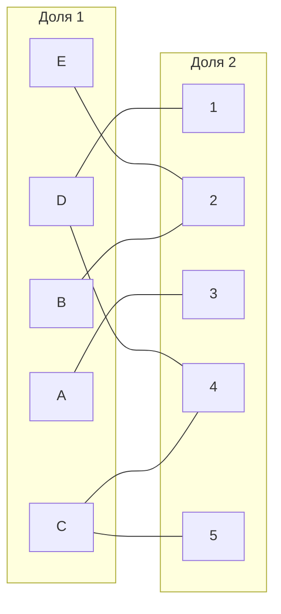
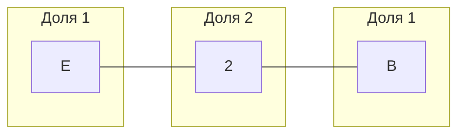
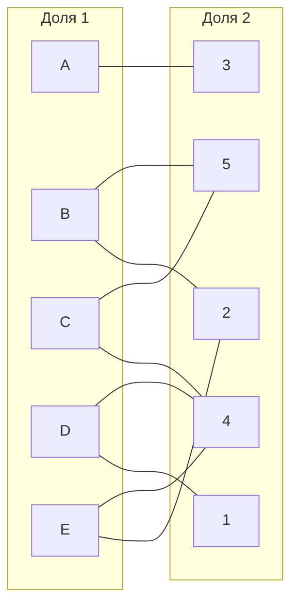
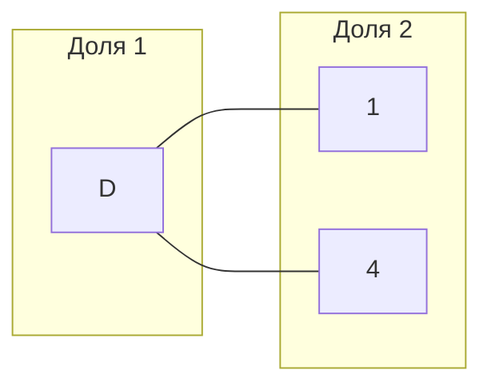

### Над работой работали работники рабочего класса:
##### Агеев Некета В
##### Бинтиков Алексий В
##### Ерофиев Ярость

|       | **1** | **2** | **3** | **4** | **5** |
|-------|:-----:|:-----:|:-----:|:-----:|:-----:|
| **A** |  11   |  13   |   5   |  13   |  11   |
| **B** |  12   |   5   |  13   |  15   |   6   |
| **C** |   6   |  10   |  11   |   6   |   5   |
| **D** |   6   |   7   |  10   |   7   |   7   |
| **E** |  13   |  10   |  14   |  12   |  12   |

Проведем редукцию матрицы затрат.

|       | **1** | **2** | **3** | **4** | **5** |
|-------|:-----:|:-----:|:-----:|:-----:|:-----:|
| **A** |   6   |   8   |   0   |   8   |   6   |
| **B** |   7   |   0   |   8   |  10   |   1   |
| **C** |   1   |   5   |   6   |   1   |   0   |
| **D** |   0   |   1   |   4   |   1   |   1   |
| **E** |   3   |   0   |   4   |   2   |   2   |

|       | **1** | **2** | **3** | **4** | **5** |
|-------|:-----:|:-----:|:-----:|:-----:|:-----:|
| **A** |   6   |   8   |   0   |   7   |   6   |
| **B** |   7   |   0   |   8   |   9   |   1   |
| **C** |   1   |   5   |   6   |   0   |   0   |
| **D** |   0   |   1   |   4   |   0   |   1   |
| **E** |   3   |   0   |   4   |   1   |   2   |

Выбираем произвольное паросочетание A-2 B-3

|       | **2** | **1** | **3** | **4** | **5** |
|-------|:-----:|:-----:|:-----:|:-----:|:-----:|
| **E** |   0   |   2   |   3   |   0   |   1   |
| **B** |   0   |   6   |   7   |   8   |   0   |
| **A** |   9   |   6   |   0   |   7   |   6   |
| **C** |   6   |   1   |   6   |   0   |   0   |
| **D** |   2   |   0   |   4   |   0   |   1   |

Паросочетание A-3 B-5 C-4

E-2 - это цепь, перекрашиваем звенья в противоположный цвет и добавляем в паросочетание

Паросочетание A-3 B-5 C-4 E-2

D-1 - это цепь, добавляем в паросочетание

Получаем цепь A-3 B-5 C-4 E-2 D-1, считаем итоговую сумму по этим парам из изначальной матрицы

5 + 6 + 6 + 10 + 6 = 33

Ответ: {A3, B5, C4, E2, D1}, Sum = 33.