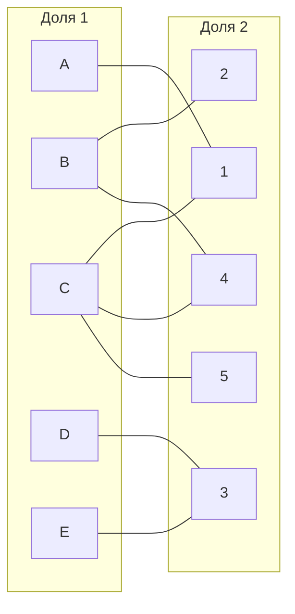
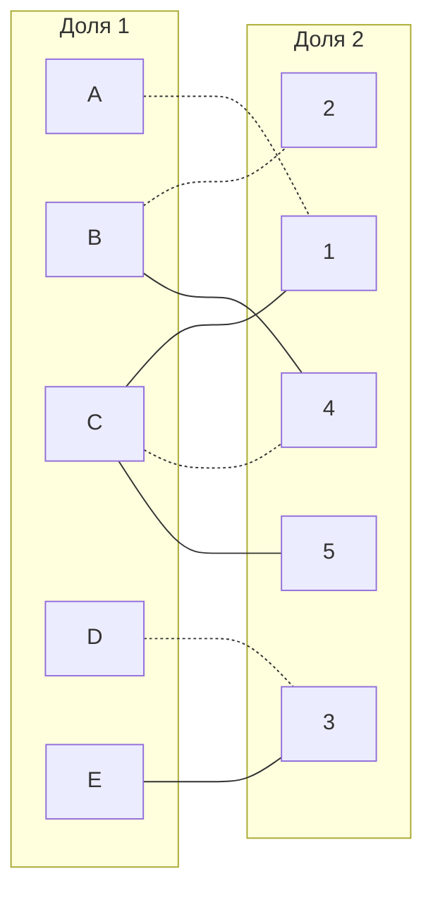
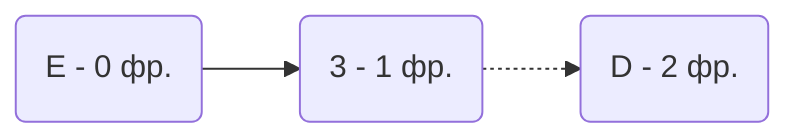
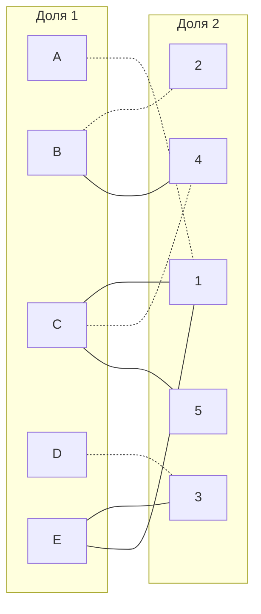
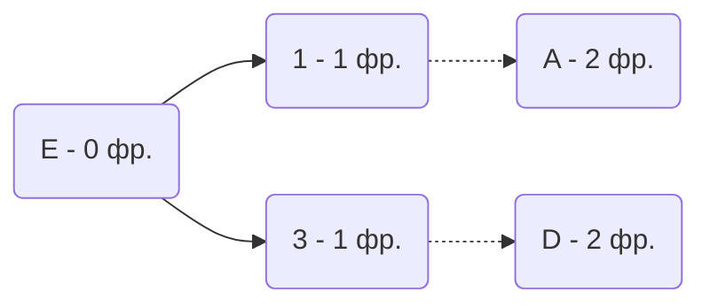
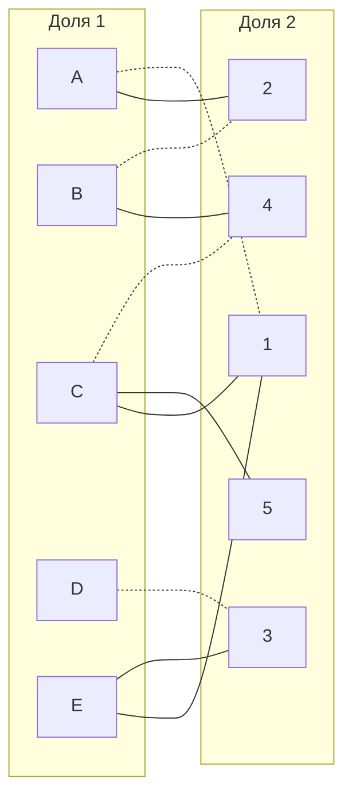
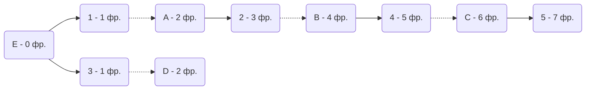
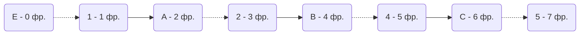
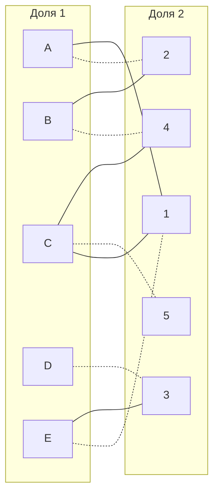

# Задание №13
# Задача о назначениях. Венгерский алгоритм.

## Задание
Для каждой команды представлены условия задачи о назначении, в соответствии с которыми необходимо: 
1. Решить задачу с использованием Венгерского алгоритма.
2. Оформить решение задачи по шагам с подробными комментариями, таблицами и диаграммами.
3. В ответе указать минимальную сумму затрат на выполнение всех заданий.
4. В ответе вывести найденные назначения

## Постановка задачи
1. Дан полный двудольный граф, в котором каждое ребро имеет определенную стоимость. Вершины первой доли представляют задачи, вершины второй доли исполнителей. Стоимость ребра определяет затраты при выполнении соответствующей задачи соответствующим исполнителем. 
2. Затраты неотрицательны и представлены в виде матрицы затрат, в которой на пересечении i-й строки и j-го столбца указаны затраты j-го исполнителя на выполнение i-го задания.
3. Необходимо назначить исполнителей на задачи таким образом, чтобы общая стоимость затрат была минимальной.
4. Задача сводится к нахождению совершенного паросочетания с минимальной суммарной стоимостью в двудольном графе.
### ALTYN Team:

|       | **1** | **2** | **3** | **4** | **5** |
|-------|:-----:|:-----:|:-----:|:-----:|:-----:|
| **A** |   9   |  10   |  10   |  14   |  13   |
| **B** |   9   |   5   |  14   |   6   |   8   |
| **C** |   8   |  13   |  13   |   9   |   8   |
| **D** |  10   |  11   |   5   |  13   |  12   |
| **E** |   9   |  12   |   6   |  15   |  15   |

## Решение

Дана матрица затрат для задач A, B, C, D, E и исполнителей 1, 2, 3, 4, 5:

|       | **1** | **2** | **3** | **4** | **5** |
|-------|:-----:|:-----:|:-----:|:-----:|:-----:|
| **A** |   9   |  10   |  10   |  14   |  13   |
| **B** |   9   |   5   |  14   |   6   |   8   |
| **C** |   8   |  13   |  13   |   9   |   8   |
| **D** |  10   |  11   |   5   |  13   |  12   |
| **E** |   9   |  12   |   6   |  15   |  15   |

1. Проведем редукцию матрицы затрат. Вычтем из каждой строки минимальное значение, представленное в этой строке.

|       | **1** | **2** | **3** | **4** | **5** | **Min** |
|:-------:|-------|:-----:|:-----:|:-----:|:-----:|:-----:|
| **A** |   0   |  1   |  1   |  5   |  4   |   -9    |
| **B** |   4   |   0   |  9   |   1   |   3   |   -5    |
| **C** |   0   |  5   |  5   |   1   |   0   |   -8    |
| **D** |  5   |  6   |   0   |  8   |  7   |	-5	  |
| **E** |   3   |  6   |   0   |  9   |  9   |   -6    |

После чего вычтем из каждого столбца минимальное значение, представленное в этом столбце.

|       | **1** | **2** | **3** | **4** | **5** | **Min** |
|:-------:|-------|:-----:|:-----:|:-----:|:-----:|:-----:|
| **A** |   0   |  1   |  1   |  5   |  4   |   -9    |
| **B** |   4   |   0   |  9   |   0   |   3   |   -5    |
| **C** |   0   |  5   |  5   |   0   |   0   |   -8    |
| **D** |  5   |  6   |   0   |  8   |  7   |	-5	  |
| **E** |   3   |  6   |   0   |  9   |  9   |   -6    |
| **Min** |   0   |   0  |   0   |   1   |   0      | |

Получим редуцированную матрицу, где нули обозначают наименее затратные варианты назначений.

|       | **1** | **2** | **3** | **4** | **5** |
|:-------:|-------|:-----:|:-----:|:-----:|:-----:|
| **A** |   0   |  1   |  1   |  5   |  4   |
| **B** |   4   |   0   |  9   |   0   |   3   | 
| **C** |   0   |  5   |  5   |   0   |   0   | 
| **D** |  5   |  6   |   0   |  8   |  7   |
| **E** |   3   |  6   |   0   |  9   |  9   | 

2. Построим двудольный граф, вынесем на него те ребра, для которых в редуцированной матрице указаны нули.

Выберем произвольное паросочетание A --- 1, B --- 2, C --- 4, D --- 3 и попытаемся построить совершенное паросочетание с помощью чередующихся деревьев.

Попытаемся построить дерево из оставшейся непокрытой вершины E.

В построенном дереве нет цепей, чередующееся относительно текущего паросочетания, ветка закончилась в покрытой вершине, то есть в указанном графе нет совершенного паросочетания.

3. Проведем диагональную редукцию матрицы затрат.

Во множество X выпишем все **покрытые построенным деревом** вершины первой доли графа, во множество Y все **покрытые построенным деревом** вершины из второй доли графа.

X = \{E, D\}

Y = \{3\}

Необходимо найти минимальный элемент из строк, включенных во множество X и столбцов, не включенных во множество Y. В нашем случае это будут строки E, D и столбец 3. Минимальный элемент 3, расположен в строке E и столбце 1. 

Вычтем найденное значение из строк множества X и прибавим к столбцам множества Y:

|       | **3** | **1** | **2** | **4** | **5** |
|:-------:|-------|:-----:|:-----:|:-----:|:-----:|
| **D** |   0   |  **5** |  **6** |  **7** |  **7**   |
| **E** |   0   |   **3**|  **6** |   **8** |   **9**  | 
| **A** |   **1**   |  0   |  1   |   4   |   4   | 
| **B** |  **9**   |  4   |   0   |  0   |  3   |
| **C** |   **5**   |  0   |   5   |  0   |  0   | 

Получим: 
|       | **3** | **1** | **2** | **4** | **5** |
|:-------:|-------|:-----:|:-----:|:-----:|:-----:|
| **D** |   0   |  2 | 3 |  4 |  4   |
| **E** |   0   |   0|  3 |   5 |   6  | 
| **A** |   4   |  0   |  1   |   4   |   4   | 
| **B** |  12   |  4   |   0   |  0   |  3   |
| **C** |   8  |  0   |   5   |  0   |  0   | 

В ячейке E1 появилось новое нулевое значение, добавим соответствующее ребро в двудольный граф.

4. Попытаемся построить совершенное паросочетание с помощью чередующихся деревьев.

Так как чередующихся цепей нет, применяем диагональную редукцию:
X = \{A, E, D\}

Y = \{1, 3\}

Необходимо найти минимальный элемент из строк, включенных во множество X и столбцов, не включенных во множество Y. В нашем случае это будут строки A, E, D и столбцы 1, 3. Минимальный элемент 1, расположен в строке A и столбце 2. 
Вычтем найденное значение из строк множества X и прибавим к столбцам множества Y:

|       | **3** | **1** | **2** | **4** | **5** |
|:-------:|-------|:-----:|:-----:|:-----:|:-----:|
| **D** |   0   |  2 | **3** |  **4** |  **4**   |
| **E** |   0   |   0|  **3** |   **5** |   **6**  | 
| **A** |   4   |  0   |  **1**   |   **4**   |   **4**   | 
| **B** |  **12**   |  **4**   |   0   |  0   |  3   |
| **C** |   **8**  |  **0**   |   5   |  0   |  0   | 

Получим:

|       | **3** | **1** | **2** | **4** | **5** |
|:-------:|-------|:-----:|:-----:|:-----:|:-----:|
| **D** |   0   |  2 |  2    |  3 |  3   |
| **E** |   0   |  0 |  2    |   4 |   5  | 
| **A** |   4   |  0 |  0    |   3 |   3  | 
| **B** |  13   |  5 |   0   |  0   |  3   |
| **C** |   9   |  1 |   5   |  0   |  0   | 

В ячейке A2 появилось новое нулевое значение, добавим соответствующее ребро в двудольный граф.

Попытаемся построить совершенное паросочетание с помощью чередующихся деревьев.

Мы обнаружили чередующуюся цепь, перекрашиваем рёбра:

Отобразим данные изменения в двудольном графе:

Полученное расписание является совершенным. Выпишем полученные назначения и их стоимости из исходной матрицы:
- D3 - 5
- E1 - 9
- A2 - 10
- B4 - 6
- C5 - 8
Общая стоимость затрат = 5 + 9 + 10 + 6 + 8 = 38.

## Ответ
Минимальная стоимость затрат 38, при следующих назначениях:
- задача E, исполнитель 1,
- задача A, исполнитель 2,
- задача D, исполнитель 3,
- задача B, исполнитель 4,
- задача C, исполнитель 5.