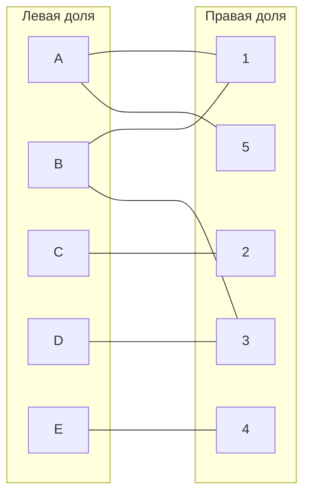
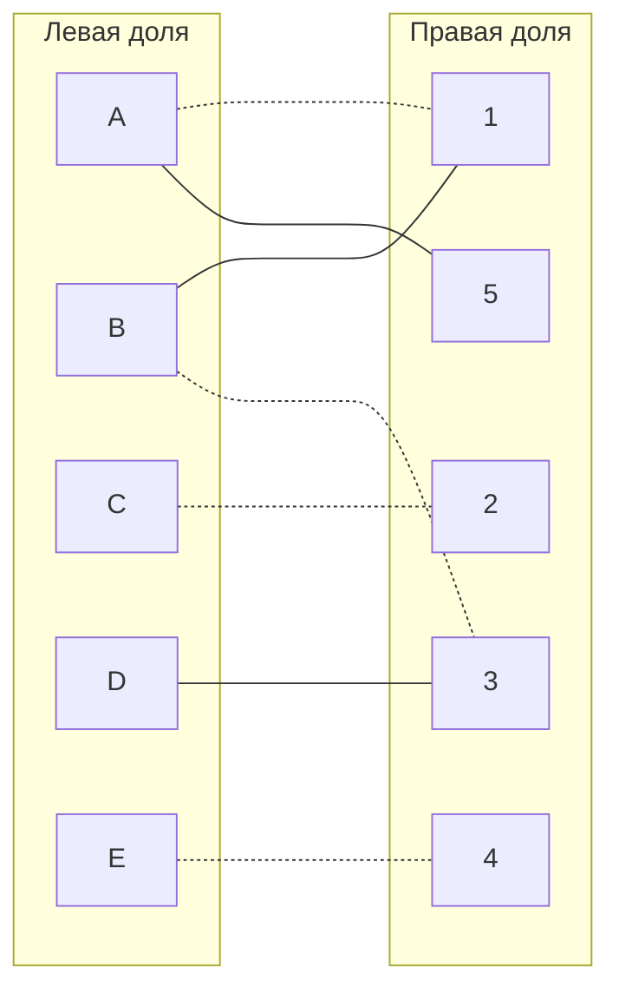
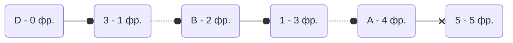
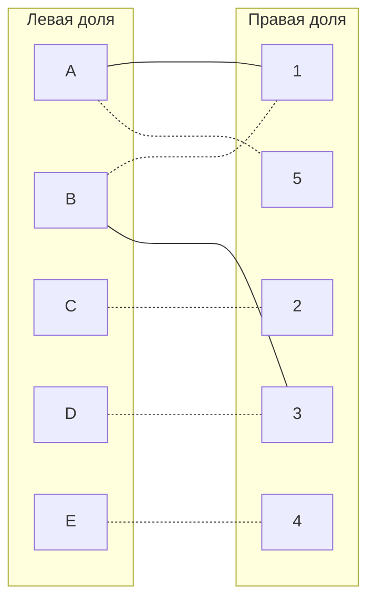

# Задача о назначениях. Венгерский алгоритм.  
1. В условиях задачи для каждой команды указан полный двудольный граф, в котором каждое ребро имеет определенную стоимость. Вершины первой доли представляют задачи, вершины второй доли исполнителей. Стоимость ребра определяет затраты при выполнении соответствующей задачи соответствующим исполнителем.  
2. Затраты неотрицательны и представлены в виде матрицы затрат, в которой на пересечении i-й строки и j-го столбца указаны затраты j-го исполнителя на выполнение i-го задания.  
3. Необходимо назначить исполнителей на задачи таким образом, чтобы общая стоимость затрат была минимальной.  
4. Для решения задачи требуется найти совершенное паросочетание с минимальной суммарной стоимостью в двудольном графе.  
  
# Условия задачи:  
  
### citrine Team:  
  
|       | **1** | **2** | **3** | **4** | **5** |  
|-------|:-----:|:-----:|:-----:|:-----:|:-----:|  
| **A** |  11   |  10   |  14   |  13   |   7   |  
| **B** |   9   |  12   |   5   |   6   |  10   |  
| **C** |  11   |   1   |   9   |   7   |  10   |  
| **D** |  14   |  13   |   5   |  13   |  15   |  
| **E** |  14   |  14   |  15   |   9   |  15   |  

# Решение:
## I шаг - Выполнить редукцию матрицы по строкам и стобцам:

 В первую очередь выполним редукцию матрицы по строкам, для этого необходимо из каждой строки вычесть значение минимального элемента каждой строчки: 
 |       | **1** | **2** | **3** | **4** | **5** |Минимальное значение|  
|-------|:-----:|:-----:|:-----:|:-----:|:-----:|:----:|
| **A** |  11   |  10   |  14   |  13   |   7   | 7 |
| **B** |   9   |  12   |   5   |   6   |  10   | 5 |
| **C** |  11   |   1   |   9   |   7   |  10   | 1 |
| **D** |  14   |  13   |   5   |  13   |  15   | 5 |
| **E** |  14   |  14   |  15   |   9   |  15   | 9 |

Тогда получаем следующую матрицу:
|       | **1** | **2** | **3** | **4** | **5** |  
|-------|:-----:|:-----:|:-----:|:-----:|:-----:|  
| **A** |  4   |  3   |  7   |  6   |   0   |  
| **B** |   4   |  7   |   0   |   1   |  5   |  
| **C** |  10   |   0   |   8   |   6   |  9   |  
| **D** |  9   |  8   |   0   |  8   |  10   |  
| **E** |  5   |  5   |  6   |   0   |  6   |  

После редукции по строкам мы получаем первые нули, они впоследствии понадобятся для назначения работ работникам.
Теперь же проведём редукции по столбцам для матрицы, в данном случае можно провести редукцию только для первого столбца.
Примечание: редукцию по столбцам и строкам имеет смысл проводить для столбцов и/или строк, которые не содержат в себе элемента со значением 0
|       | **1** | **2** | **3** | **4** | **5** |  
|-------|:-----:|:-----:|:-----:|:-----:|:-----:|  
| **A** |  4   |  3   |  7   |  6   |   0   |  
| **B** |   4   |  7   |   0   |   1   |  5   |  
| **C** |  10   |   0   |   8   |   6   |  9   |  
| **D** |  9   |  8   |   0   |  8   |  10   |  
| **E** |  5   |  5   |  6   |   0   |  6   |  
|**Минимальное значение**| 4 | 0| 0| 0| 0

Получаем следующую матрицу:
|       | **1** | **2** | **3** | **4** | **5** |  
|-------|:-----:|:-----:|:-----:|:-----:|:-----:|  
| **A** |  0   |  3   |  7   |  6   |   0   |  
| **B** |   0   |  7   |   0   |   1   |  5   |  
| **C** |  6   |   0   |   8   |   6   |  9   |  
| **D** |  5   |  8   |   0   |  8   |  10   |  
| **E** |  1   |  5   |  6    |   0   |  6   |

В результате первого шага, мы получили редуцированную матрицу, содержащую нули, и можем переходить ко второму шагу.
## II Шаг -  Построение двудольного графа, у которого левая доля содержит работы (A, B, C, D, E),  а правая доля - работников(1, 2, 3, 4, 5), а рёбра соответствуют нулевым элементам редуцированной матрицы:
 

## III Шаг - в построенном графе необходимо найти совершенное паросочетание, используя волновой метод
Для этого в первую очередь выберем произвольное паросочетание, например, A->1, B->3, C->2, E->4, а также закрасим эти отрезки для удобства,
получаем следующий граф:

Получаем непокрытую вершину D, и воспользуемся волновым методом для этой вершины, попытаясь построить чередующееся дерево, где кружок - закрашенная вершина, а крест - нет:

Таким образом, получился волновой метод до 5 фронта, где была найдена чередующаяся цепь: D--->**3**-.->**B**--->**1**-.->**A**--->5
"Перекрашиваем" цепь и изменяем граф: D-.->**3**--->**B**-.->**1**--->**A**-.->5

Проведя одну итерацию, переходим к IV шагу, который определит продолжится работа алгоритма или закончится.

## IV Шаг - Конец или возвращение к III шагу
### А) Если совершенное паросочетание нашли, то задача решена и алгоритм завершает работу

### Б) Если совершенного паросочетания нет, тогда выполняем диагональную редукцию и переходим к шагу III (Диагональная редукция выполняется только по упомянутым вершинам в чередующемся дереве)

В данном случае совершенное паросочетание было найдено, так как все вершины являются закрашенными, следовательно, алгоритм завершает работу.

## V Шаг - подсчитываем сумму по найденному совершенному паросочетанию в изначальной матрице, а также выпишем в ответ это распределение:

Ответ: A-->5 B-->1 C-->2 D-->3 E-->4, сумма = 7+9+1+5+9 = 31