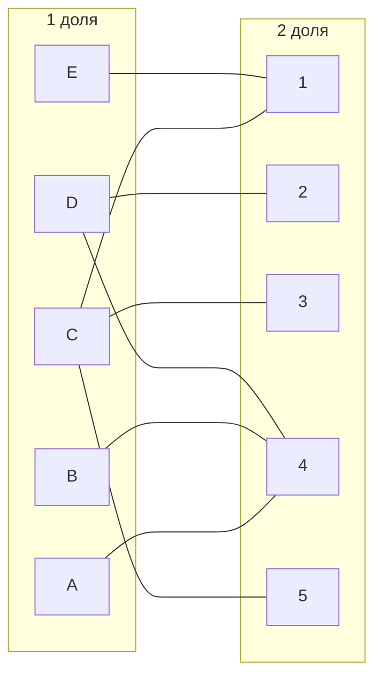
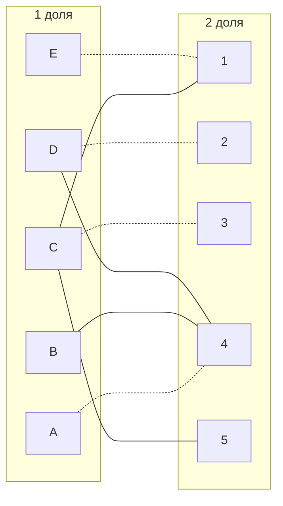
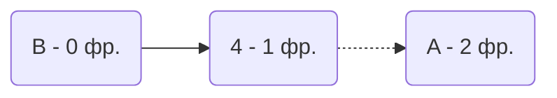
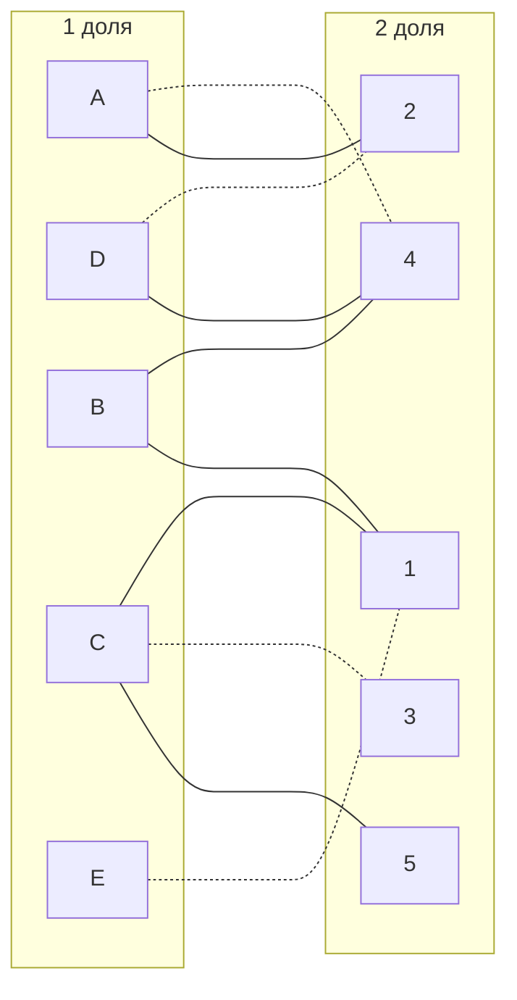
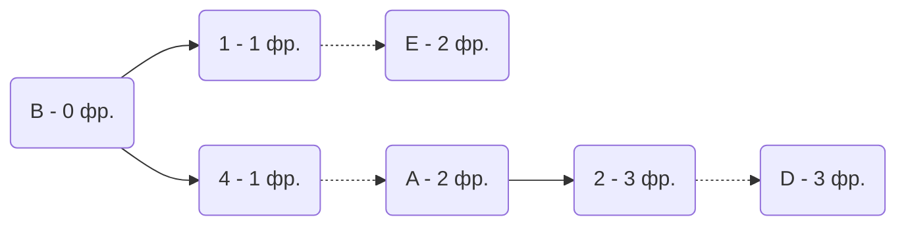
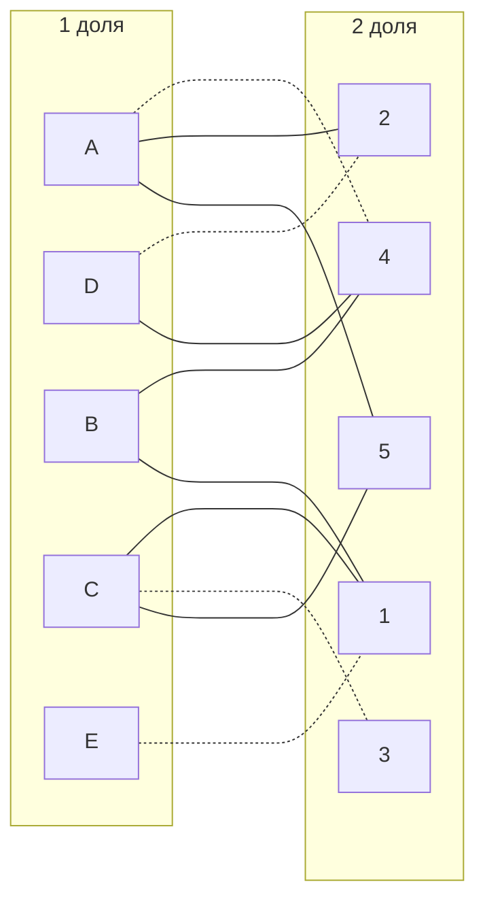
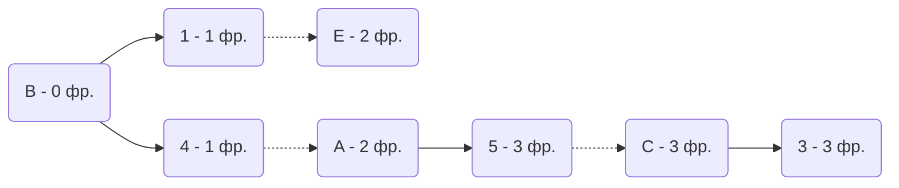
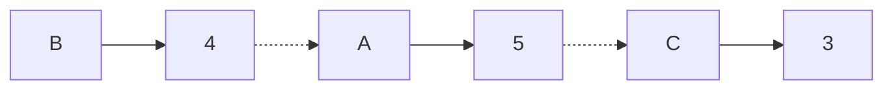
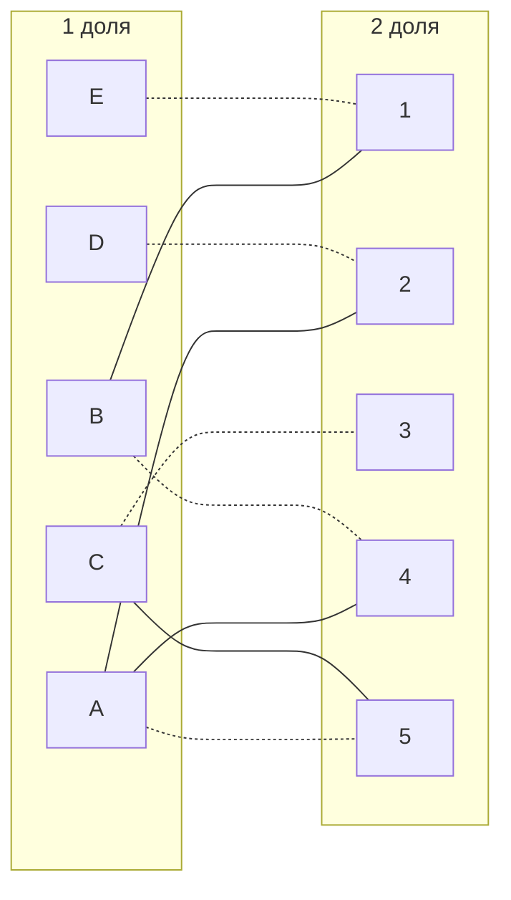

# Задача о назначениях. Венгерский алгоритм.  
1. В условиях задачи для каждой команды указан полный двудольный граф, в котором каждое ребро имеет определенную стоимость. Вершины первой доли представляют задачи, вершины второй доли исполнителей. Стоимость ребра определяет затраты при выполнении соответствующей задачи соответствующим исполнителем.  
2. Затраты неотрицательны и представлены в виде матрицы затрат, в которой на пересечении i-й строки и j-го столбца указаны затраты j-го исполнителя на выполнение i-го задания.  
3. Необходимо назначить исполнителей на задачи таким образом, чтобы общая стоимость затрат была минимальной.  
4. Для решения задачи требуется найти совершенное паросочетание с минимальной суммарной стоимостью в двудольном графе.  
### Gigacode Team:

|       | **1** | **2** | **3** | **4** | **5** |
|-------|:-----:|:-----:|:-----:|:-----:|:-----:|
| **A** |  10   |   9   |  14   |   7   |   9   |
| **B** |   6   |   8   |  15   |   5   |   9   |
| **C** |   7   |  10   |   7   |  15   |   7   |
| **D** |  11   |  10   |  15   |   9   |  11   |
| **E** |   7   |  11   |  15   |   8   |  13   |

# Решение:
## 1 - Проведем редукцию матрицы:

 Вычитаем значение минимального из строк: 
|       | **1** | **2** | **3** | **4** | **5** |  Min  |
|-------|:-----:|:-----:|:-----:|:-----:|:-----:|:-----:|
| **A** |  3   |   2   |  7   |   0   |   2   |   -7   |
| **B** |   1   |   3   |  10   |   0   |   4   |   -5   |
| **C** |   0   |  3   |   0   |  8   |   0   |   -7   |
| **D** |  2   |  1   |  6   |   0   |  2   |   -9   |
| **E** |   0   |  4   |  8   |   1   |  6   |   -7   |

 Вычитаем значение минимального из столбцов
|       | **1** | **2** | **3** | **4** | **5** |
|-------|:-----:|:-----:|:-----:|:-----:|:-----:|
| **A** |  3   |   1   |  7   |   0   |   2   |
| **B** |   1   |   2   |  10   |   0   |   4   |
| **C** |   0   |  2   |   0   |  8   |   0   |
| **D** |  2   |  0   |  6   |   0   |  2   |
| **E** |   0   |  3   |  8   |   1   |  6   |
|  Min  |   0   |   -1   |   0   |   0   |   0   |

Получаем следующую редуцированную матрицу:
|       | **1** | **2** | **3** | **4** | **5** |
|-------|:-----:|:-----:|:-----:|:-----:|:-----:|
| **A** |  3   |   1   |  7   |   0   |   2   |
| **B** |   1   |   2   |  10   |   0   |   4   |
| **C** |   0   |  2   |   0   |  8   |   0   |
| **D** |  2   |  0   |  6   |   0   |  2   |
| **E** |   0   |  3   |  8   |   1   |  6   |

Нули обозначают наименее затратные варианты назначений.
## 2 -  Построим двудольный граф, где 1 доля - работы, 2 - работники, а ребра - нулевые элементы редуцированной матрицы.
 

## 3 - Найдем совершенное паросочетание
Выберем произвольные паросочетния, например Е - 1, D - 2, C - 3, A - 4 
Выделим их

Получили непокрытую вершину B, пробуем строить чередующееся дерево:

В построенном дереве нет цепей, чередующееся относительно текущего паросочетания, то есть в указанном графе нет совершенного паросочетания.

## 4 - Проведем повторную редукцию матрицы затрат.

Во множество X выпишем все **покрытые построенным деревом** вершины первой доли графа, во множество Y все **покрытые построенным деревом** вершины из второй доли графа.

X = $$\{A, B\}$$ 
Y = $$\{ 4 \}$$

Необходимо найти минимальный элемент из строк, включенных во множество X и столбцов, не включенных во множество Y. В нашем случае это будут строки A, B и столбцы 1, 2, 3, 5. Минимальный элемент 1, расположен в строке B и столбце 1. 

Вычтем найденное значение из строк множества X и прибавим к столбцам множества Y:

|       | **1** | **2** | **3** | **4** | **5** |   **Min** |
|-------|:-----:|:-----:|:-----:|:-----:|:-----:|:-----:|
| **A** |  2   |   0   |  6   |   0   |   1   | -1  |
| **B** |   0   |   1   |  9   |   0   |   3   |   -1  |
| **C** |   0   |  2   |   0   |  9   |   0   |
| **D** |  2   |  0   |  6   |   1   |  2   |    |
| **E** |   0   |  3   |  8   |   2   |  6   |      |
| **Min** |       |     |       |   +1  |       |     |

В ячейке B1 и A2 появилось новое нулевое значение, добавим соответствующие ребра в двудольный граф.

 Попытаемся построить совершенное паросочетание с помощью чередующихся деревьев.

В построенном дереве нет цепей, чередующееся относительно текущего паросочетания, обе ветки закончились в покрытых вершинах, значит снова проведем редукцию.
Во множество X выпишем все **покрытые построенным деревом** вершины первой доли графа, во множество Y все **покрытые построенным деревом** вершины из второй доли графа.

X = $$\{A, B, E, D\}$$ 
Y = $$\{ 1, 2, 4 \}$$

Необходимо найти минимальный элемент из строк, включенных во множество X и столбцов, не включенных во множество Y. В нашем случае это будут строки A, B и столбцы 1, 2, 3, 5. Минимальный элемент 1, расположен в строке B и столбце 1. 

Вычтем найденное значение из строк множества X и прибавим к столбцам множества Y:

|       | **1** | **2** | **3** | **4** | **5** |   **Min** |
|-------|:-----:|:-----:|:-----:|:-----:|:-----:|:-----:|
| **A** |  2   |   0   |  5   |   0   |   0   | -1  |
| **B** |   0   |   1   |  8   |   0   |   2   |   -1  |
| **C** |   1   |  3   |   0   |  10   |   0   |   |
| **D** |  2   |  0   |  5   |   1   |  1   |  -1  |
| **E** |   0   |  3   |  7   |   2   |  5   |   -1   |
| **Min** | +1   | +1    |       |   +1  |       |     |

В ячейке A5 появилось новое нулевое значение, добавим соответствующие ребра в двудольный граф.

 Попытаемся построить совершенное паросочетание с помощью чередующихся деревьев.

Построенное дерево содержит чередующуюся, относительно текущего паросочетания, цепь B4 - 4A - A5 - 5C - C3, цепь начинается и заканчивается в непокрытых вершинах, все ребра в цепи чередуются по вхождению в текущее паросочетание.

Полученное расписание является совершенным. Выпишем полученные назначения и их стоимости из исходной матрицы:

A5 - 9
B4 - 5
C3 - 7
D2 - 10
E1 - 7
Общая стоимость затрат = 9 + 5 + 7 + 10 + 7 = 38.
## Ответ:
Минимальная стоимость затрат - 38:
А - 5 исполнитель
B - 4 исполнитель
С - 3 исполнитель
D - 2 исполнитель
E - 1 исполнитель
