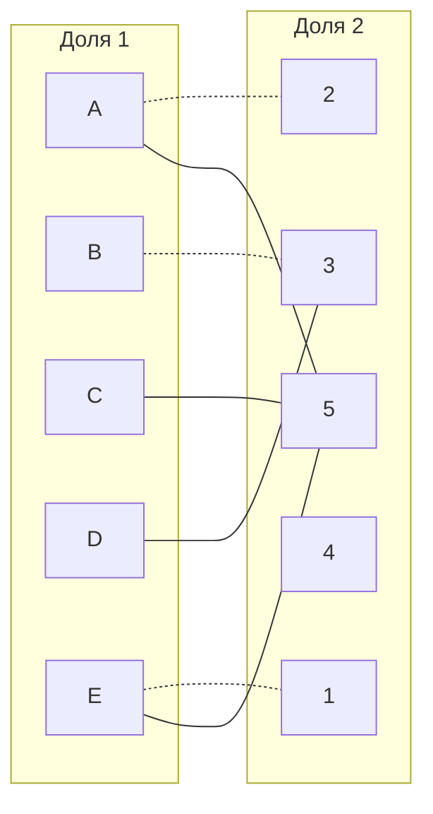
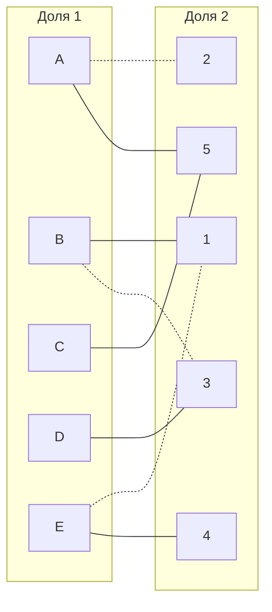
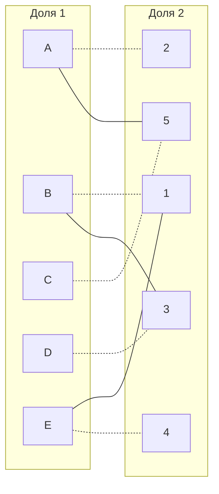

**Задача о назначении (венгерский алгоритм)**

Исходные данные:

|       | **1** | **2** | **3** | **4** | **5** |
|-------|:-----:|:-----:|:-----:|:-----:|:-----:|
| **A** |  15   |  10   |  12   |  14   |   9   |
| **B** |  12   |  13   |   7   |   9   |   9   |
| **C** |  12   |   9   |   9   |  11   |   6   |
| **D** |  14   |  13   |   6   |  14   |  12   |
| **E** |  14   |  12   |  11   |  10   |  15   |    

**Шаг 1:** Проведем редукцию матрицы затрат - из каждой строки исходной матрицы вычитаем минимальный элемент строки, а затем из каждого столбца полученной матрицы вычитаем минимальный элемент столбца.

*После вычитания минимальных элементов строки получаем следующую матрицу:*

|       | **1** | **2** | **3** | **4** | **5** |
|-------|:-----:|:-----:|:-----:|:-----:|:-----:|
| **A** |   6   |   1   |   3   |   5   |   0   |
| **B** |   5   |   6   |   0   |   2   |   2   |
| **C** |   6   |   3   |   3   |   5   |   0   |
| **D** |   8   |   7   |   0   |   8   |   6   |
| **E** |   4   |   2   |   1   |   0   |   5   |    

*Выполняем вычитание минимальных элементов каждого столбца и получаем преобразованную матрицу затрат:*

|       | **1** | **2** | **3** | **4** | **5** |
|-------|:-----:|:-----:|:-----:|:-----:|:-----:|
| **A** |   2   |   0   |   3   |   5   |   0   |
| **B** |   1   |   5   |   0   |   2   |   2   |
| **C** |   2   |   2   |   3   |   5   |   0   |
| **D** |   4   |   6   |   0   |   8   |   6   |
| **E** |   0   |   1   |   1   |   0   |   5   |    

**Шаг 2:** исходя из получившейся преобразованной матрицы затрат построим соответствующий ей двудольный граф и попытаемся найти совершенное паросочетание.

*Ниже представлен построенный двудольный граф:*

<i>Произвольно выберем начальное паросочетание – тогда М0 : [A2], [B3], [Е1]. Двудольный граф будет выглядеть следующим образом:</i> 

*Попытаемся построить чередующееся дерево для непокрытой вершины D:* 

***D – 0 фр.   - - >   3 – 1 фр. ->  B – 2 фр.***

*В построенном дереве нет чередующейся цепи относительно данного паросочетания. Следовательно, в указанном графе не существует совершенного паросочетания.* 

**Шаг 3:** проведем повторную редукцию матрицы затрат.

*Для начала необходимо определить множества X, Y и неY для проведения повторной редукции матрицы:*

**X = {B, D} – покрытые построенным деревом вершины левой доли графа**

**Y = {3} – покрытые построенным деревом вершины правой доли графа**

**Не Y = {1, 2, 4, 5} - непокрытые построенным деревом вершины правой доли графа**

*Найдем минимальный элемент из строк, включенных во множество X и столбцов, включенных во множество не Y. В нашем случае это будут строки B, D и столбцы 1,2,4,5. Минимальный элемент = 1, он расположен в строке B и столбце 1.*

*Вычтем найденное минимальное значение из строк множества X:*

|       | **1** | **2** | **3** | **4** | **5** |
|-------|:-----:|:-----:|:-----:|:-----:|:-----:|
| **A** |   2   |   0   |   3   |   5   |   0   |
| **B** |   0   |   4   |  -1   |   1   |   1   |
| **C** |   2   |   2   |   3   |   5   |   0   |
| **D** |   3   |   5   |  -1   |   7   |   5   |
| **E** |   0   |   1   |   1   |   0   |   5   |    

*Прибавим это же значение к столбцу, входящему во множество Y и получим результат проведения повторной редукции матрицы затрат:*

|       | **1** | **2** | **3** | **4** | **5** |
|-------|:-----:|:-----:|:-----:|:-----:|:-----:|
| **A** |   2   |   0   |   4   |   5   |   0   |
| **B** |   0   |   4   |   0   |   1   |   1   |
| **C** |   2   |   2   |   4   |   5   |   0   |
| **D** |   3   |   5   |   0   |   7   |   5   |
| **E** |   0   |   1   |   2   |   0   |   5   |

*После проведения повторной редукции матрицы затрат в начальный граф необходимо добавить новое ребро В-1:*

**Шаг 4:** исходя из повторно преобразованной матрицы затрат попытаемся найти совершенное паросочетание.

*Теперь чередующаяся цепь для непокрытой вершины D будет выглядеть следующим образом:*

***D – 0 фр.   ->   3 – 1 фр.   - - >   B – 2 фр.  ->   1 – 3 фр.   - - >   E - 4 фр.   ->   4 - 5 фр.***

*Построенная цепь начинается и заканчивается в непокрытых вершинах, все ребра в цепи чередуются по вхождению в текущее паросочетание. Перекрасим полученную цепь:* 

***D – 0 фр.   - - >   3 – 1 фр.   ->   B – 2 фр.  - - >   1 – 3 фр.   ->   E - 4 фр.   - - >   4 - 5 фр.***

*Теперь попытаемся построить чередующееся дерево для оставшейся непокрытой вершины С:*

***С – 0 фр.   ->   5 – 1 фр.***

*Построенная цепь является чередующейся относительно текущего паросочетания, перекрасим ее:*

***С – 0 фр.   - - >   5 – 1 фр.***

*Теперь двудольный граф будет выглядеть следующим образом:*

*Теперь мы можем выделить паросочетания для подсчета минимальной суммы затрат на выполнение всех заданий: [A2], [B1], [C5], [D3], [E4].* 

*Тогда, сложим значения из исходной матрицы, соответствующие паросочетаниям выше и получим: 10 + 12 + 6 + 6 + 10 = 44*

**Ответ: 44**
