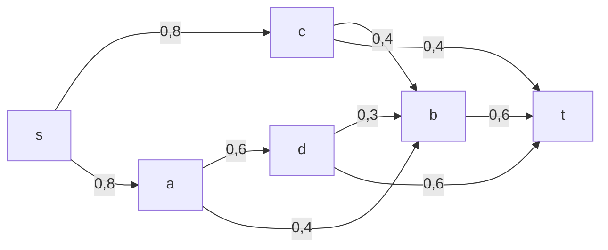
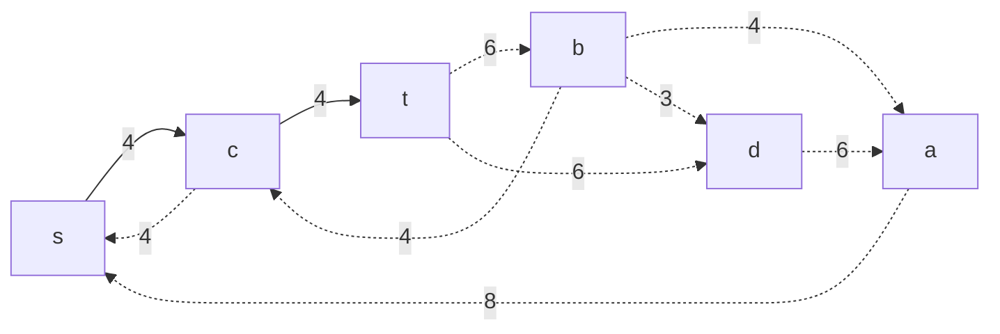
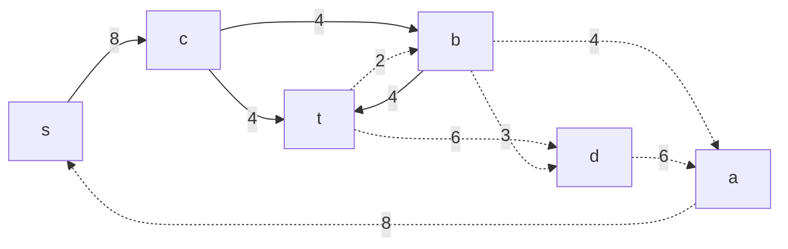
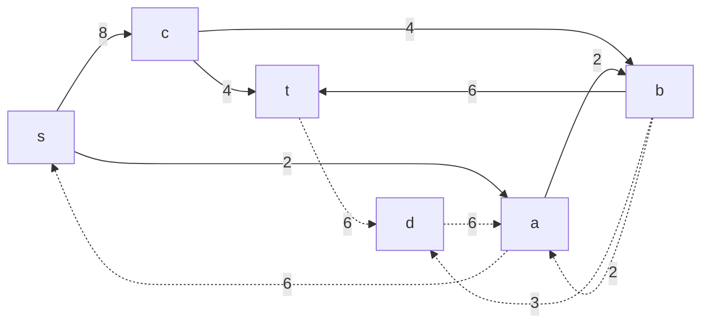
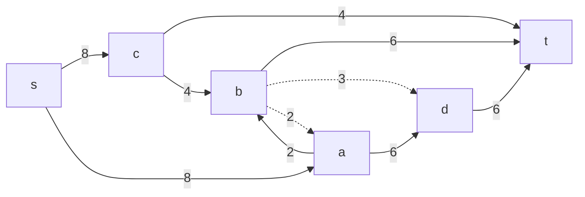

# Задание №14
# Задача о максимальном потоке.
## Постановка задачи
1. Дана сеть (взвешенный ориентированный граф) с источником s и стоком t.
2. Для каждой дуги определена пропускная способность.
3. Необходимо найти максимальный поток для указанной сети. 

## Решение
### Вариант 6:
Пропускная способность дуг сети указана в таблице.

|          Дуги          | sa | sc | ab | ad | db | cb | ct | bt | dt |
|:----------------------:|:--:|:--:|:--:|:--:|----|:--:|:--:|:--:|:--:|
| Пропускная способность | 8  | 8  | 4  | 6  | 3  | 4  | 4  | 6  | 6  |

### 1. Построим сеть с источником **s**, стоком **t** и указанными пропускными способностями дуг.

Найдем начальный поток:

Пропускная способность F=4.

### 2. Построим остаточную сеть, соответствующую взятому на 1 шаге потоку.

### 3. В остаточной сети ищем увеличивающий путь из t в s.
Возьмем путь: 

Минимальный вес дуги равен 4. 

Уменьшим вес дуг на найденном пути, дуги для которых вес стал нулевым удалим из остаточной сети.

Таким образом, новая пропускная способность F=4+4=8. Получаем новую остаточную сеть.

### 4. Продолжим поиск увеличивающего пути в остаточной сети.
Возьмем путь:

Минимальный вес дуги равен 2. 
Уменьшим вес дуг на найденном пути, дуги для которых вес стал нулевым удалим из остаточной сети.

Таким образом, новая пропускная способность F=8+2=10. Получаем новую остаточную сеть.

### 5. Продолжим поиск увеличивающего пути в остаточной сети.
Возьмем путь:

Минимальный вес дуги равен 2. 
Уменьшим вес дуг на найденном пути, дуги для которых вес стал нулевым удалим из остаточной сети.

Таким образом, новая пропускная способность F=10+6=16. Получаем новую остаточную сеть.

В последней полученной остаточной сети найти увеличивающий путь из t в s не представляется возможным. Cледовательно, алгоритм завершил работу и найденный поток величиной 16 является максимальным для данной сети.

### 6. Проверим значение максимального потока перебором всех разрезов сети.
Найдем величину максимального потока через поиск минимальной пропускной способности резервов сети.

Для нахождения пропускных способностей резервов сети используем изначально данную сеть и учитываем максимальную пропускную способность каждой дуги. 

Разрез сети - разбиение множества вершин на два подмножества V1 и V2, где во множество V1 входит источник, а в V2 входит сток.

Пропускная способность разреза - сумма пропускной способности дуг, начинающихся в вершинах из множества V1 и оканчивающихся в вершинах из V2.

Для сети из _n_ вершин существует 2n - 2 различных разрезов, так как две вершины из множества (источник и сток) "зафиксированы" в V1 и V2, остальные вершины можно различными способами распределять между множествами V1 и V2.

Для сети из 5 вершин нужно найти 26 - 2 = 24 = 16 разрезов. 

| №  | V1 | V2 | Пропускная способность разреза |
|----|:--------------|:--------------|:------------------------------:|
| 1  | s             | a, b, c, d, t |           8 + 8 = 16           |
| 2  | s, a          | b, c, d, t    |         8 + 4 + 6 = 18         |
| 3  | s, a, b       | d, c, t       |         8 + 6 + 8 = 22         |
| 4  | s, a, b, c    | d, t          |         4 + 6 + 6 = 16         |
| 5  | s, a, b, c, d | t             |         4 + 6 + 6 = 16         |
| 6  | s, b          | a, c, d, t    |         8 + 8 + 6 = 22         |
| 7  | s, b, c       | a, d, t       |         8 + 6 + 4 = 18         |
| 8  | s, b, c, d    | a, t          |       8 + 4 + 6 + 6 = 24       |
| 9  | s, c          | a, b, d, t    |         4 + 4 + 8 = 16         |
| 10 | s, c, d       | a, b, t       |       8 + 4 + 4 + 6 = 22       |
| 11 | s, a, c, d    | b, t          |     4 + 4 + 3 + 4 + 6 = 21     |
| 12 | s, d          | a, b, c, t    |       8 + 8 + 3 + 6 = 25       |
| 13 | s, a, c       | b, d, t       |       4 + 4 + 4 + 6 = 18       |
| 14 | s, b, d       | a, c, t       |       8 + 8 + 6 + 6 = 28       |
| 15 | s, a, b, d    | c, t          |         8 + 6 + 6 = 20         |
| 16 | s, a, d       | b, c, t       |       8 + 4 + 3 + 6 = 21       |

**Минимальная пропускная способность разреза равна 16 ( {s} / {a, b, c, d, t} ), что совпадает с найденной величиной максимального потока в сети.
Алгоритм завершил свою работу, поскольку в остаточной сети больше нет увеличивающих путей. 
Найденный поток величины 16 является максимальным.**
