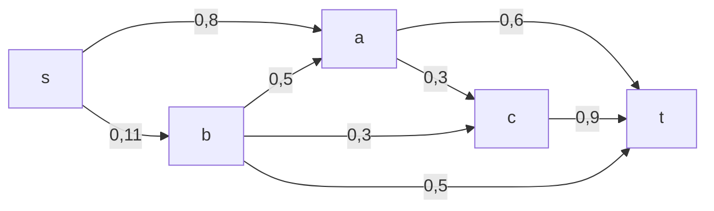
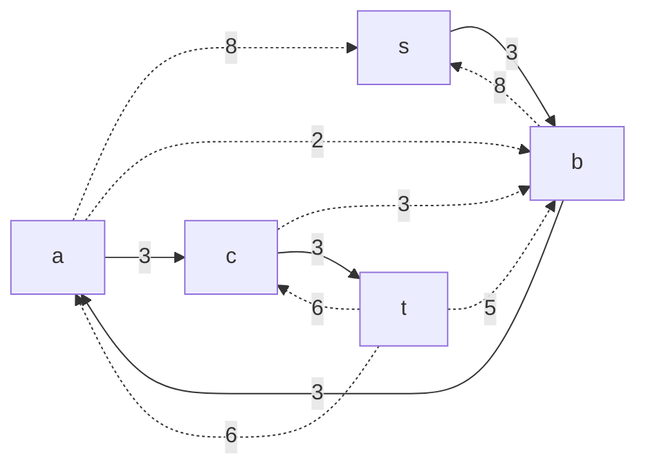
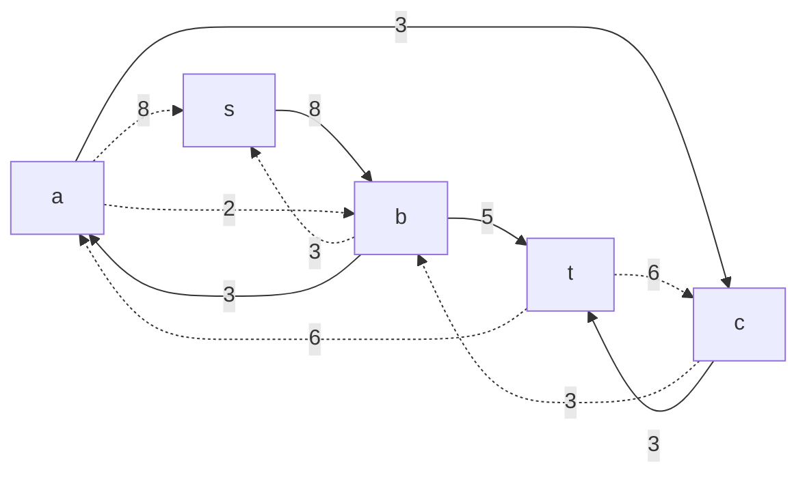
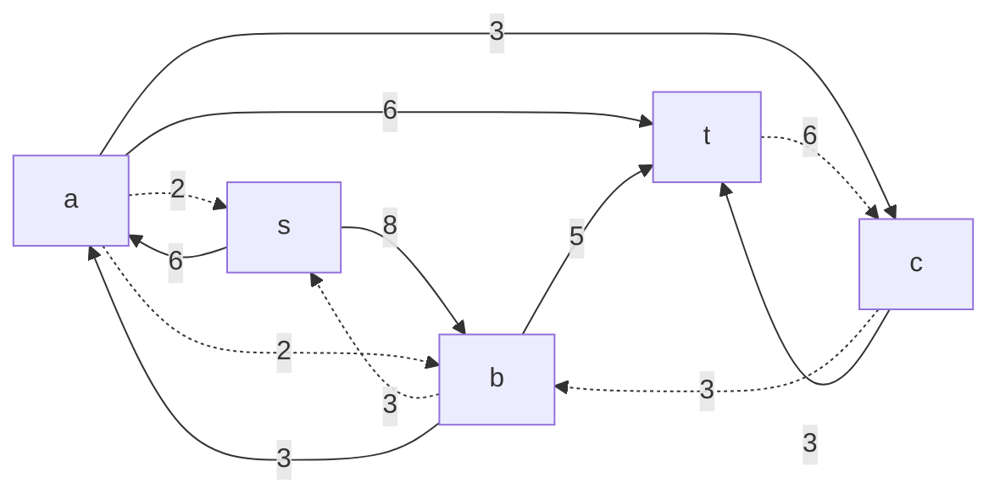
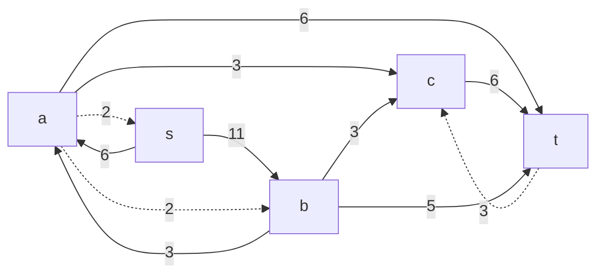

# Задание №14
# Задача о максимальном потоке.
## Постановка задачи
1. Дана сеть (взвешенный ориентированный граф) с источником s и стоком t.
2. Для каждой дуги определена пропускная способность.
3. Необходимо найти максимальный поток для указанной сети. 

## Решение
### Вариант 8:
Пропускная способность дуг сети указана в таблице.

|          Дуги          | sb | sa | bt | ba | bc | ac | at | ct |
|:----------------------:|:--:|:--:|:--:|:--:|:--:|:--:|:--:|:--:|
| Пропускная способность | 11 | 8  | 5  | 5  | 3  | 3  | 6  | 9  |

### 1. Построим сеть с источником **s**, стоком **t** и указанными пропускными способностями дуг.

Найдем начальный поток:

Пропускная способность F=3.

### 2. Построим остаточную сеть, соответствующую взятому на 1 шаге потоку.

### 3. В остаточной сети ищем увеличивающий путь из t в s.
Возьмем путь: 

Минимальный вес дуги равен 5. Далее необходимо: 
а) уменьшить веса дуг t->b, b->s на 5;  
б) увеличить веса дуг s->b, b->t на 5.  
Таким образом, новая пропускная способность F=3+5=8. Получаем новую остаточную сеть.

### 4. Продолжим поиск увеличивающего пути в остаточной сети.
Возьмем путь:

Минимальный вес дуги равен 6. Далее необходимо: 
а) уменьшить веса дуг t->a, a->s на 6;  
б) увеличить веса дуг s->a, a->t на 5.  
Таким образом, новая пропускная способность F=8+6=14. Получаем новую остаточную сеть.

### 5. Продолжим поиск увеличивающего пути в остаточной сети.
Возьмем путь:

Минимальный вес дуги равен 3. Далее необходимо: 
а) уменьшить веса дуг t->c, c->b, b->s на 3;  
б) увеличить веса дуг s->b, b->c, c->t на 3.  
Таким образом, новая пропускная способность F=14+3=17. Получаем новую остаточную сеть.

В последней полученной остаточной сети найти увеличивающий путь из t в s не представляется возможным. Cледовательно, алгоритм завершил работу и найденный поток величиной 17 является максимальным для данной сети.

### 6. Проверим значение максимального потока перебором всех разрезов сети.
Найдем величину максимального потока через поиск минимальной пропускной способности резервов сети.

Для нахождения пропускных способностей резервов сети используем изначально данную сеть и учитываем максимальную пропускную способность каждой дуги. 

Разрез сети - разбиение множества вершин на два подмножества V1 и V2, где во множество V1 входит источник, а в V2 входит сток.

Пропускная способность разреза - сумма пропускной способности дуг, начинающихся в вершинах из множества V1 и оканчивающихся в вершинах из V2.

Для сети из _n_ вершин существует 2n - 2 различных разрезов, так как две вершины из множества (источник и сток) "зафиксированы" в V1 и V2, остальные вершины можно различными способами распределять между множествами V1 и V2.

Для сети из 5 вершин нужно найти 25 - 2 = 23 = 8 разрезов. 

| № | V1                   | V2 | Пропускная способность разреза |
|---|:--------------------------------|:--------------|:------------------------------:|
| 1 | s                               | a, b, c, t    |           11 + 8 = 19           |
|   | **s + одна вершина из a, b, c** |               |                                |
| 2 | s, a                            | b, c, t       |         11 + 3 + 6 = 20         |
| 3 | s, b                            | a, c, t       |         8 + 5 + 3 + 5 = 21         |
| 4 | s, c                            | a, b, t       |         8 + 11 + 9 = 28         |
|   | **s + пара вершин из a, b, c**  |               |                                |
| 5 | s, a, b                         | c, t          |         6 + 3 + 3 + 5 = 17         |
| 6 | s, a, c                         | b, t          |         6 + 9 + 11 = 26         |
| 7 | s, b, c                         | a, t          |         8 + 5 + 5 + 9 = 27         |
|   | **s + три вершины из a, b, c**  |               |                                |
| 8 | s, a, b, c                      | t             |           6 + 9 + 5 = 20           |

Минимальная пропускная способность разреза равна 17 ( {s, a, b} / {c, t} ), что совпадает с найденной величиной максимального потока в сети.

### Ответ:
Максимальный поток в сети равен 17, он реализуется следующим локальными потоками:

