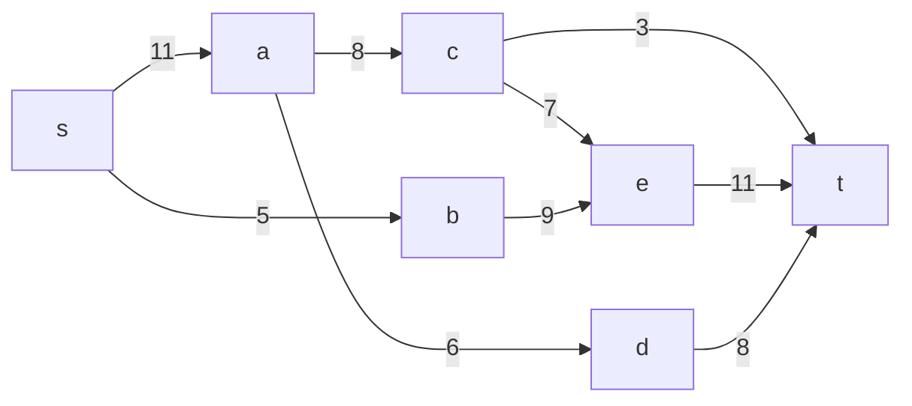
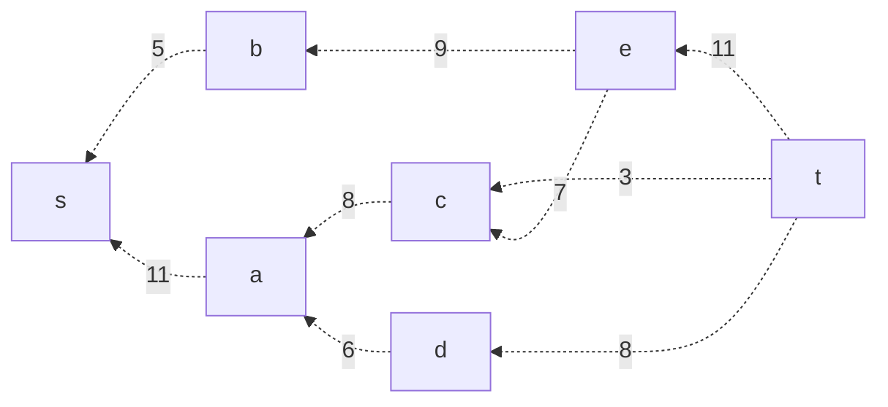
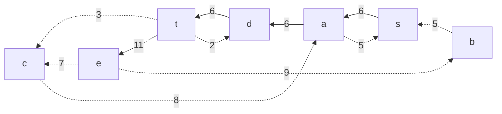
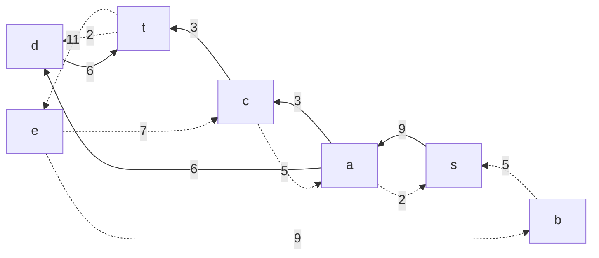
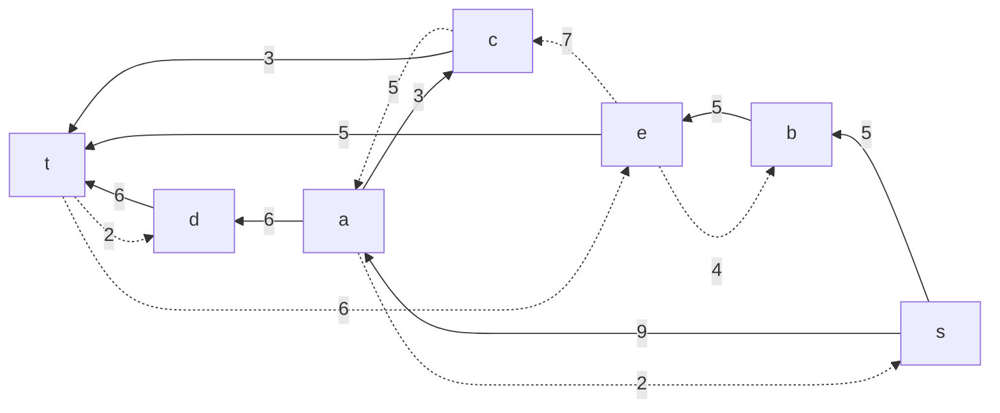
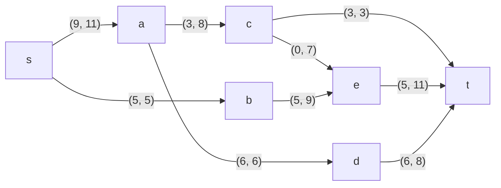
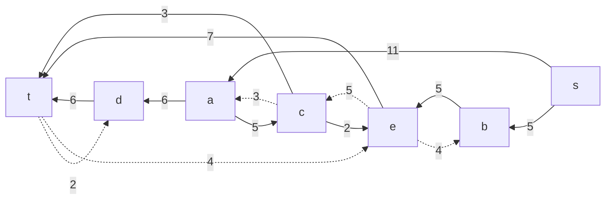
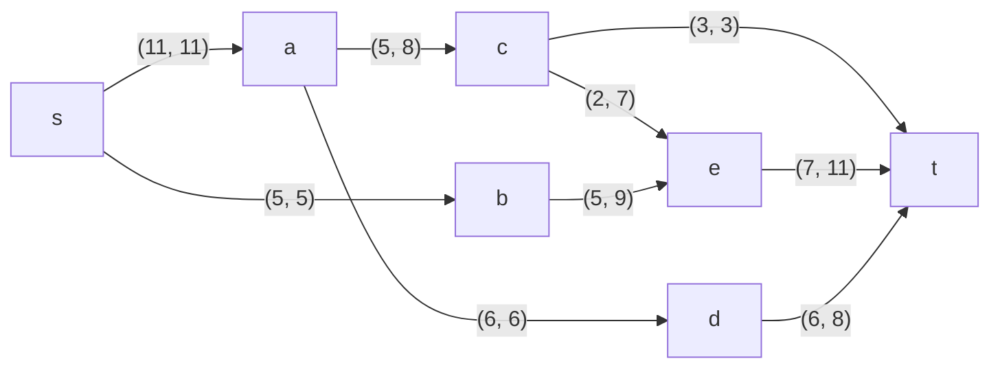

### Вариант 10:

|          Дуги          | sa | sb | ac | ce | be | ad | ct | dt | et |
|:----------------------:|:--:|:--:|:--:|:--:|:--:|:--:|:--:|:--:|:--:|
| Пропускная способность | 11 | 5  | 8  | 7  | 9  | 6  | 3  | 8  | 11 |

### 1. Построим сеть. s-источник, t-сток.

Остаточная сеть (основного потока нет -> все потоки виртуальные): 

### 2. Ищем увеличивающий путь
Берём произвольный увеличивающий путь t -> d -> a -> s. Минимальный вес дуг на этом пути - 6.

Уменьшим вес всех путей на 6 (те, что становятся равны 0 - удаляются).

Перестроим оригинальную сеть: 

### 3. Ищем увеличивающий путь в остаточной сети
Берём произвольный увеличивающий путь t -> с -> a -> s. Минимальный вес дуг на этом пути - 3.

Уменьшим вес всех путей на 3 (те, что становятся равны 0 - удаляются).

Перестроим оригинальную сеть: 

### 3. Ищем увеличивающий путь в остаточной сети остаточной сети
Берём произвольный увеличивающий путь t -> e -> b -> s. Минимальный вес дуг на этом пути - 5.

Уменьшим вес всех путей на 5 (те, что становятся равны 0 - удаляются).

Перестроим оригинальную сеть: 

### 4. Ищем увеличивающий путь в остаточной сети остаточной сети остаточной сети
Берём произвольный увеличивающий путь t -> e -> с -> a -> s. Минимальный вес дуг на этом пути - 2.

Уменьшим вес всех путей на 2 (те, что становятся равны 0 - удаляются).

Перестроим оригинальную сеть: 

### 5. Продолжим поиск увеличивающего пути в остаточной сети остаточной сети остаточной сети остаточной сети
В остаточной сети не найдено увеличивающих путей, следовательно, алгоритм завершил работу.
Макс. поток - 16.

### 6. Сумма входящих потоков равна сумме исходящих потоков для всех узлов кроме стока и источника. 

### Ответ:
Максимальный поток в сети равен 16. Итоговая сеть: 

