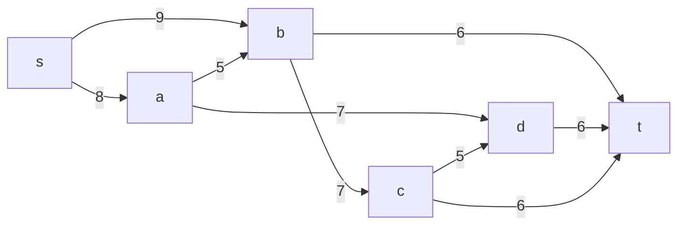
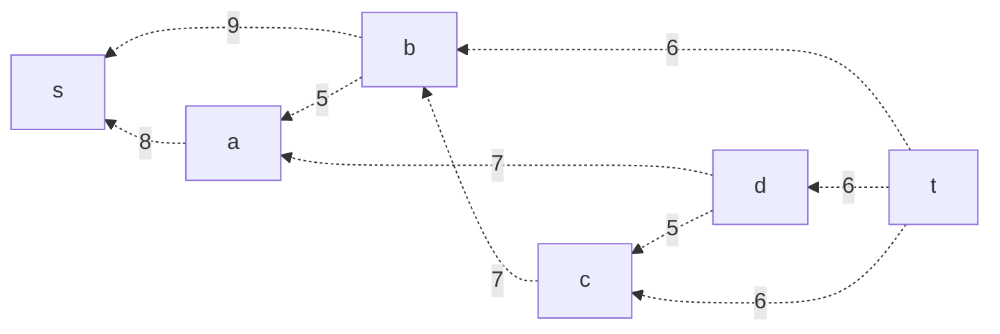
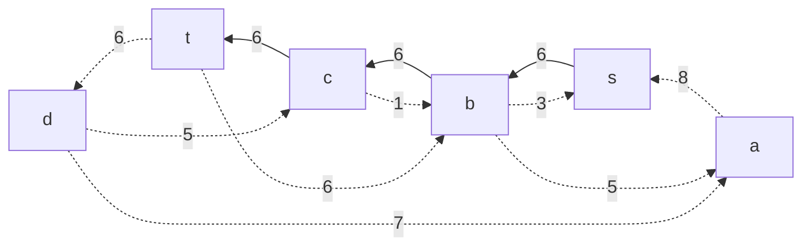
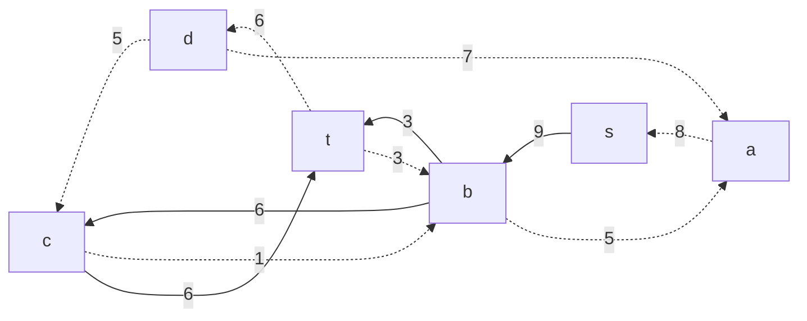
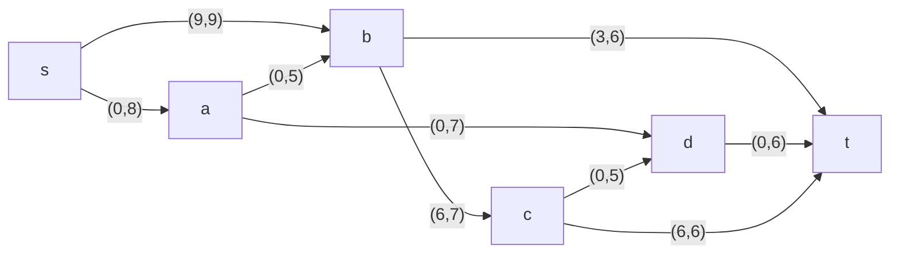
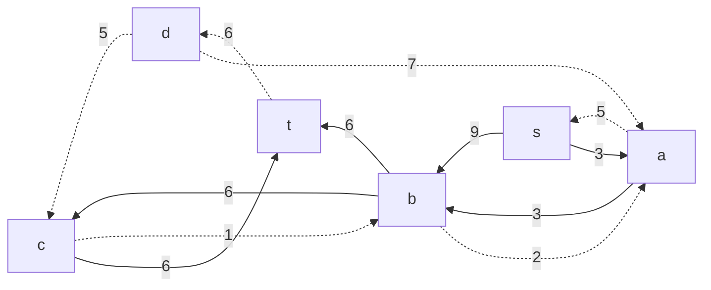
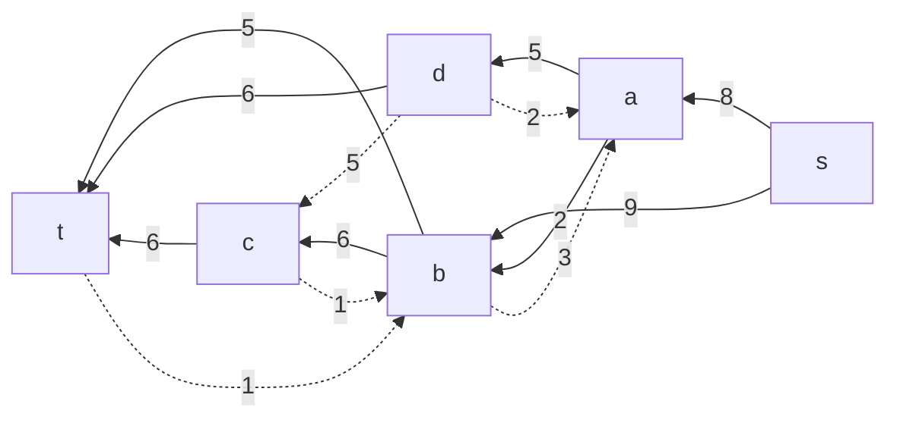

# Задача о максимальном потоке.
**Постановка задачи:**
1. Построить сеть с указанием пропускной способности дуг.
2. Построить остаточную сеть.
3. Определить максимальный поток методом поиска увеличивающих путей в остаточной сети.
4. Проверить величину максимального потока через поиск минимальной пропускной способности разрезов сети.
5. Оформить решение задачи по шагам с подробными комментариями, таблицами и диаграммами.
6. В ответе указать максимальную величину потока и сеть с указанием соответствующих локальных потоков.
### Вариант 1:

|          Дуги          | sa | sb | ad | ab | bc | cd | bt | dt | ct |
|:----------------------:|:--:|:--:|:--:|:--:|:--:|:--:|:--:|:--:|:--:|
| Пропускная способность | 8  | 9  | 7  | 5  | 7  | 5  | 6  | 6  | 6  |

## Решение
### 1. Построим сеть с источником **s**, стоком **t** и указанными пропускными способностями дуг.

Построим остаточную сеть. Так как изначально поток в сети не задан, все дуги сети являются пустыми (локальный поток равен нулю), соответственно в остаточную сеть необходимо вынести обратную дугу с весом равным пропускной способности. 

### 2. Проведем поиск увеличивающего пути в остаточной сети
В остаточной сети найден увеличивающий путь t -> c -> b -> s. Минимальный вес дуг на этом пути равен 6.

Уменьшим вес дуг на найденном пути, дуги для которых вес стал нулевым удалим из остаточной сети.

Скорректируем соответствующим образом локальные потоки в исходной сети. Первым числом будем указывать локальный поток, вторым пропускную способность дуги. 

### 3. Продолжим поиск увеличивающего пути в остаточной сети

В остаточной сети найден увеличивающий путь t -> b ->  s. Минимальный вес дуг на этом пути равен 3.

Уменьшим вес дуг на найденном пути, дуги для которых вес стал нулевым удалим из остаточной сети.

Скорректируем соответствующим образом локальные потоки в исходной сети.

### 4. Продолжим поиск увеличивающего пути в остаточной сети

В остаточной сети найден увеличивающий путь t -> b -> a -> s. Минимальный вес дуг на этом пути равен 3.

Уменьшим вес дуг на найденном пути, дуги для которых вес стал нулевым удалим из остаточной сети.

Скорректируем соответствующим образом локальные потоки в исходной сети.

### 5. Продолжим поиск увеличивающего пути в остаточной сети

В остаточной сети найден увеличивающий путь t -> d -> a -> s. Минимальный вес дуг на этом пути равен 5.

Уменьшим вес дуг на найденном пути, дуги для которых вес стал нулевым удалим из остаточной сети.

Скорректируем соответствующим образом локальные потоки в исходной сети.

### 6. Продолжим поиск увеличивающего пути в остаточной сети
В остаточной сети не найдено увеличивающих путей, следовательно, алгоритм завершил работу и найденный поток величиной 17 является максимальным для данной сети.
### 6. Проверим значение максимального потока перебором всех разрезов сети.
Разрез сети - разбиение множества вершин на два подмножества V1 и V2, где во множество V1 входит источник, а в V2 входит сток.

Пропускная способность разреза - сумма пропускной способности дуг, начинающихся в вершинах из множества V1 и оканчивающихся в вершинах из V2.

Для сети из _n_ вершин существует 2n - 2 различных разрезов, так как две вершины из множества (источник и сток) "зафиксированы" в V1 и V2, остальные вершины можно различными способами распределять между множествами V1 и V2.

Для сети из 6 вершин нужно найти 26 - 2 = 24 = 16 разрезов. 

| № | V1                   | V2 | Пропускная способность разреза |
|---|:--------------------------------|:--------------|:------------------------------:|
| 1 | s                               | a, b, c, d, t    |           8 + 9 = 17           |            |
| 2 | s, a                            | b, c, d, t       |         9 + 5 + 7 = 21         |
| 3 | s, b                            | a, c, d, t       |         8 + 7 + 6 = 21         |
| 4 | s, c                            | a, b, d, t       |         8 + 9 + 6 + 5 = 28         |             |
| 5 | s, d                            | a, b, c, t       |         8 + 9 + 6 = 23         |             |
| 6 | s, a, b                         | c, d, t          |         7 + 7 + 6 = 20         |
| 7 | s, a, c                         | b, d, t          |         9 + 5 + 5 + 6 = 22         |
| 8 | s, a, d                         | b, c, t          |         9 + 5 + 6 = 20         |            |
| 9 | s, b, c                      | a, d, t             |           8 + 6 + 6 = 20           |
| 10 | s, b, d                               | a, c, t    |           8 + 7 + 6 = 21           |            |
| 11 | s, c, d                            | a, b, t       |         8 + 9 + 6 + 6 = 29         |
| 12 | s, b, c, d                            | a, t       |         8 + 6 + 6 + 6 = 26         |
| 13 | s, a, c, d                           | b, t       |         9 + 6 + 6 + 6 = 27         |             |
| 14 | s, a, b, d                         | c, t          |         7 + 6 + 6 = 19         |
| 15 | s, a, b, c                         | d, t          |         7 + 6 + 6 = 19         |
| 16 | s, a, b, c, d                        | t          |         6 + 6 + 6 = 18         |            |

Минимальная пропускная способность разреза равна 17 ( {s} / {a, b, c, d, t} ), что совпадает с найденной величиной максимального потока в сети.

### Ответ:
Максимальный поток в сети равен 17, он реализуется следующим локальными потоками:

