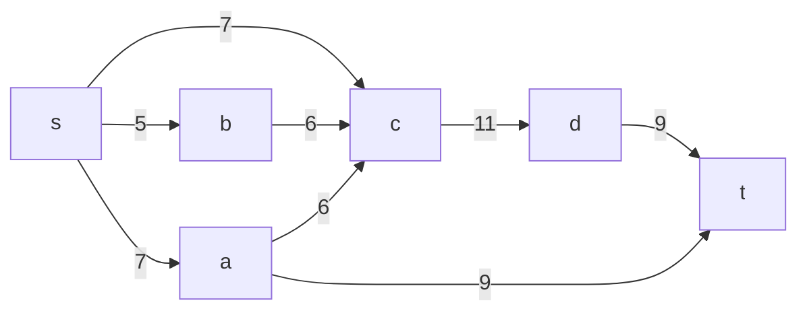
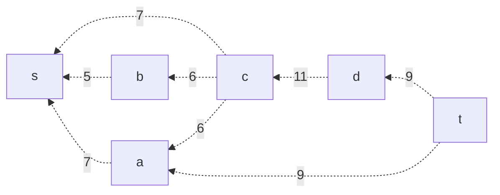
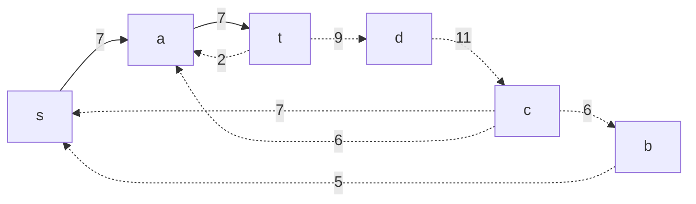
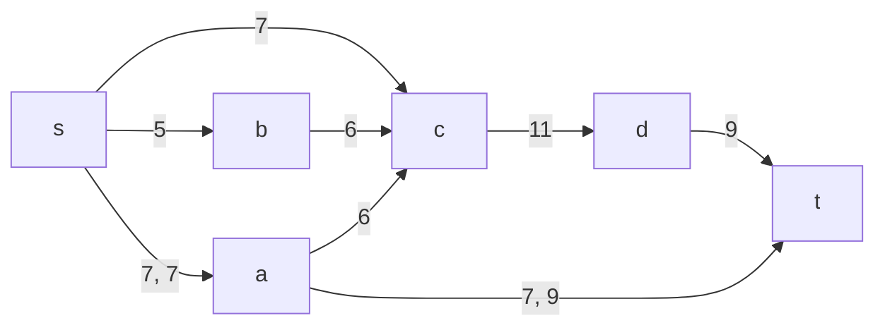
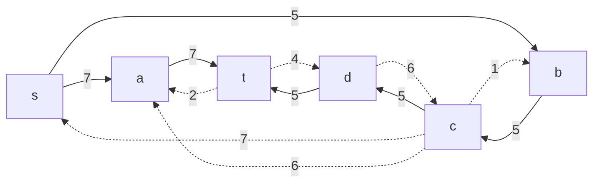
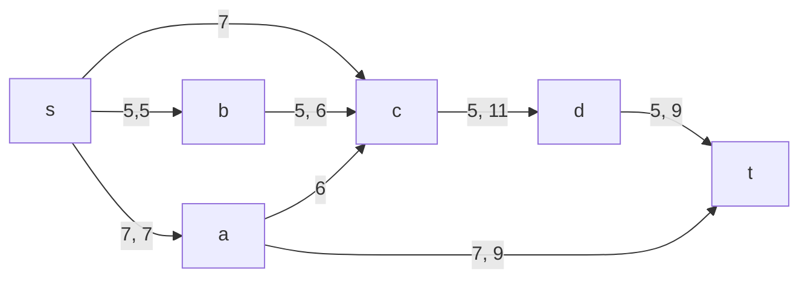
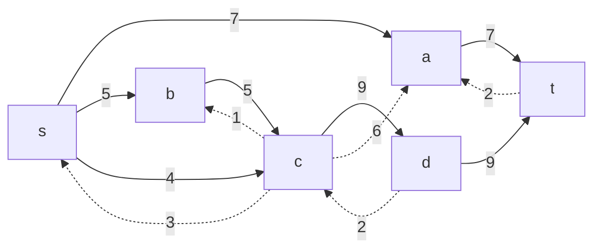
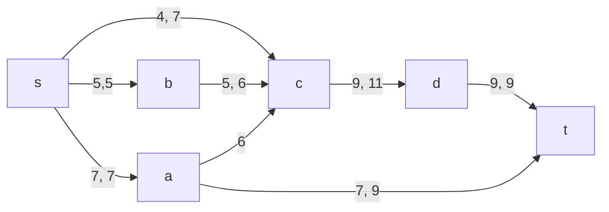

# Задача о максимальном потоке.
Для каждого варианта представлены условия задачи, в соответствии с которыми необходимо: 
1. Построить сеть с указанием пропускной способности дуг.
2. Построить остаточную сеть.
3. Определить максимальный поток методом поиска увеличивающих путей в остаточной сети.
4. Проверить величину максимального потока через поиск минимальной пропускной способности разрезов сети.
5. Оформить решение задачи по шагам с подробными комментариями, таблицами и диаграммами.
6. В ответе указать максимальную величину потока и сеть с указанием соответствующих локальных потоков.

## Условие задачи:

### Вариант 7:

|          Дуги          | sa | sb | sc | bc | cd | dt | ac | at |
|:----------------------:|:--:|:--:|:--:|:--:|:--:|:--:|:--:|:--:|
| Пропускная способность | 7  | 5  | 7  | 6  | 11 | 9  | 6  | 9  |

## Решение:

### I Шаг - Построим сеть с источником s, стоком t и указанными пропускными способностями дуг.

Построим остаточную сеть. Так как изначально поток в сети не задан, все дуги сети являются пустыми (локальный поток равен нулю), соответственно в остаточную сеть необходимо вынести обратную дугу с весом равным пропускной способности.

### II Шаг - Проведем поиск увеличивающего пути в остаточной сети

В остаточной сети найден увеличивающий путь t -> a -> s. Минимальный вес дуг на этом пути равен 7.

Уменьшим вес дуг на найденном пути, дуги для которых вес стал нулевым удалим из остаточной сети.

Скорректируем соответствующим образом локальные потоки в исходной сети. Первым числом будем указывать локальный поток, вторым пропускную способность дуги.

### III Шаг - Продолжим поиск увеличивающего пути в остаточной сети

В остаточной сети найден увеличивающий путь t -> d -> c -> b -> s. Минимальный вес дуг на этом пути равен 5.

Уменьшим вес дуг на найденном пути, дуги для которых вес стал нулевым удалим из остаточной сети.

Скорректируем соответствующим образом локальные потоки в исходной сети.

### IV Шаг - Продолжим поиск увеличивающего пути в остаточной сети

В остаточной сети найден увеличивающий путь t -> d -> c -> s. Минимальный вес дуг на этом пути равен 4

Уменьшим вес дуг на найденном пути, дуги для которых вес стал нулевым удалим из остаточной сети.

Скорректируем соответствующим образом локальные потоки в исходной сети.

### V Шаг - Продолжим поиск увеличивающего пути в остаточной сети

В остаточной сети не найдено увеличивающих путей, следовательно, алгоритм завершил работу и найденный поток величиной 16 является максимальным для данной сети.

### VI Шаг - Проверим значение максимального потока перебором всех разрезов сети.  
  
Разрез сети - разбиение множества вершин на два подмножества V1 и V2, где во множество V1 входит источник, а в V2 входит сток.  
  
Пропускная способность разреза - сумма пропускной способности дуг, начинающихся в вершинах из множества V1 и оканчивающихся в вершинах из V2.  
  
Для сети из n вершин существует 2n - 2 различных разрезов, так как две вершины из множества (источник и сток) "зафиксированы" в V1 и V2, остальные вершины можно различными способами распределять между множествами V1 и V2.  
  
Для сети из 6 вершин нужно найти 2^(6-2) - 2 = 2^4 = 16 разрезов.

| № | v1 | v2 | Пропускная способность |
|--|--|--|--|
| 1 | s | abcdt | 7+5+7=19 |
| 2 | sa | bcdt | 7+6+9+5=27 |
| 3 | sb | acdt | 7+6+7=20 |
| 4 | sc | abdt | 7+11=18 |
| 5 | sd | abct | 7+7+6+9=29 |
| 6 | sab | cdt | 7+6+9+6=28 |
| 7 | sac | bdt | 5+9+11=25 |
| 8 | sad | bct | 5+7+6+9+9=36 |
| 9 | sbc | adt | 7+11=18 |
| 10 | sbd | act | 7+7+9+6=29 |
| 11 | scd | abt | 7+5+9=21 |
| 12 | sabc | dt | 9+11=20 |
| 13 | sabd | ct | 7+6+9+6=28 |
| 14 | sbcd | at | 7+9=16 |
| 15 | sacd | bt | 5+9+9=23 |
| 16 | sabcd | t | 9+9=18 |
Минимальная пропускная способность разреза равна 16 ( {s, b, c, d} / {t} ), что совпадает с найденной величиной максимального потока в сети.

## Ответ:
Максимальный поток в сети равен 16, он реализуется следующим локальными потоками:

