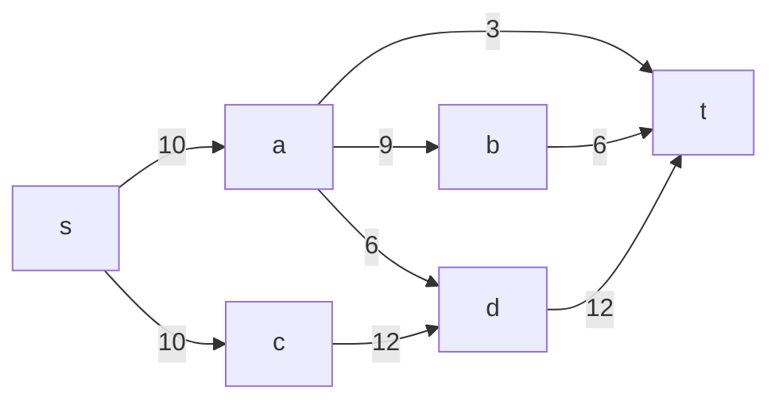
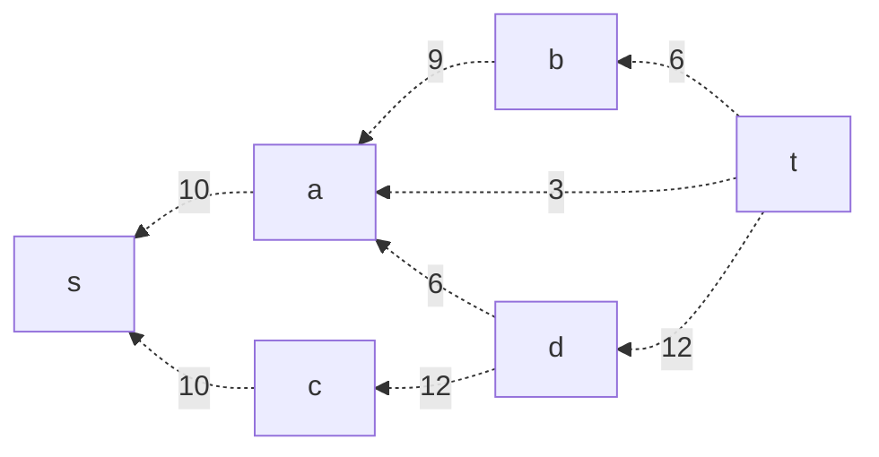
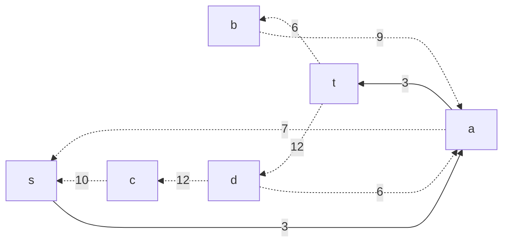
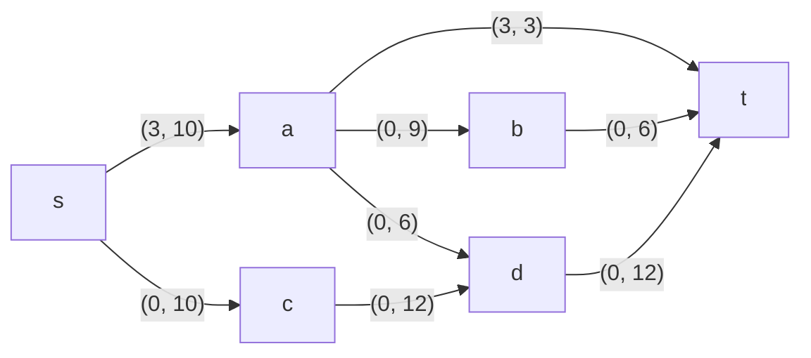
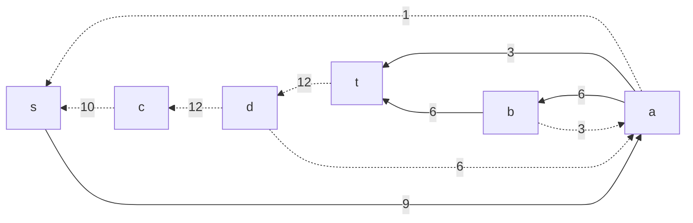
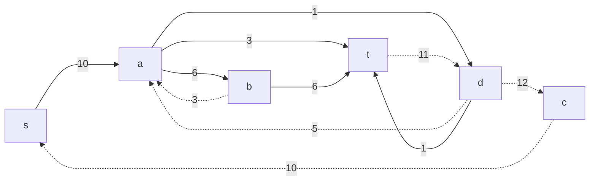
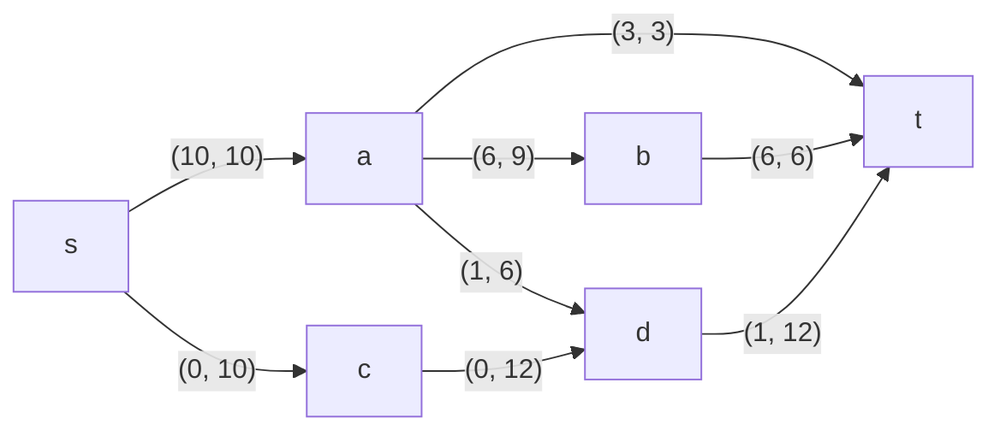
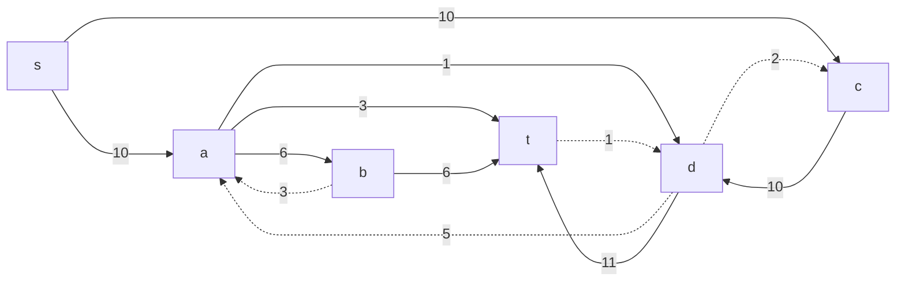
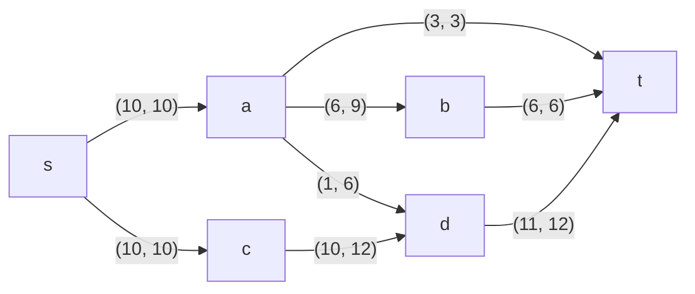

# Задание №14
# Задача о максимальном потоке.
Для каждого варианта представлены условия задачи, в соответствии с которыми необходимо: 
1. Построить сеть с указанием пропускной способности дуг.
2. Построить остаточную сеть.
3. Определить максимальный поток методом поиска увеличивающих путей в остаточной сети.
4. Проверить величину максимального потока через поиск минимальной пропускной способности разрезов сети.
5. Оформить решение задачи по шагам с подробными комментариями, таблицами и диаграммами.
6. В ответе указать максимальную величину потока и сеть с указанием соответствующих локальных потоков.
### Вариант 5: 

|          Дуги          | sa | sc | at | ab | ad | cd | bt | dt |
|:----------------------:|:--:|:--:|:--:|:--:|:--:|:--:|:--:|:--:|
| Пропускная способность | 10 | 10 | 3  | 9  | 6  | 12 | 6  | 12 |

# Решение:
### 1. Построим сеть с источником **s**, стоком **t** b указанными пропускными способностями дуг.

Построим остаточную сеть. Так как изначально поток в сети не задан, все дуги сети являются пустыми (локальный поток равен нулю), соответственно в остаточную сеть необходимо вынести обратную дугу с весом равным пропускной способности. 

### 2. Проведем поиск увеличивающего пути в остаточной сети
В остаточной сети найден увеличивающий путь t -> a -> s. Минимальный вес дуг на этом пути равен 3.

Уменьшим вес дуг на найденном пути, дуги для которых вес стал нулевым удалим из остаточной сети.

Скорректируем соответствующим образом локальные потоки в исходной сети. Первым числом будем указывать локальный поток, вторым пропускную способность дуги. 

### 3. Продолжим поиск увеличивающего пути в остаточной сети

В остаточной сети найден увеличивающий путь t -> b -> a -> s. Минимальный вес дуг на этом пути равен 6.

Уменьшим вес дуг на найденном пути, дуги для которых вес стал нулевым удалим из остаточной сети.

Скорректируем соответствующим образом локальные потоки в исходной сети.

### 4. Продолжим поиск увеличивающего пути в остаточной сети

В остаточной сети найден увеличивающий путь t -> d -> a -> s. Минимальный вес дуг на этом пути равен 1.

Уменьшим вес дуг на найденном пути, дуги для которых вес стал нулевым удалим из остаточной сети.

Скорректируем соответствующим образом локальные потоки в исходной сети.

### 5. Продолжим поиск увеличивающего пути в остаточной сети

В остаточной сети найден увеличивающий путь t -> d -> c -> s. Минимальный вес дуг на этом пути равен 10.

Уменьшим вес дуг на найденном пути, дуги для которых вес стал нулевым удалим из остаточной сети.

Скорректируем соответствующим образом локальные потоки в исходной сети.

### 6. Продолжим поиск увеличивающего пути в остаточной сети
В остаточной сети не найдено увеличивающих путей, следовательно, алгоритм завершил работу и найденный поток величиной 20 является максимальным для данной сети.

### 7. Проверим значение максимального потока перебором всех разрезов сети.
Разрез сети - разбиение множества вершин на два подмножества V1 и V2, где во множество V1 входит источник, а в V2 входит сток.

Пропускная способность разреза - сумма пропускной способности дуг, начинающихся в вершинах из множества V1 и оканчивающихся в вершинах из V2.

Для сети из _n_ вершин существует 2n - 2 различных разрезов, так как две вершины из множества (источник и сток) "зафиксированы" в V1 и V2, остальные вершины можно различными способами распределять между множествами V1 и V2.

Для сети из 6 вершин нужно найти 26 - 2 = 24 = 16 разрезов. 

| №  | V1       |      V2       | Пропускная способность разреза |
|----|----------|:-------------:|--------------------------------|
| 1  | s        | t, a, b, c, d | 10 + 10 = 20                   | 
| 2  | s,a      |  t, b, c, d   | 10 + 3 + 9 + 6 = 28            |
| 3  | s,b      |  t, a, c, d   | 10 + 6 = 16                    |
| 4  | s,c      |  t, a, b, d   | 10 + 12 = 22                   |
| 5  | s,d      |  t, a, b, c   | 10 + 10 + 12 = 32              |
| 6  | s,a,b    |    t, c, d    | 10 + 3 + 6 + 6 = 25            |
| 7  | s,a,c    |    t, b, d    | 9 + 3 + 6 + 12 = 30            |
| 8  | s,a,d    |    t, b, c    | 10 + 3 + 9 + 12 = 34           |
| 9  | s,b,c    |    t, a, d    | 10 + 12 + 6 = 28               |
| 10 | s,b,d    |    t, a, c    | 10 + 10 + 6 + 12 = 38          |
| 11 | s,c,d    |    t, a, b    | 10 + 12 = 22                   |
| 12 | s,a,b,c  |     t, d      | 3 + 6 + 6 + 12 = 27            |
| 13 | s,a,b,d  |     t, c      | 10 + 3 + 6 + 12 = 31           |
| 14 | s,a,c,d  |     t, b      | 3 + 12 + 9 = 24                |
| 15 | s,b,c,d  |     t, a      | 3 + 6 + 12 + 10 = 31           |
| 16 | s,a,b,c,d |       t       | 3 + 6 + 12 = 21                |

Минимальная пропускная способность разреза равна 20 ( s / {t, a, b, c, d} ), что совпадает с найденной величиной максимального потока в сети.

### Ответ:
Максимальный поток в сети равен 20, он реализуется следующим локальными потоками:

