## Задача о максимальном потоке
### Вариант 2:
|          Дуги          | sa | sс | aс | ba | cb | bt | at |
|:----------------------:|:--:|:--:|:--:|:--:|:--:|:--:|:--:|
| Пропускная способность | 9  | 7  | 8  | 5  | 11 | 10 | 3  |

1. **Построим сеть с источником s, стоком t и укажем пропускные способности:**

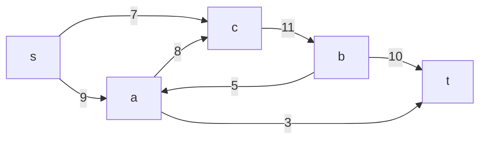
Построим остаточную сеть:

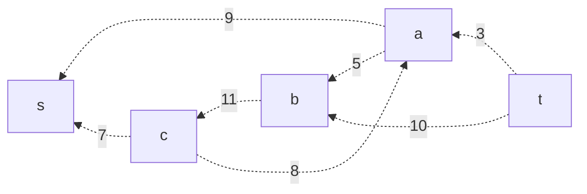

2. **Проведем поиск увеличивающего пути в остаточной сети:**

В остаточной сети есть увеличивающий путь t –> a –> s. Минимальный вес дуг, образующих этот путь, равен 3. Согласно алгоритму, уменьшаем веса дуг (t, a) и (a, s) в остаточной сети на 3. 
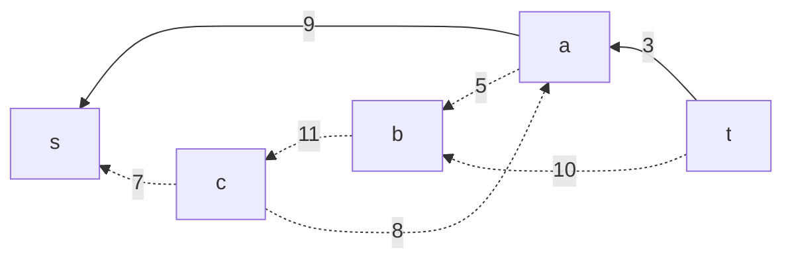
Скорректированный поток:
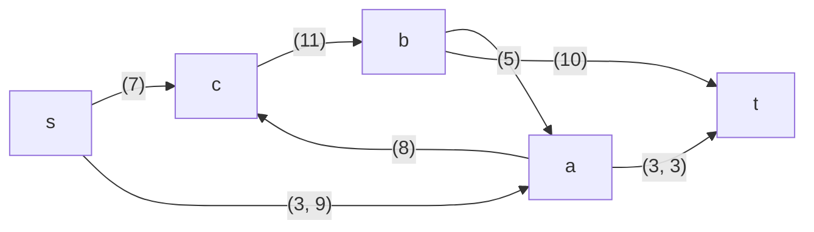
Скорректированная остаточная сеть:
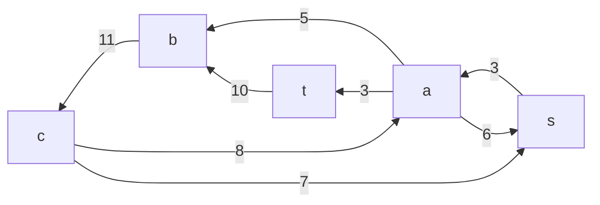
3. **Продолжим поиск увеличивающего пути в остаточной сети:**

В скорректированной остаточной сети есть увеличивающий путь t –> b –> c –> s с минимальным весом входящих в него ребер, равным 7.
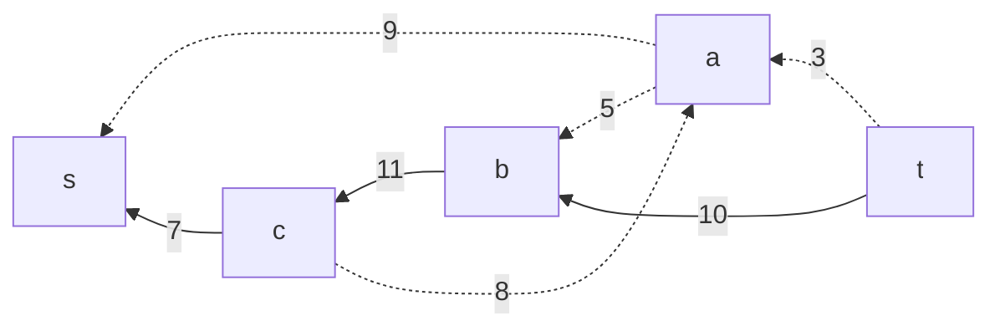

Уменьшаем в остаточной сети веса дуг (t, b), (b, c) и (c, s) на 7 и одновременно с этим наращиваем поток в исходной сети с 3 до 10.

Увеличенный поток и соответствующая ему остаточная сеть: 
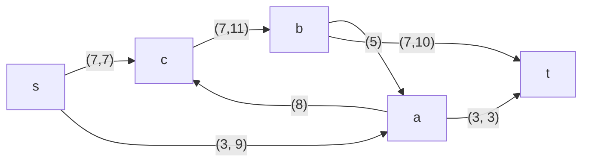
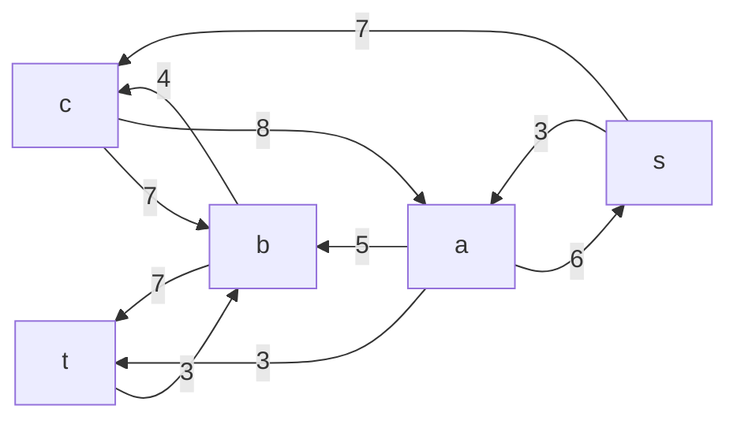

4. **Продолжим поиск увеличивающего пути в остаточной сети:**

В скорректированной остаточной сети есть увеличивающий путь t –> b –> c –> a -> s с минимальным весом входящих в него ребер, равным 3.
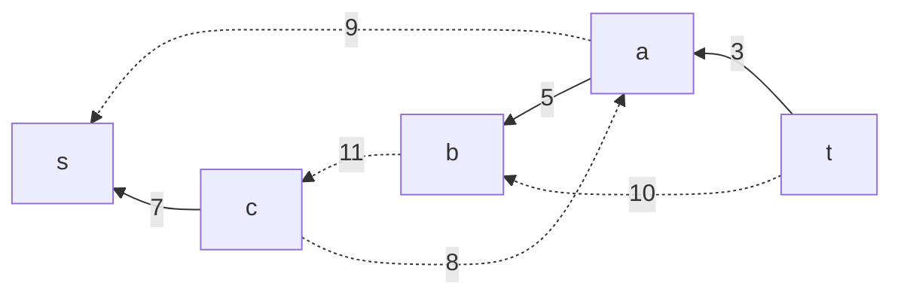

Уменьшаем в остаточной сети веса дуг (t, b), (b, c), (c, a) и (a, s) на 3 и одновременно с этим наращиваем поток в исходной сети с 10 до 13.

Увеличенный поток и соответствующая ему остаточная сеть:
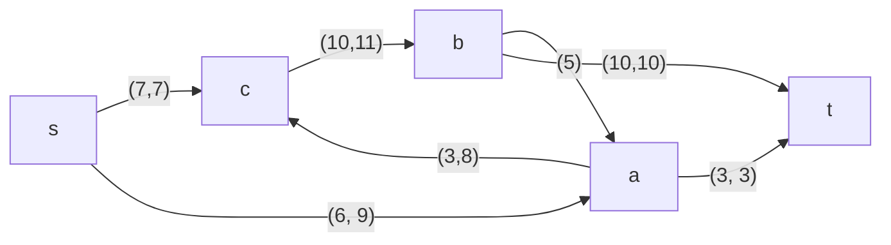
Из остаточной сети удаляем дугу (t, b), поскольку ее вес стал равен нулю:
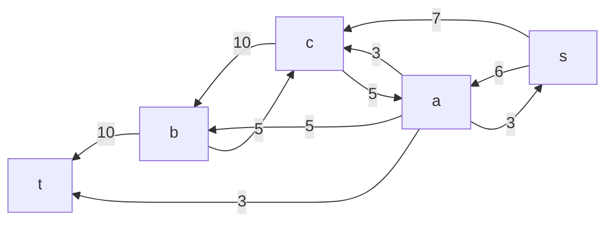
5. **Проверим значение максимального потока перебором всех разрезов сети**
Разрез сети - разбиение множества вершин на два подмножества V1 и V2, где во множество V1 входит источник, а в V2 входит сток.

Пропускная способность разреза - сумма пропускной способности дуг, начинающихся в вершинах из множества V1 и оканчивающихся в вершинах из V2.

Для сети из _n_ вершин существует 2n - 2 различных разрезов, так как две вершины из множества (источник и сток) "зафиксированы" в V1 и V2, остальные вершины можно различными способами распределять между множествами V1 и V2.

Для сети из 5 вершин нужно найти 25 - 2 = 23 = 8 разрезов. 

| № | V1                   | V2 | Пропускная способность разреза |
|---|:--------------------------------|:--------------|:------------------------------:|
| 1 | s                               | a, b, c, t    |           9 + 7 = 16           |
|   | **s + одна вершина из a, b, c** |               |                                |
| 2 | s, a                            | b, c, t       |      7 + 5 + 8 + 3  = 23       |
| 3 | s, b                            | a, c, t       |      9 + 7 + 5 + 10 = 31       |
| 4 | s, c                            | a, b, t       |          9 + 11 = 20           |
|   | **s + пара вершин из a, b, c**  |               |                                |
| 5 | s, a, b                         | c, t          |      7 + 8 + 3 + 10 = 28       |
| 6 | s, a, c                         | b, t          |          3 + 11  = 14          |
| 7 | s, b, c                         | a, t          |        9 + 5 + 10 = 24         |
|   | **s + три вершины из a, b, c**  |               |                                |
| 8 | s, a, b, c                      | t             |          3 + 10 = 13           |

Минимальная пропускная способность разреза равна 13 ( {s, a, b, c} / {t} ), что совпадает с найденной величиной максимального потока в сети.
**Алгоритм завершил свою работу, поскольку в остаточной сети больше нет увеличивающих путей. Найденный поток величины 13 является максимальным.**

