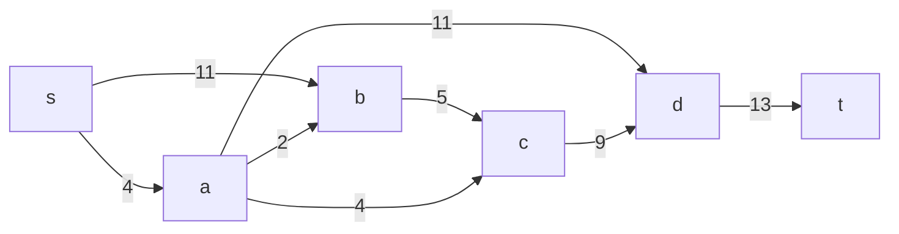
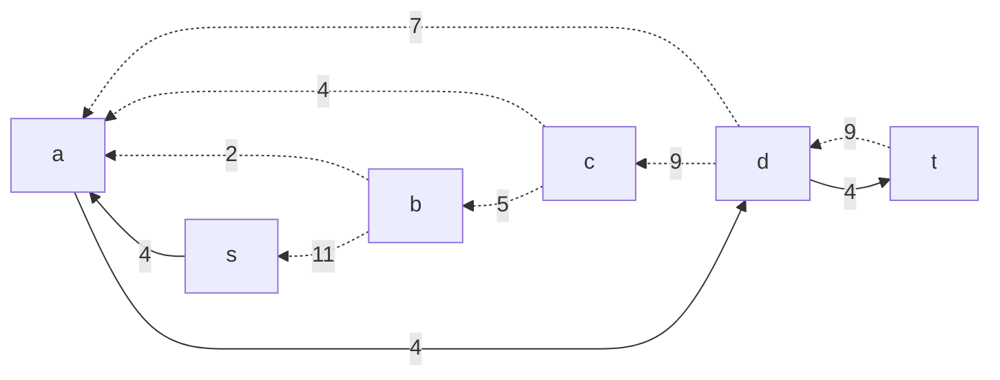
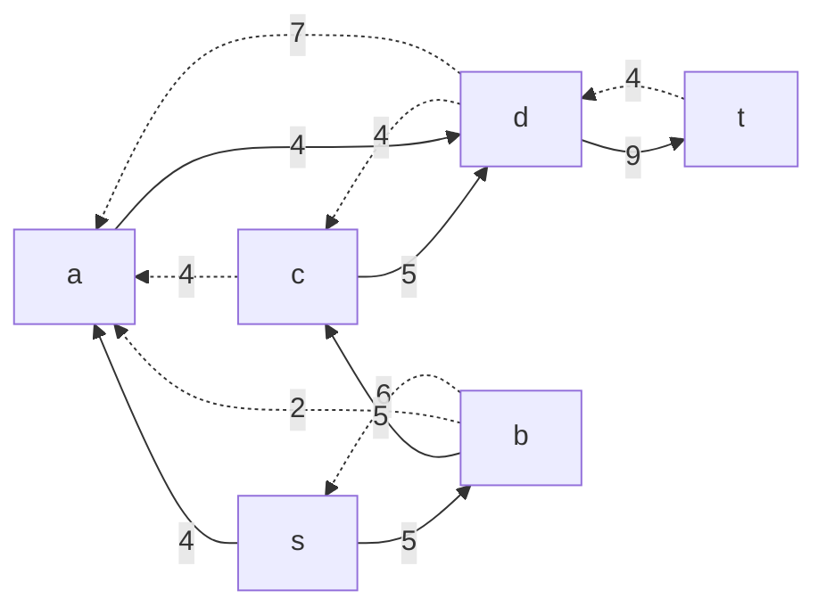
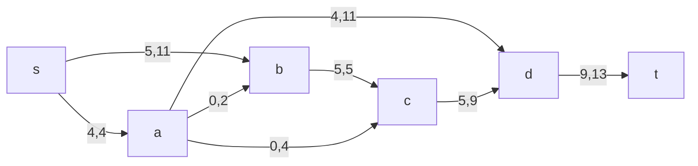
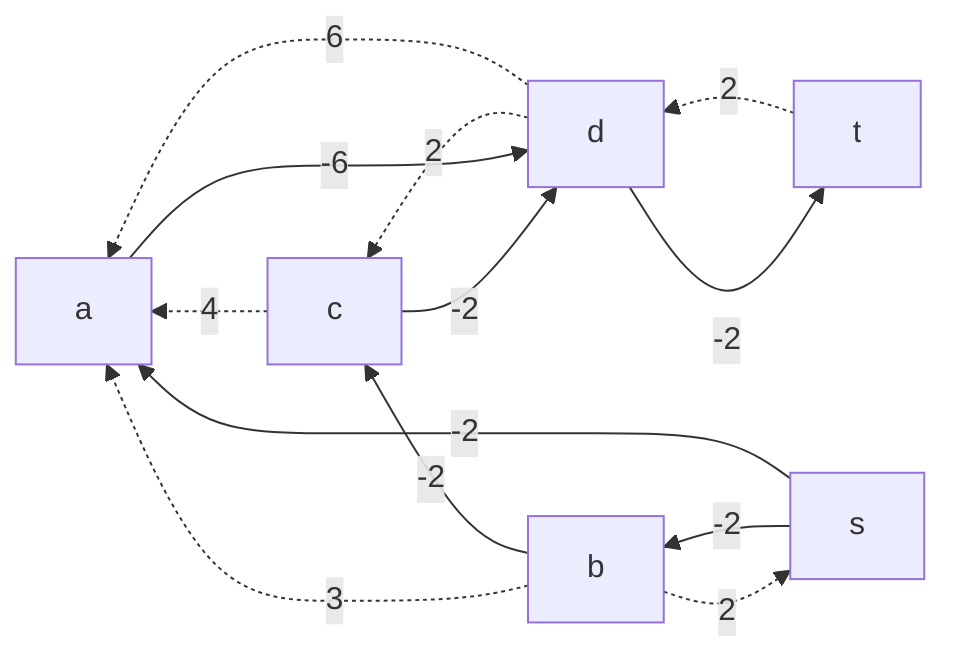

## Постановка задачи
1. Дана сеть (взвешенный ориентированный граф) с источником s и стоком t.
2. Для каждой дуги определена пропускная способность и стоимость транспортировки.
3. Необходимо найти для указанной сети максимальный поток минимальной стоимости. 

## Решение задачи на поиск в сети максимального потока минимальной стоимости

Пропускная способность дуг сети и стоимость транспортировки указана в таблице.

### Вариант 8:

| Дуги                      | sa | sb | bc | ab | ac | ad | cd | dt |
|:--------------------------|:--:|:--:|:--:|:--:|:--:|:--:|:--:|:--:|
| Пропускная способность    | 4  | 11 | 5  | 2  | 4  | 11 | 9  | 13 |
| Стоимость транспортировки | 2  | 2  | 2  | 3  | 4  | 6  | 2  | 2  |

### 1. Построим сеть с источником **s**, стоком **t** и указанными пропускными способностями дуг для поиска максимального потока.

Укажем начальный поток величиной 4: **s -> a -> d -> t**. Построим соответствующую остаточную сеть.

### 2. Проведем поиск увеличивающего пути в остаточной сети
В остаточной сети найден увеличивающий путь t -> d -> с -> b -> s. Минимальный вес дуг на этом пути равен 5.

Уменьшим вес дуг на найденном пути, дуги для которых вес стал нулевым удалим из остаточной сети.

### 3. Продолжим поиск увеличивающего пути в остаточной сети

В остаточной сети не найдено увеличивающих путей, следовательно, алгоритм завершил работу и найденный поток величиной 9 является максимальным для данной сети.

### 4. Рассчитаем стоимость полученного максимального потока.

| Дуги                                          | sa | sb | bc | ab | ac | ad | cd | dt | Итого  |
|:----------------------------------------------|:--:|:--:|:--:|:--:|:--:|:--:|:--:|:--:|:------:|
| Пропускная способность p(e)                   | 4  | 11  | 5  | 2  | 4  | 11  | 9 | 13 |        |
| Локальный поток f(e)                          | 4  | 5  | 5  | 0  | 0  | 4  | 5 | 9 |        |
| Стоимость транспортировки единицы потока c(e) | 2  | 2  | 2  | 3  | 4  | 6  | 2  | 2  |        |
| Суммарная стоимость f(e)*c(e)                 | 8 | 10 | 10  | 0  | 0 | 24  | 10 | 18 | **80** |

Стоимость полученного потока составляет 80. 

### 5. Попробуем уменьшить стоимость потока для чего построим остаточную сеть.
Для каждого ребра остаточной сети укажем стоимость транспортировки единицы потока.

В остаточной сети отсутствуют циклы отрицательной стоимости, следовательно, стоимость потока минимальна.

### Ответ:
Максимальный поток в сети равен 9, минимальная стоимость потока 80, она реализуется следующим локальными потоками:

