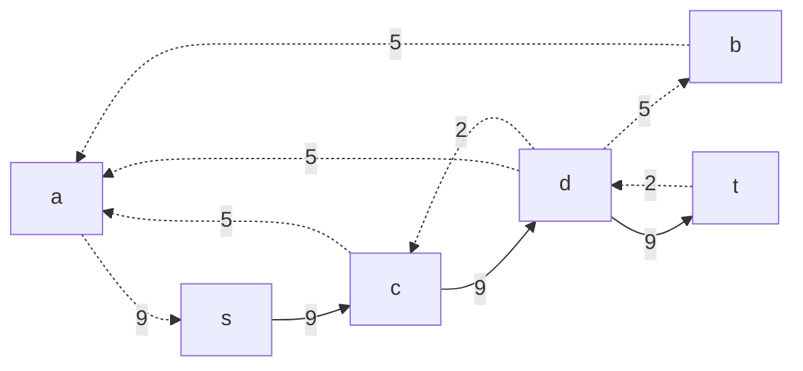
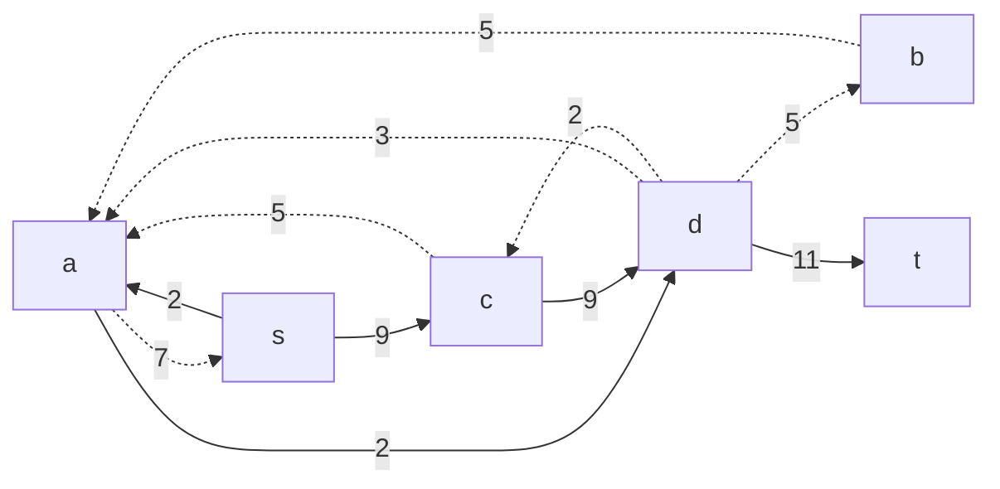
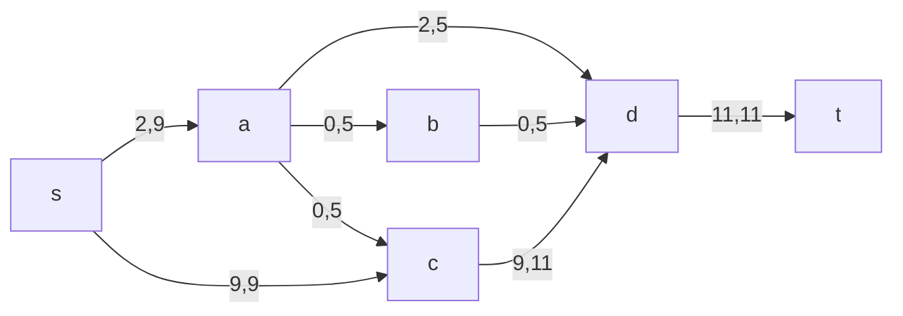
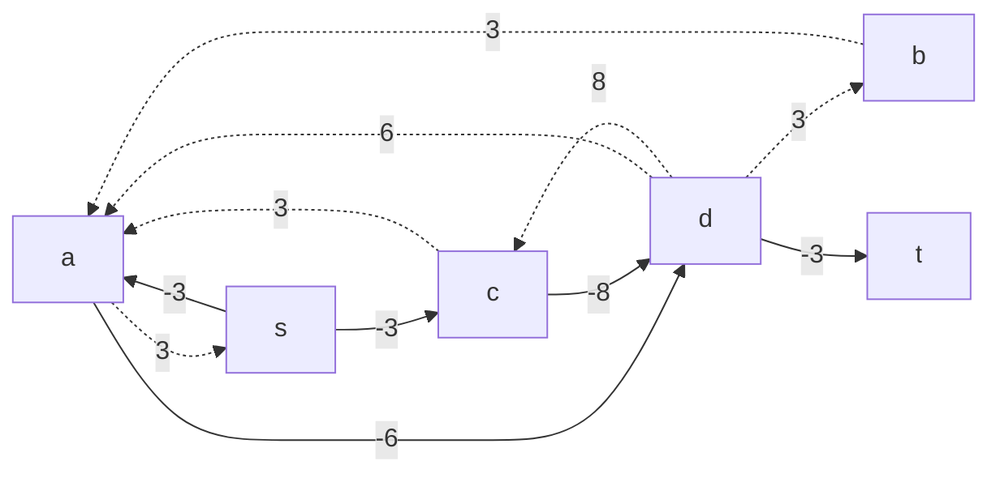
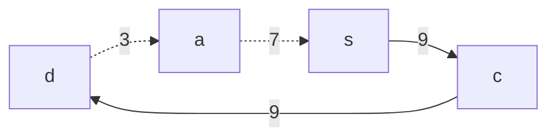
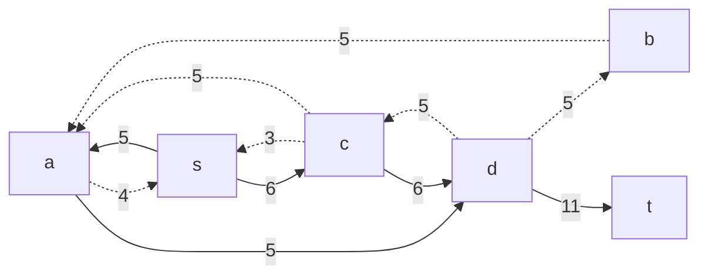
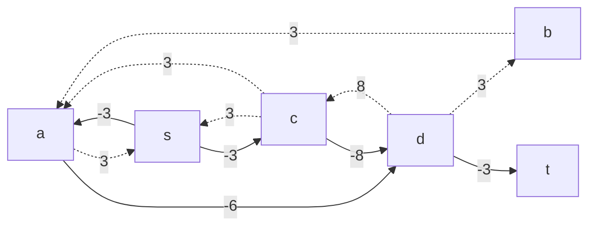
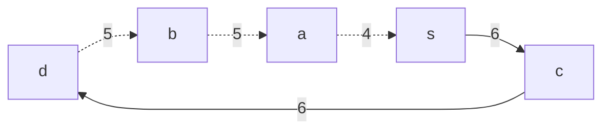
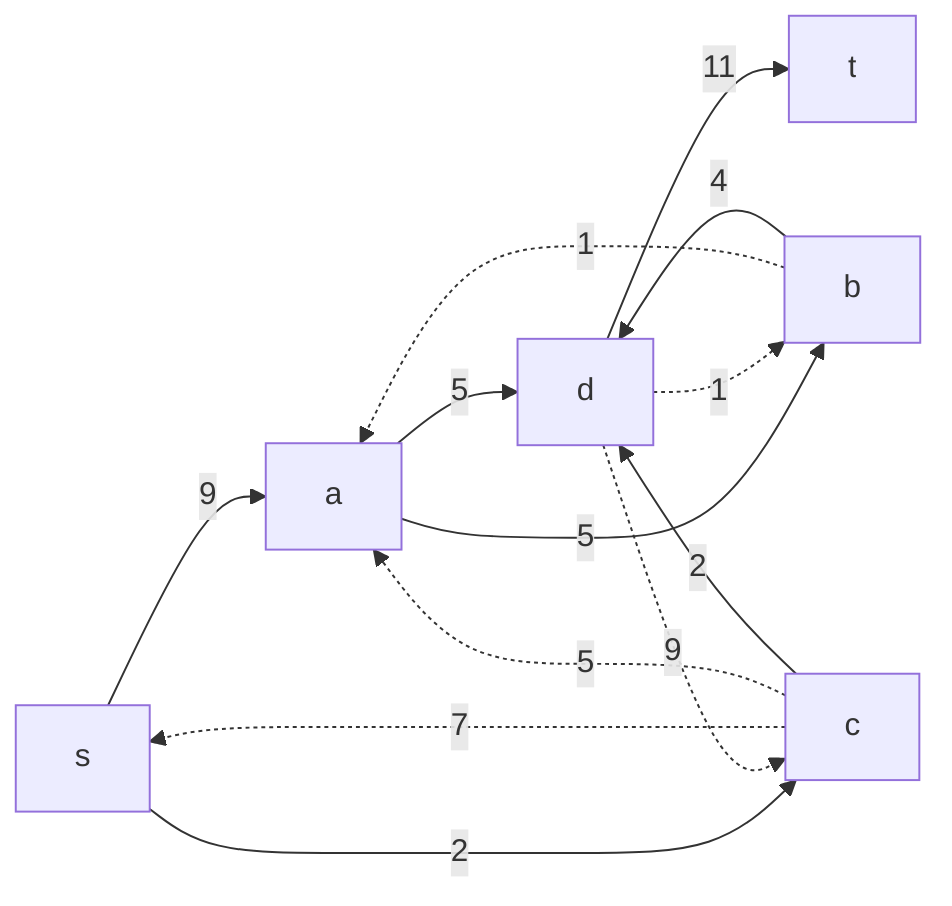
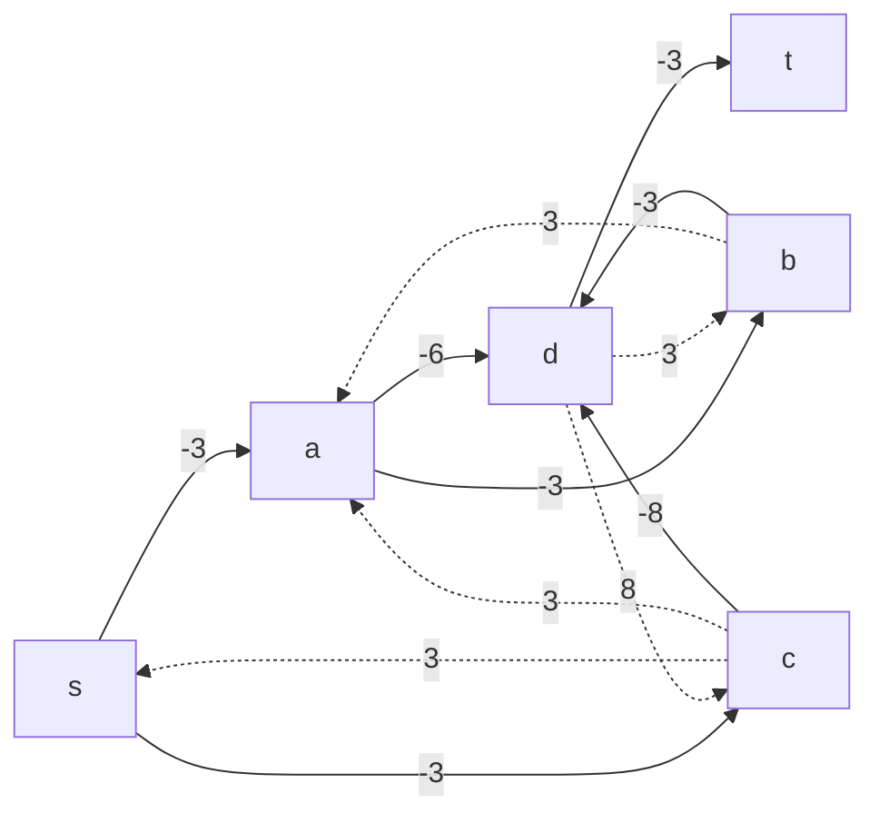

# Задание №15
# Задача о максимальном потоке минимальной стоимости.
## Постановка задачи
1.  Дана сеть (взвешенный ориентированный граф) с источником s и стоком t.
2.  Для каждой дуги определена пропускная способность и стоимость транспортировки.
3.  Необходимо найти для указанной сети максимальный поток минимальной стоимости.

## Решение

### Вариант 6:

Пропускная способность дуг сети и стоимость транспортировки указана в таблице.

| Дуги                      | sa | sc | ab | ad | ac | cd | bd | dt |
|:--------------------------|:--:|:--:|:--:|:--:|:--:|:--:|:--:|:--:|
| Пропускная способность    | 9  | 9  | 5  | 5  | 5  | 11 | 5  | 11 |
| Стоимость транспортировки | 3  | 3  | 3  | 6  | 3  | 8  | 3  | 3  |

### 1. Построим сеть с источником **s**, стоком **t** и указанными пропускными способностями дуг для поиска максимального потока.

Найдем начальный поток:

Пропускная способность F=9.
### 2. Построим остаточную сеть, соответствующую взятому на 1 шаге потоку.

### 3. В остаточной сети ищем увеличивающий путь из t в s.
Возьмем путь: 

Минимальный вес дуги равен 2. Далее необходимо: 
а) уменьшить веса дуг t->d, d->a, a->s на 2;  
б) увеличить веса дуг s->a, a->d, d->t на 2.  
Таким образом, новая пропускная способность F=9+2=11. Получаем новую остаточную сеть.

В последней полученной остаточной сети найти увеличивающий путь из t в s не представляется возможным. Cледовательно, алгоритм завершил работу и найденный поток величиной 11 является максимальным для данной сети.

### 4.  Рассчитаем стоимость полученного максимального потока.

| Дуги                                          | sa | sc | ab | ad | ac | cd | bd | dt | Итог |
|:----------------------------------------------|:--:|:--:|:--:|:--:|:--:|:--:|:--:|:--:|:----:|
| Пропускная способность p(e)                   | 9  | 9  | 5  | 5  | 5  |11  |  5 | 11  |
| Локальный поток f(e)                          | 2  | 9  | 0  | 2  | 0  | 9  | 0  | 11  |
| Стоимость транспортировки единицы потока c(e) | 3  | 3  | 3  | 6  | 3  | 8  | 3  | 3   |
| Суммарная стоимость f(e)*c(e)                 | 6  | 27 | 0  | 12 | 0  | 72 | 0  | 33   |**150**|

Стоимость полученного потока составляет 150. 

### 5. Минимизируем стоимость максимального потока посредством поиска циклов отрицательной стоимости.
Построим остаточную сеть стоимости

В остаточной сети найден ориентированный цикл отрицательной стоимости d -> a -> s -> c -> d (6 + 3 - 3 - 8 = -2 < 0).
Перестроим потоки в сети:

Минимальный вес дуги равен 3. Далее необходимо: 
а) уменьшить веса дуг d->a, a->s, s->c, c->d на 3;  
б) увеличить веса дуг d->c, c->s, s->a, s->d на 3. 

Получаем новую остаточную сеть:

Построим новую остаточную сеть стоимости:

### 6. Проведем повторный поиск цикла отрицательной стоимости в остаточной сети.

В остаточной сети найден ориентированный цикл отрицательной стоимости d -> b -> a -> s -> c -> d (3 + 3 + 3 - 3 - 8 = -2 < 0).
Перестроим потоки в сети:

Минимальный вес дуги равен 4. Далее необходимо: 
а) уменьшить веса дуг d->b, b->a, a->s, s->c, c->d на 4;  
б) увеличить веса дуг d->c, c->s, s->a, a->b, b->d на 4. 

Получаем новую остаточную сеть:

Построим новую остаточную сеть стоимости:

В остаточной сети отсутствуют циклы отрицательной стоимости, следовательно, стоимость потока минимальна.
### 7. Рассчитаем стоимость полученного максимального потока.

| Дуги                                          | sa | sc | ab | ad | ac | cd | bd | dt | Итог |
|:----------------------------------------------|:--:|:--:|:--:|:--:|:--:|:--:|:--:|:--:|:----:|
| Пропускная способность p(e)                   | 9  | 9  | 5  | 5  | 5  |11  |  5 | 11  |
| Локальный поток f(e)                          | 9  | 2  | 4  | 5  | 0  | 2  | 4  | 11  |
| Стоимость транспортировки единицы потока c(e) | 3  | 3  | 3  | 6  | 3  | 8  | 3  | 3   |
| Суммарная стоимость f(e)*c(e)                 | 27 | 6  | 12 | 30 | 0  | 16 | 12 | 33   |**136**|

Стоимость полученного потока составляет 136.

### Ответ:
Максимальный поток в сети равен 11, минимальная стоимость потока 136, она реализуется следующим локальными потоками:

