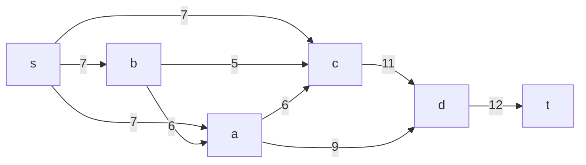
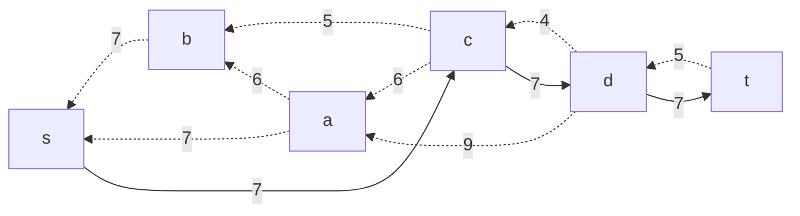
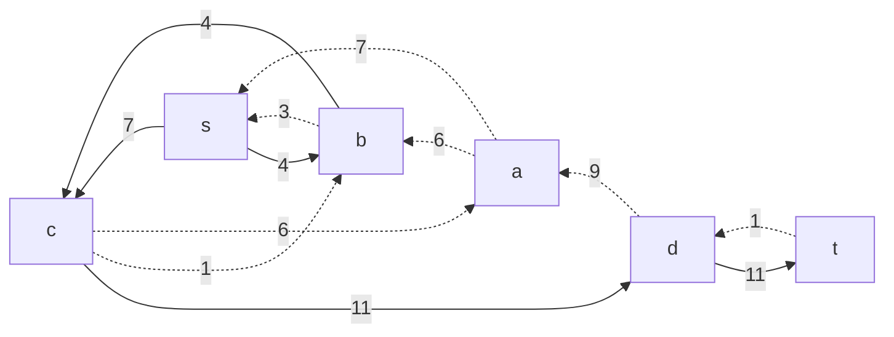
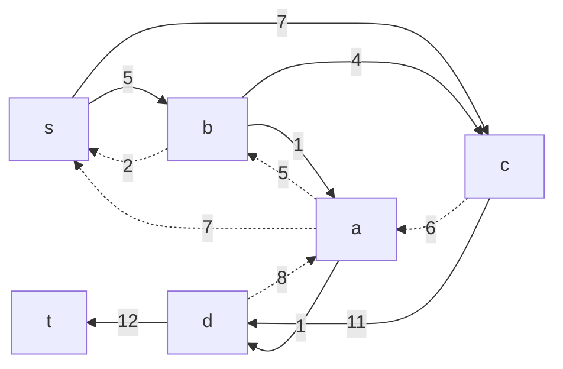
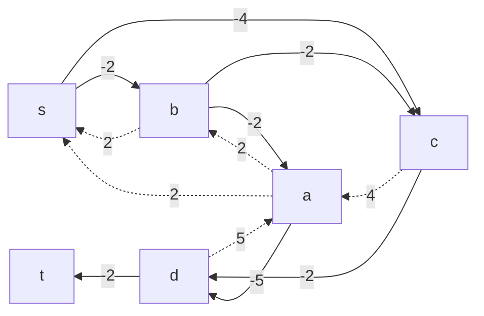
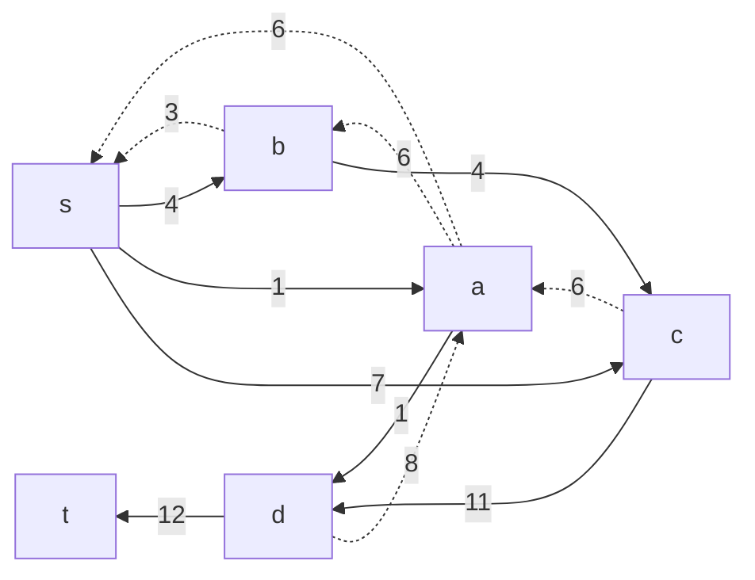
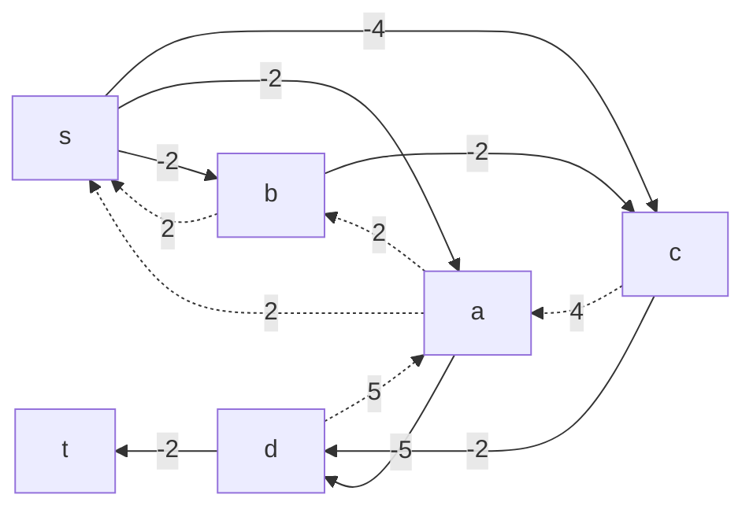
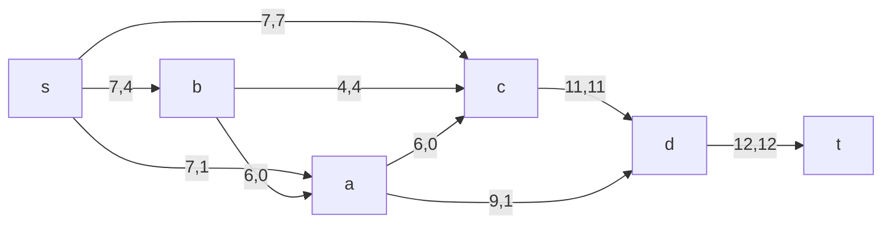

### Вариант 4:

|          Дуги          | sa | sb | sc | ba | bc | cd | ac | ad | dt |
|:----------------------:|:--:|:--:|----|:--:|:--:|:--:|:--:|:--:|:--:|
| Пропускная способность | 7  | 7  | 7  | 6  | 5  | 11 | 6  | 9  | 12 |
| Стоимость транспортировки | 2  | 2  | 4  | 2  | 2  | 2  | 4  | 5  | 2  |

### 1. Построим сеть с источником **s**, стоком **t** и указанными пропускными способностями дуг для поиска максимального потока.

Укажем начальный поток величиной 7 s -> с -> d -> t. Построим соответствующую остаточную сеть. 

### 2. Проведем поиск увеличивающего пути в остаточной сети
В остаточной сети найден увеличивающий путь t -> d -> с -> b -> s. Минимальный вес дуг на этом пути равен 4.

Уменьшим вес дуг на найденном пути, дуги для которых вес стал нулевым удалим из остаточной сети.

### 3. Продолжим поиск увеличивающего пути в остаточной сети
В остаточной сети найден увеличивающий путь t -> d -> a -> b -> s. Минимальный вес дуг на этом пути равен 1.

Уменьшим вес дуг на найденном пути, дуги для которых вес стал нулевым удалим из остаточной сети.

### 4. Продолжим поиск увеличивающего пути в остаточной сети
#### В остаточной сети не найдено увеличивающих путей, следовательно, алгоритм завершил работу и найденный поток величиной 12 является максимальным для данной сети.

### 4. Рассчитаем стоимость полученного максимального потока.

Для каждого ребра остаточной сети укажем стоимость транспортировки единицы потока.

|           Дуги            | sa | sb | sc | ba | bc | cd | ac | ad | dt | Итог |
|:-------------------------:|:--:|:--:|----|:--:|:--:|:--:|:--:|:--:|:--:|:----:|
|  Пропускная способность   | 7  | 7  | 7  | 6  | 4  | 11 | 4  | 9  | 12 | 
|      Локальный поток      | 0  | 5  | 7  | 1  | 4  | 11 | 0  | 1  | 12 |
| Стоимость транспортировки | 2  | 2  | 4  | 2  | 2  | 2  | 4  | 5  | 2  |
|    Суммарная стоимость    | 0  | 10 | 28 | 2  | 8  | 22 | 0  | 5  | 24 |  99  |

#### Стоимость полученного потока составляет 99

### 5. Пробуем уменьшить стоимость потока, для чего строим остаточную сеть
Для каждого ребра остаточной сети укажем стоимость транспортировки единицы потока.

#### В остаточной сети найден ориентированный цикл отрицательной стоимости s -> b -> a -> s (-2 -2 +2 = -2).

#### Найдем минимальный вес ребра в указанном цикле, изображенном в остаточной сети с указанием величины потока.

#### Минимальный вес ребра в цикле 1.
#### Удалим найденный цикл - уменьшим на 1 вес всех ребер, входящих в цикл.

### Повторяем 5 шаг. Пробуем уменьшить стоимость потока, для чего строим остаточную сеть.

#### Скорректируем остаточную сеть с указанием стоимости транспортировки единицы потока.

#### В остаточной сети не найден ориентированный цикл с отрицательной стоимостью.

|           Дуги            | sa | sb | sc | ba | bc | cd | ac | ad | dt | Итог |
|:-------------------------:|:--:|:--:|----|:--:|:--:|:--:|:--:|:--:|:--:|:----:|
|  Пропускная способность   | 7  | 7  | 7  | 6  | 4  | 11 | 6  | 9  | 12 | 
|      Локальный поток      | 1  | 4  | 7  | 0  | 4  | 11 | 0  | 1  | 12 |
| Стоимость транспортировки | 2  | 2  | 4  | 2  | 2  | 2  | 4  | 5  | 2  |
|    Суммарная стоимость    | 2  | 8  | 28 | 0  | 8  | 22 | 0  | 5  | 24 |  97  |

### Ответ:
Стоимость максимального потока с минимальной стоимостью составляет 97.
