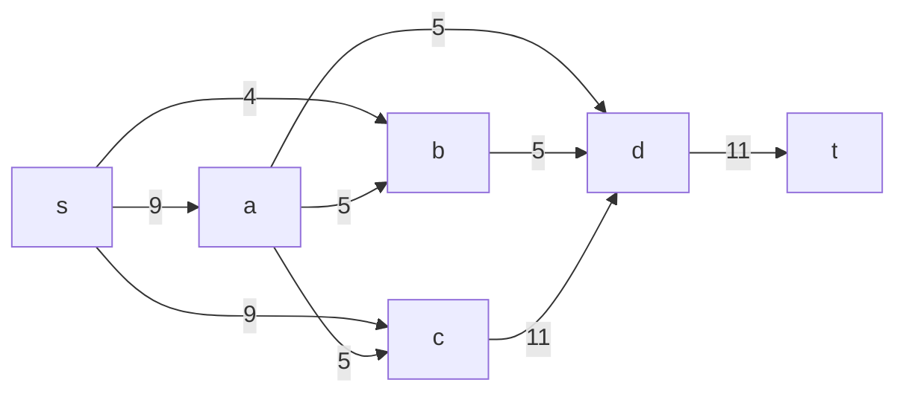
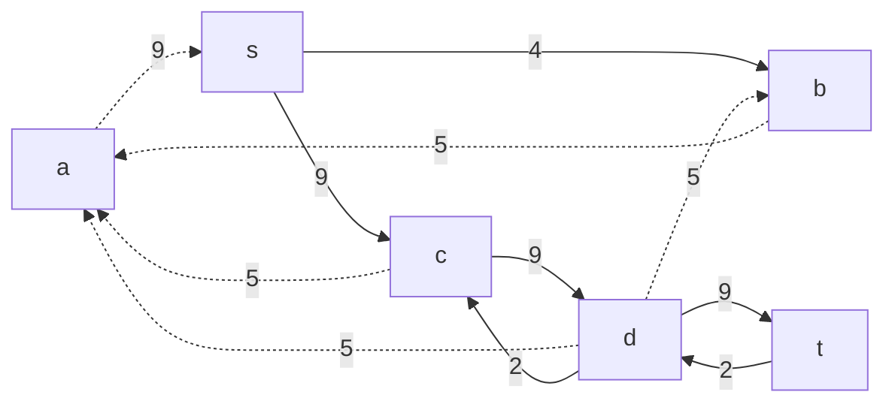
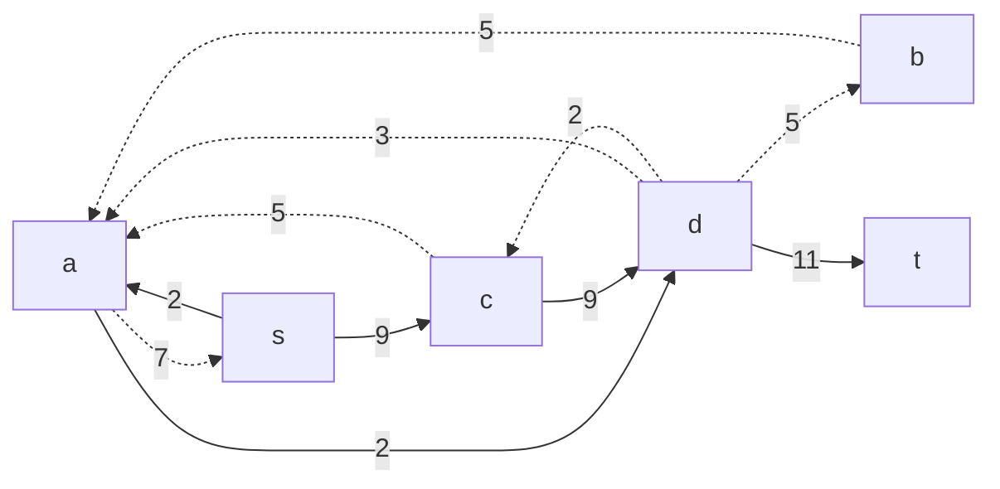
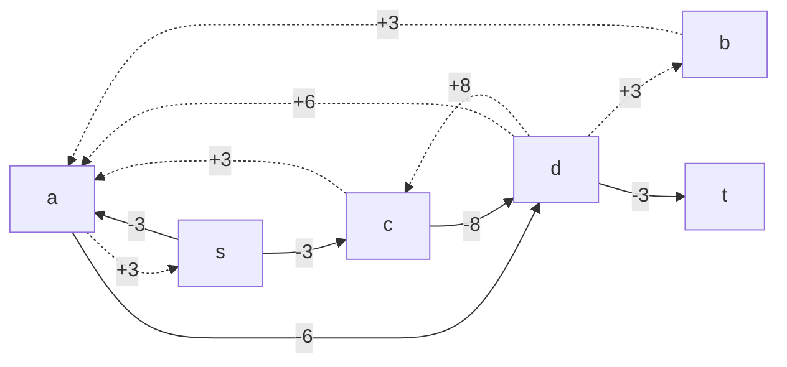
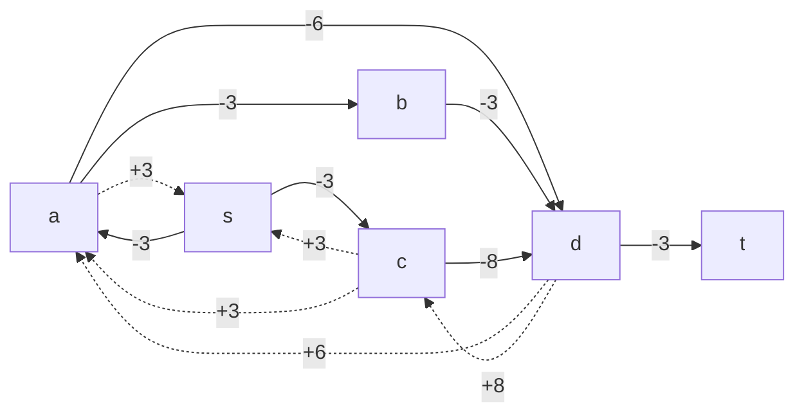
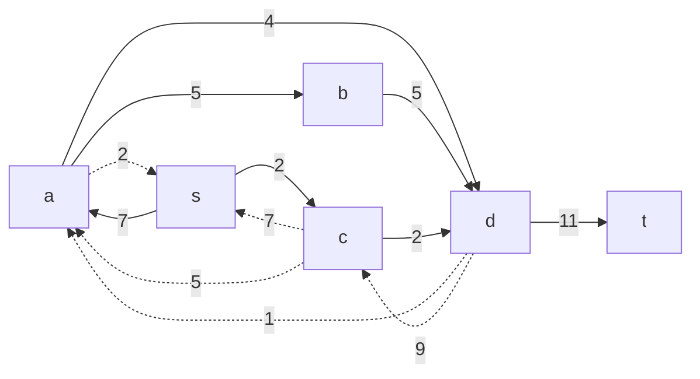
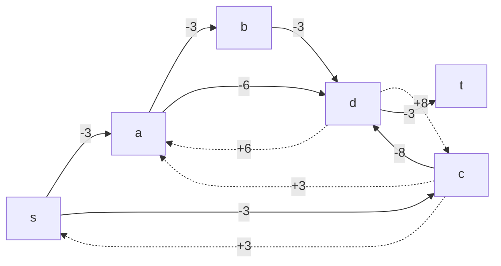
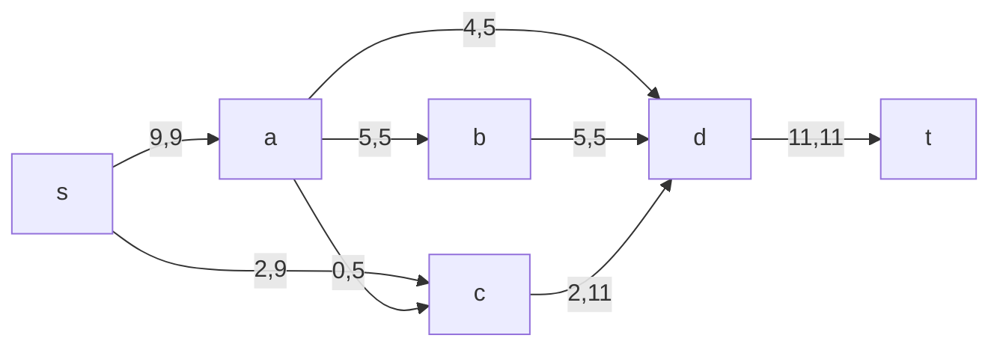

## Постановка задачи
1. Дана сеть (взвешенный ориентированный граф) с источником s и стоком t.
2. Для каждой дуги определена пропускная способность и стоимость транспортировки.
3. Необходимо найти для указанной сети максимальный поток минимальной стоимости. 

## Решение задачи на поиск в сети максимального потока минимальной стоимости

Пропускная способность дуг сети и стоимость транспортировки указана в таблице.

### Вариант 6:
| Дуги                      | sa | sc | ab | ad | ac | cd | bd | dt |
|:--------------------------|:--:|:--:|:--:|:--:|:--:|:--:|:--:|:--:|
| Пропускная способность    | 9  | 9  | 5  | 5  | 5  | 11 | 5  | 11 |
| Стоимость транспортировки | 3  | 3  | 3  | 6  | 3  | 8  | 3  | 3  |
### 1. Построим сеть с источником **s**, стоком **t** и указанными пропускными способностями дуг для поиска максимального потока.

Укажем начальный поток величиной 9 **s -> c -> d -> t**. Построим соответствующую остаточную сеть.

### 2. Проведем поиск увеличивающего пути в остаточной сети
В остаточной сети найден увеличивающий путь t -> d -> a -> s. Минимальный вес дуг на этом пути равен 2.

Уменьшим вес дуг на найденном пути, дуги для которых вес стал нулевым удалим из остаточной сети. 

В остаточной сети не найдено увеличивающих путей, следовательно, алгоритм завершил работу и найденный поток величиной 11 является максимальным для данной сети. 

### 3. Попробуем уменьшить стоимость потока для чего построим остаточную сеть.
Для каждого ребра остаточной сети укажем стоимость транспортировки единицы потока.

В остаточной сети найден ориентированный цикл отрицательной стоимости s -> c -> d -> b -> a -> s (- 3 - 8 + 3 + 3 + 3 = -2). 
Найдем минимальный вес ребра в указанном цикле, изображенном **в остаточной сети с указанием величины потока**. 

Минимальный вес ребра в цикле 5 - это неиспользованный резерв ребра d -> b.

Удалим найденный цикл - уменьшим на 5 вес всех ребер, входящих в цикл.

### 4. Проведем повторный поиск цикла отрицательной стоимости в остаточной сети.
Скорректируем остаточную сеть с указанием стоимости транспортировки единицы потока.

В остаточной сети найден ориентированный цикл отрицательной стоимости s -> c -> d -> a -> s (- 3 - 8 + 6 + 3 = -2). 

Найдем минимальный вес ребра в указанном цикле, изображенном **в остаточной сети с указанием величины потока**.  

Минимальный вес ребра в цикле 2 - это неиспользованный резерв ребер s -> a

Удалим найденный цикл - уменьшим на 2 вес всех ребер, входящих в цикл.

### 5. Проведем повторный поиск цикла отрицательной стоимости в остаточной сети.
Скорректируем остаточную сеть с указанием стоимости транспортировки единицы потока.

В остаточной сети отсутствуют циклы отрицательной стоимости, следовательно, стоимость потока минимальна.
### 6. Рассчитаем стоимость полученного максимального потока.
| Дуги                      | sa | sc | ab | ad | ac | cd | bd | dt | Итого |
|:--------------------------|:--:|:--:|:--:|:--:|:--:|:--:|:--:|:--:|:--:|
| Пропускная способность    | 9  | 9  | 5  | 5  | 5  | 11 | 5  | 11 | |
| Локальный поток f(e)                          | 9  | 2  | 5  | 4  | 0  | 2  | 5 | 11 | |
| Стоимость транспортировки | 3  | 3  | 3  | 6  | 3  | 8  | 3  | 3  | |
| Суммарная стоимость f(e)*c(e)                 | 27 | 6  | 15  | 24  | 0 | 16 | 15 | 33 | **136** |
Стоимость полученного потока составляет 136.
### Ответ:

Максимальный поток в сети равен 11, минимальная стоимость потока 136, она реализуется следующим локальными потоками:

