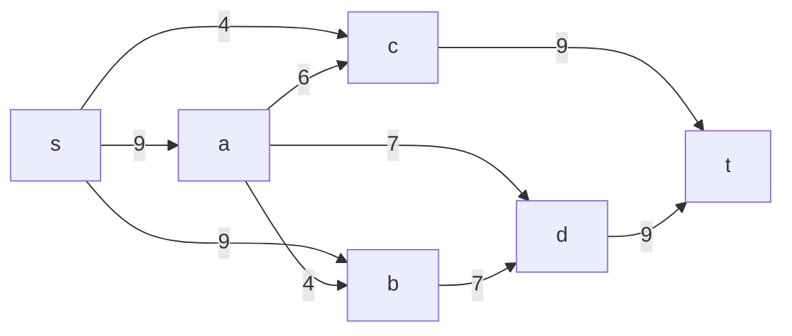
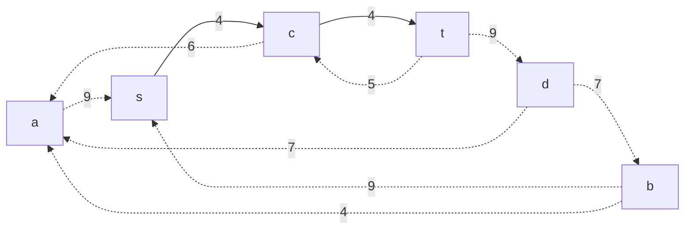
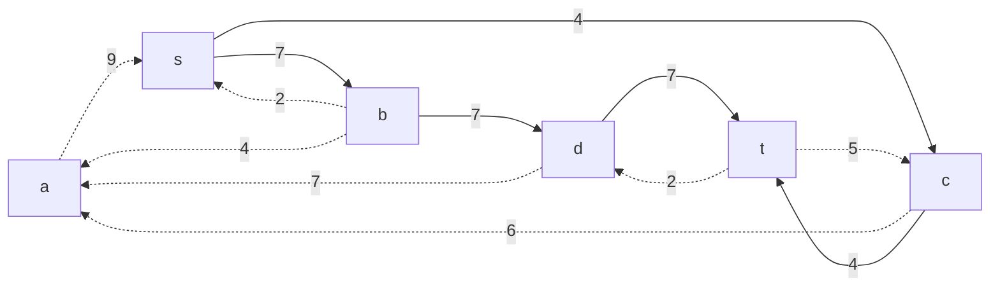
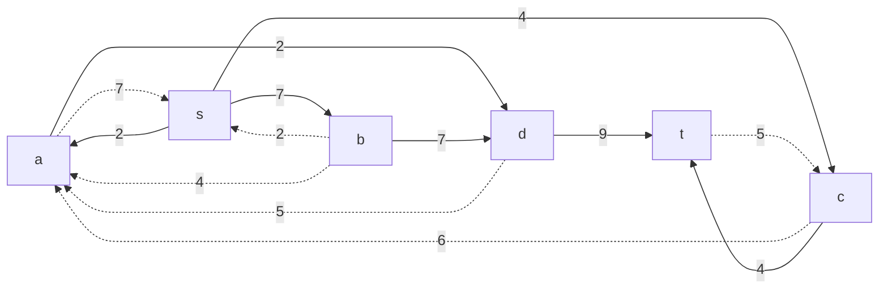
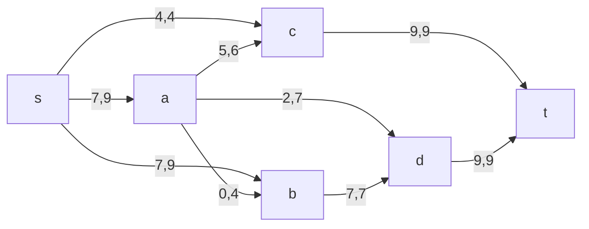
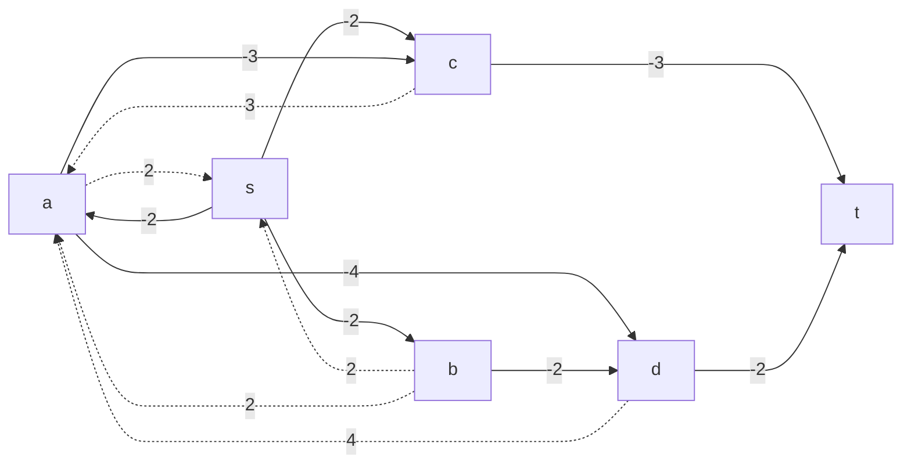

# Задание №15
# Задача о максимальном потоке минимальной стоимости.
Для каждого варианта представлены условия задачи, в соответствии с которыми необходимо: 
1. Построить сеть с указанием пропускной способности дуг.
2. Построить остаточную сеть.
3. Определить максимальный поток методом поиска увеличивающих путей в остаточной сети.
4. Минимизировать стоимость максимального потока посредством поиска циклов отрицательной стоимости.
5. Оформить решение задачи по шагам с подробными комментариями, таблицами и диаграммами.
6. В ответе указать максимальную величину потока, минимальную стоимость и сеть с указанием соответствующих локальных потоков.

## Постановка задачи
1. Дана сеть (взвешенный ориентированный граф) с источником s и стоком t.
2. Для каждой дуги определена пропускная способность и стоимость транспортировки.
3. Необходимо найти для указанной сети максимальный поток минимальной стоимости. 

### Вариант 5: 

| Дуги                      | sa | sb | sc | ac | ad | ab | bd | ct | dt |
|:--------------------------|:--:|:--:|:--:|:--:|:--:|:--:|:--:|:--:|:--:|
| Пропускная способность    | 9  | 9  | 4  | 6  | 7  | 4  | 7  | 9  | 9  |
| Стоимость транспортировки | 2  | 2  | 2  | 3  | 4  | 2  | 2  | 3  | 2  |

## Решение
### 1. Построим сеть с источником **s**, стоком **t** и указанными пропускными способностями дуг для поиска максимального потока.

Укажем начальный поток величиной 4 **s -> c -> t**. Построим соответствующую остаточную сеть.

### 2. Проведем поиск увеличивающего пути в остаточной сети
В остаточной сети найден увеличивающий путь t -> d -> b -> s. Минимальный вес дуг на этом пути равен 7.

Уменьшим вес дуг на найденном пути, дуги для которых вес стал нулевым удалим из остаточной сети.

### 3. Продолжим поиск увеличивающего пути в остаточной сети
В остаточной сети найден увеличивающий путь t -> d -> a -> s. Минимальный вес дуг на этом пути равен 2.

Уменьшим вес дуг на найденном пути, дуги для которых вес стал нулевым удалим из остаточной сети.

### 4. Продолжим поиск увеличивающего пути в остаточной сети
В остаточной сети найден увеличивающий путь t -> c -> a -> s. Минимальный вес дуг на этом пути равен 5.

Уменьшим вес дуг на найденном пути, дуги для которых вес стал нулевым удалим из остаточной сети.

### 5. Продолжим поиск увеличивающего пути в остаточной сети

В остаточной сети не найдено увеличивающих путей, следовательно, алгоритм завершил работу и найденный поток величиной 18 является максимальным для данной сети.

### 6. Рассчитаем стоимость полученного максимального потока.

| Дуги                                          | sa | sb | sc | ad | ac | ab | bd | ct | dt |  Итого  |
|:----------------------------------------------|:--:|:--:|:--:|:--:|:--:|:--:|:--:|:--:|:--:|:-------:|
| Пропускная способность p(e)                   | 9  | 9  | 4  | 7  | 6  | 4  | 7  | 9  | 9  |         |
| Локальный поток f(e)                          | 7  | 7  | 4  | 2  | 5  | 0  | 7  | 9  | 9  |         |
| Стоимость транспортировки единицы потока c(e) | 2  | 2  | 2  | 4  | 3  | 2  | 2  | 3  | 2  |         |
| Суммарная стоимость f(e)*c(e)                 | 14 | 14 | 8  | 8  | 15 | 0  | 14 | 27 | 18 | **118** |

Стоимость полученного потока составляет 118. 

### 7. Попробуем уменьшить стоимость потока для чего построим остаточную сеть.
Для каждого ребра остаточной сети укажем стоимость транспортировки единицы потока.

В остаточной сети отсутствуют циклы отрицательной стоимости, следовательно, стоимость потока минимальна.

### Ответ:
Максимальный поток в сети равен 18, минимальная стоимость потока 118, она реализуется следующим локальными потоками:

