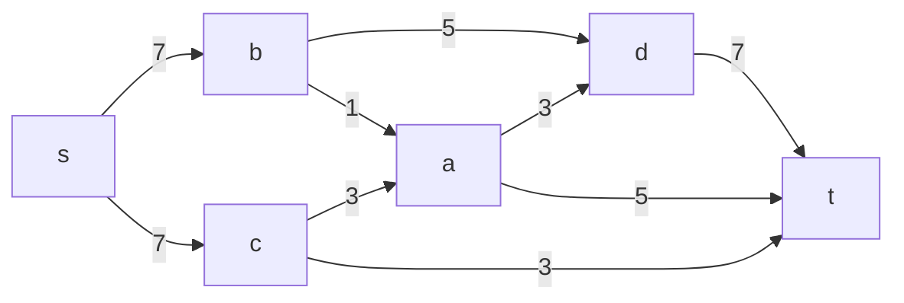
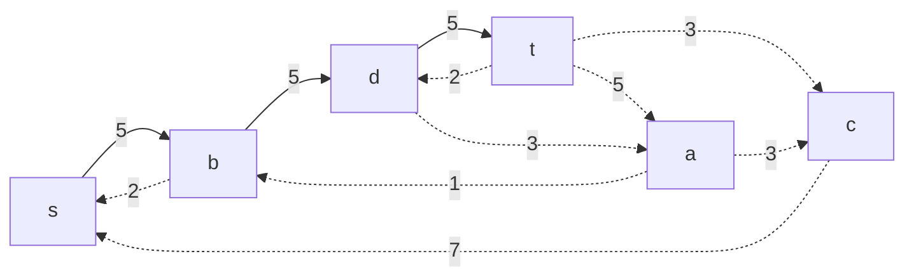
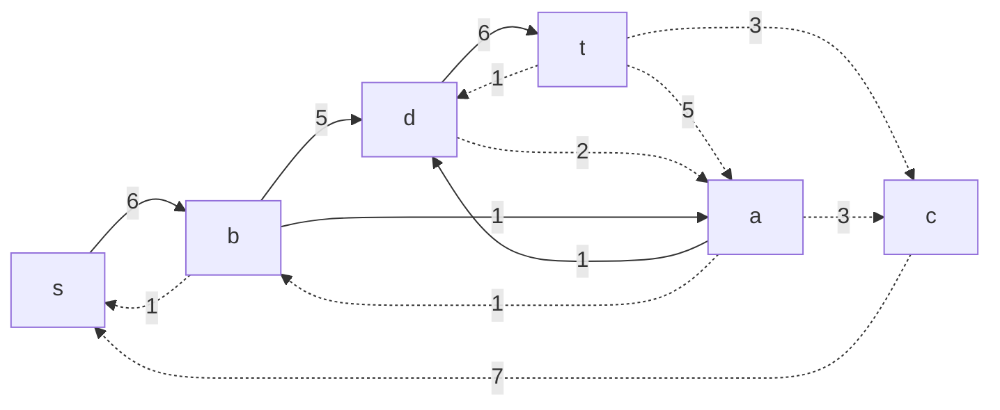
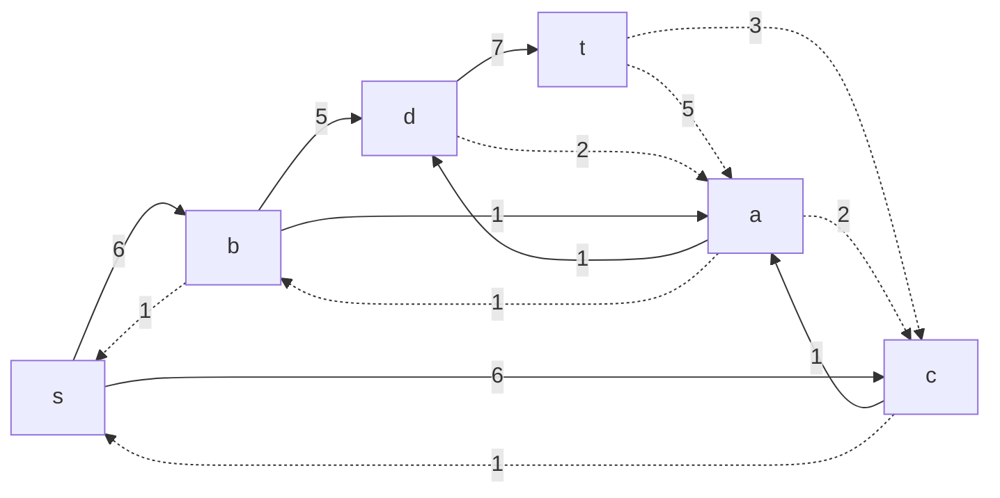
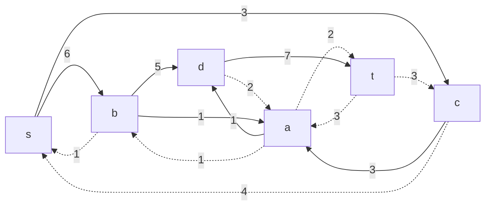
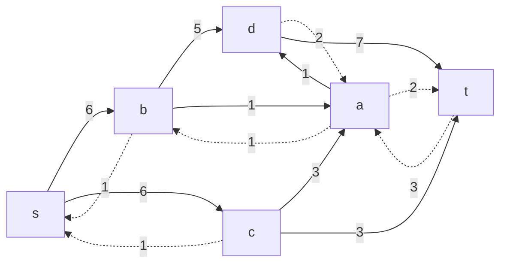
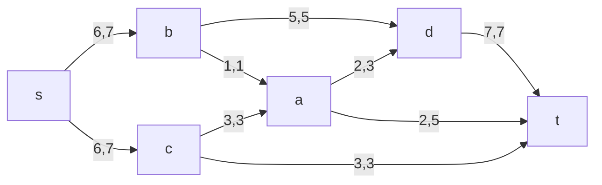
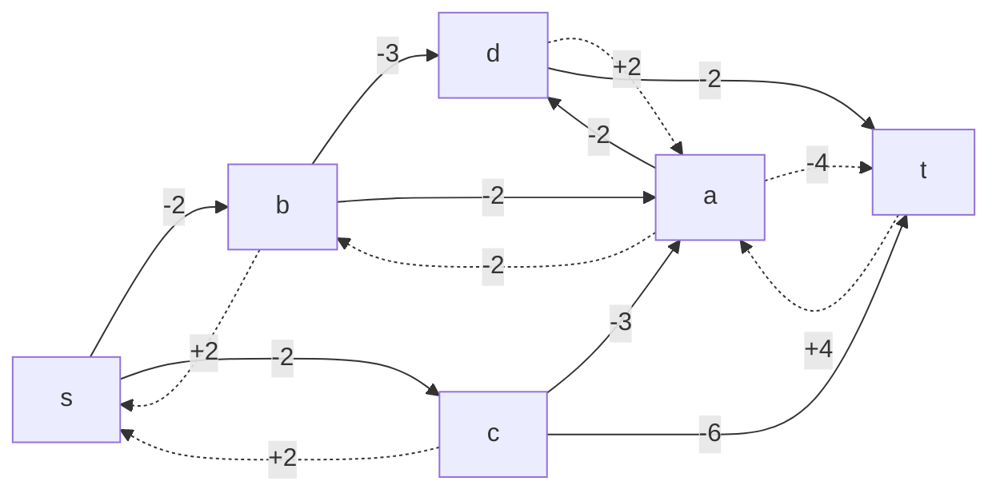

# Задача о максимальном потоке минимальной стоимости.
Для каждого варианта представлены условия задачи, в соответствии с которыми необходимо: 
1. Построить сеть с указанием пропускной способности дуг.
2. Построить остаточную сеть.
3. Определить максимальный поток методом поиска увеличивающих путей в остаточной сети.
4. Проверить величину максимального потока через поиск минимальной пропускной способности разрезов сети.
5. Оформить решение задачи по шагам с подробными комментариями, таблицами и диаграммами.
6. В ответе указать максимальную величину потока и сеть с указанием соответствующих локальных потоков.

## Условие задачи:

### Вариант 3:

|          Дуги          | sb | sc | ba | ad | bd | ca | ct | at | dt |
|:----------------------:|:--:|:--:|:--:|:--:|:--:|:--:|:--:|:--:|:--:|
| Пропускная способность | 7  | 7  | 1 | 3 | 5 | 3 | 3 | 5 | 7 |
| Стоимость транспортировки| 2 | 2 | 2 | 2 | 3 | 3 | 6 | 4  | 2 |

## Решение:

### I Шаг - Построим сеть с источником s, стоком t и указанными пропускными способностями дуг для поиска максимального потока:

Укажем начальный поток величины 5: **s ->b -> d-> t**. Построим соответствующую остаточную сеть:

### II Шаг - Проведем поиск увеличивающего пути в остаточной сети

В остаточной сети найден увеличивающий путь t -> d-> a -> b -> s. Минимальный вес дуг на этом пути равен 1.
Уменьшим вес дуг на найденном пути, a дуги, для которых вес стал нулевым, удалим из остаточной сети.

### III Шаг - Продолжим поиск увеличивающего пути в остаточной сети
В остаточной сети найден увеличивающий путь t -> d -> a -> c -> s. Минимальный вес дуг на этом пути равен 1.
Уменьшим вес дуг на найденном пути, дуги для которых вес стал нулевым удалим из остаточной сети.

### IV Шаг - Продолжим поиск увеличивающего пути в остаточной сети

В остаточной сети найден увеличивающий путь t -> a -> c -> s. Минимальный вес дуг на этом пути равен 2

### V Шаг - Продолжим поиск увеличивающего пути в остаточной сети
В остаточной сети найден увеличивающий путь t -> c -> s. Минимальный вес дуг на этом пути равен 3.
Уменьшаем вес дуг на найденном пути, а дуги, для которых вес стал нулевым, удалим из остаточной сети:

### VI Шаг - Продолжим поиск увеличивающего пути в остаточной сети.
В остаточной сети не найден увеличивающие пути, следовательно, алгоритм завершил свою работу и найденный поток величиной 12 являетс максимальным для данной сети:

### VII Шаг - Рассчитаем стоимость полученного максимального потока.
| | sb | sc | ba | ad | bd | ca | ct | at | dt | Итог|
|--|--|--|--|--|--|--|--|--|--|--|
| P(e) | 7 | 7 | 1 | 3 | 5 | 3 | 3 | 5 | 7 |               |
| F(e) | 6 | 6 | 1 | 2 | 5 | 3 | 3 | 2 | 7 | 
| C(e) | 2 | 2 | 2 | 2 | 3 | 3 | 6 | 4 | 2 | 
| F(e)*C(e) | 12 | 12 | 2 | 4 | 15 | 9 | 18 | 8 | 14 | **94** |
Стоимость полученного потока составляет 94                
### VIII Шаг - Попробуем уменьшить стоимость потока. Для этого построим остаточеую сеть.  
Для каждого ребра остаточной сети укажем стоимость транспортировки единицы потока:

В остаточной сети ориентированные циклы отрицательной стоимости не найдены. Следовательно, стоимасть потока минимальна.

## Ответ:
Максимальный поток в сети равен 12, минимальная стоимость потока составляет 94, она реализуется следующим локальными потоками:
