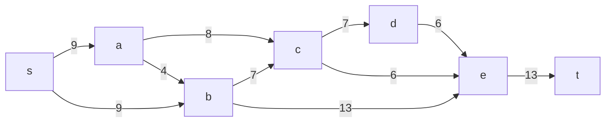

# Задача о максимальном потоке минимальной стоимости.
Для каждого варианта представлены условия задачи, в соответствии с которыми необходимо: 
1. Построить сеть с указанием пропускной способности дуг.
2. Построить остаточную сеть.
3. Определить максимальный поток методом поиска увеличивающих путей в остаточной сети.
4. Минимизировать стоимость максимального потока посредством поиска циклов отрицательной стоимости.
5. Оформить решение задачи по шагам с подробными комментариями, таблицами и диаграммами.
6. В ответе указать максимальную величину потока, минимальную стоимость и сеть с указанием соответствующих локальных потоков.

## Постановка задачи:
### Вариант 1:

| Дуги                      | sa | sb | ac | ab | bc | cd | de | ce | be | et |
|:--------------------------|:--:|:--:|:--:|:--:|:--:|:--:|:--:|:--:|:--:|:--:|
| Пропускная способность    | 9  | 9  | 8  | 4  | 7  | 7  | 6  | 6  | 13 | 13 |
| Стоимость транспортировки | 2  | 2  | 3  | 2  | 2  | 3  | 3  | 6  | 8  | 2  |

## Решение:

### I Шаг - Построим сеть с источником s, стоком t и указанными пропускными способностями дуг для поиска максимального потока.

