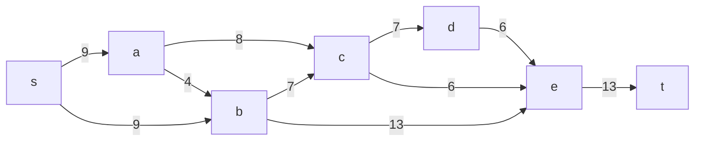
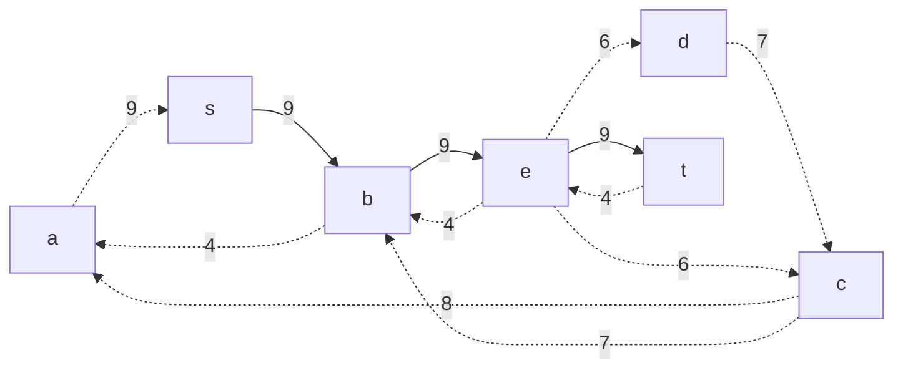
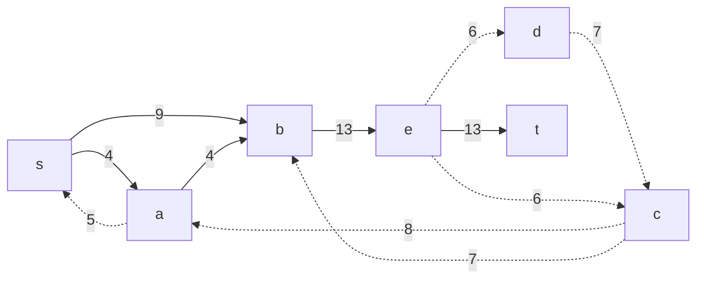
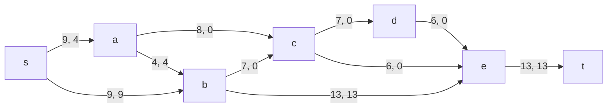
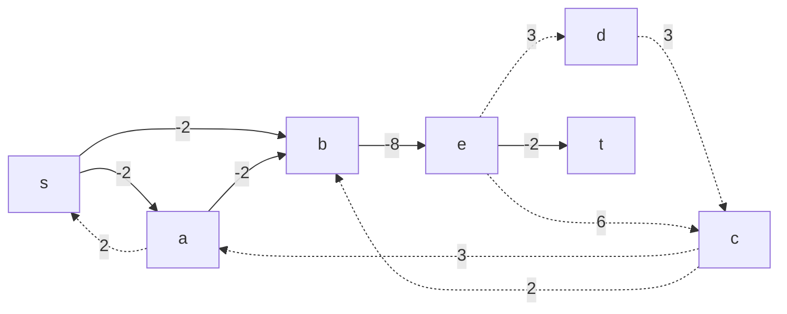
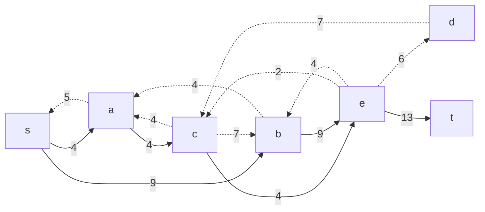
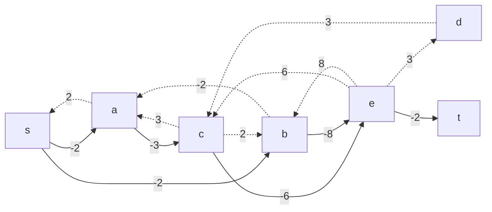

# Задача о максимальном потоке минимальной стоимости.
Для каждого варианта представлены условия задачи, в соответствии с которыми необходимо: 
1. Построить сеть с указанием пропускной способности дуг.
2. Построить остаточную сеть.
3. Определить максимальный поток методом поиска увеличивающих путей в остаточной сети.
4. Минимизировать стоимость максимального потока посредством поиска циклов отрицательной стоимости.
5. Оформить решение задачи по шагам с подробными комментариями, таблицами и диаграммами.
6. В ответе указать максимальную величину потока, минимальную стоимость и сеть с указанием соответствующих локальных потоков.

## Постановка задачи:
### Вариант 1:

| Дуги                      | sa | sb | ac | ab | bc | cd | de | ce | be | et |
|:--------------------------|:--:|:--:|:--:|:--:|:--:|:--:|:--:|:--:|:--:|:--:|
| Пропускная способность    | 9  | 9  | 8  | 4  | 7  | 7  | 6  | 6  | 13 | 13 |
| Стоимость транспортировки | 2  | 2  | 3  | 2  | 2  | 3  | 3  | 6  | 8  | 2  |

## Решение:

### I Шаг - Построим сеть с источником s, стоком t и указанными пропускными способностями дуг для поиска максимального потока.

#### Укажем начальный поток величиной 9 s -> b -> e -> t. Построим соответствующую остаточную сеть.

### II Шаг - проводим поиск увеличивающего пути
#### В остаточной сети найден увеличивающий путь t -> e -> b -> a -> s. Минимальный вес дуг на этом пути равен 4.

#### Уменьшим вес дуг на найденном пути, дуги для которых вес стал нулевым удалим из остаточной сети.

### III Шаг - Продолжаем поиск увеличивающего пути в остаточной сети

#### В остаточной сети не найдено увеличивающих путей, следовательно, алгоритм завершил работу и найденный поток величиной 13 является максимальным для данной сети.

### IV Шаг - Рассчитаем стоимость полученного максимального потока.

| Дуги                           | sa | sb | ac | ab | bc | cd | de | ce | be  | et  | Итого 
|:-------------------------------|:--:|:--:|:--:|:--:|:--:|:--:|:--:|:--:|:---:|:---:|:-----:|
| Пропускная способность p(e)    | 9  | 9  | 8  | 4  | 7  | 7  | 6  | 6  | 13  | 13  |       |
| Локальный поток f(e)           | 4  | 9  | 0  | 4  | 0  | 0  | 0  | 0  | 13  | 13  |       |
| Стоимость транспортировки c(e) | 2  | 2  | 3  | 2  | 2  | 3  | 3  | 6  |  8  |  2  |       |
| Суммарная стоимость f(e)*c(e)  | 8  | 18 | 0  | 8  | 0  | 0  | 0  | 0  | 104 | 26  |  164  |

#### Стоимость полученного потока составляет 164.

### V Шаг - пробуем уменьшить стоимость потока, для чего строим остаточную сеть
Для каждого ребра остаточной сети укажем стоимость транспортировки единицы потока.

#### В остаточной сети найден ориентированный цикл отрицательной стоимости s -> a -> b -> e -> c ->a -> s (-2 -2 -8 +6 +3+2= -1).

#### Найдем минимальный вес ребра в указанном цикле, изображенном в остаточной сети с указанием величины потока.

#### Минимальный вес ребра в цикле 4 - это ребро s -> a.
#### Удалим найденный цикл - уменьшим на 4 вес всех ребер, входящих в цикл.

### Повторим V Шаг - пробуем уменьшить стоимость потока, для чего строим остаточную сеть

#### Скорректируем остаточную сеть с указанием стоимости транспортировки единицы потока.

#### В остаточной сети не найден ориентированный цикл с отрицательной стоимостью.

### VI Шаг - рассчитываем стоимость полученного максимального потока.

| Дуги                           | sa | sb | ac | ab | bc | cd | de | ce | be | et  | Итого 
|:-------------------------------|:--:|:--:|:--:|:--:|:--:|:--:|:--:|:--:|:--:|:---:|:-----:|
| Пропускная способность p(e)    | 9  | 9  | 8  | 4  | 7  | 7  | 6  | 6  | 13 | 13  |       |
| Локальный поток f(e)           | 4  | 9  | 4  | 0  | 0  | 0  | 0  | 4  | 9  | 13  |       |
| Стоимость транспортировки c(e) | 2  | 2  | 3  | 2  | 2  | 3  | 3  | 6  | 8  |  2  |       |
| Суммарная стоимость f(e)*c(e)  | 8  | 18 | 12 | 0  | 0  | 0  | 0  | 24 | 72 | 26  |  164  |

#### Стоимость полученного потока составляет 160.