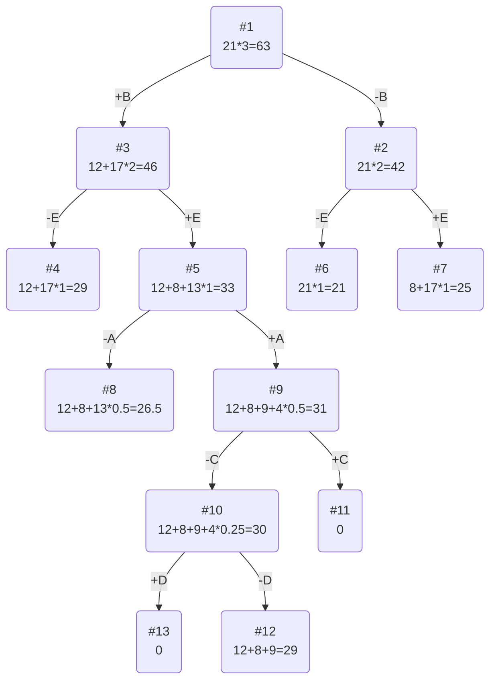

## Задание №19  
## Задача о рюкзаке (Knapsack problem)  
## Постановка задачи  
Задача о рюкзаке (англ. Knapsack problem) — дано N предметов, ni предмет имеет массу wi > 0 и стоимость pi > 0. Необходимо выбрать из этих предметов такой набор, чтобы суммарная масса не превосходила заданной величины W (вместимость рюкзака), а суммарная стоимость была максимальна.
## Условия задачи
### Вариант 1:  
  
| Предметы  | A | B  | C  | D  | E |  
|:----------|:-:|:--:|:--:|:--:|:-:|  
| Стоимость | 9 | 12 | 5  | 3  | 8 |  
| Вес       | 9 | 4  | 10 | 12 | 4 |  
  
Ограничение вместимости: 21

## Решение
### 1. Рассчитаем ценность каждого предмета
| Предметы  |  A  |  B  |  C  |  D  |  E  |
|:----------|:---:|:---:|:---:|:---:|:---:|
| Стоимость |  9  |  12 |  5  |  3  |  8  |  
| Вес       |  9  |  4  |  10 |  12 |  4  | 
| Ценность  |  1  |  3  | 1/2 | 1/4 |  2  |

### 2. Отсортируем предметы по убыванию ценности
| Предметы  |  B  |  E  |  A  |  C  |  D  |
|:----------|:---:|:---:|:---:|:---:|:---:|
| Стоимость |  12 |  8  |  9  |  5  |  3  |
| Вес       |  4  |  4  |  9  | 10  | 12  |
| Ценность  |  3  |  2  |  1  | 1/2 | 1/4 |

### 3. Рассчитаем оценку сверху для пустого рюкзака

Свободное место в рюкзаке: 21

Наибольшая ценность предмета: 3

Оценка сверху для пустого рюкзака: 21 * 3 = 63

### 4. Найдем решение задачи с использованием метода ветвей и границ

### Ответ
- Наибольшая стоимость предметов в рюкзаке 29.
- Набор предметов, обеспечивающих максимальную стоимость, B, E, A общим весом 17.
- Свободное место в рюкзаке 4.
