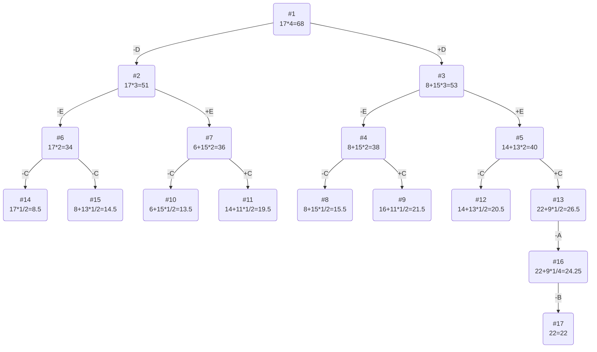

# Задача о рюкзаке (Knapsack problem)
Для каждого варианта представлены условия задачи, в соответствии с которыми необходимо: 
1. Решить задачу о рюкзаке с применением метода ветвей и границ.
2. Оформить решение задачи по шагам с подробными комментариями, таблицами и диаграммами.
3. В ответе указать:
   - максимально возможную стоимость предметов в рюкзаке,
   - набор предметов, обеспечивающих максимальную стоимость,
   - общий вес предметов в рюкзаке,
   - свободное место в рюкзаке.

### Вариант 8:

| Предметы  |  A  | B  | C | D | E |
|:----------|:---:|:--:|:-:|:-:|:-:|
| Стоимость |  5  | 3  | 8 | 8 | 6 |
| Вес       | 10  | 12 | 4 | 2 | 2 |

Ограничение вместимости: 17

# Решение
## Шаг I - Сначала нужно составить строчку ценности, в которой мы делим вес на стоимость предмета
### Получаем следующую таблицу с ценностями:

| Предметы  |  A  |  B  | C | D | E |
|:----------|:---:|:---:|:-:|:-:|:-:|
| Стоимость |  5  |  3  | 8 | 8 | 6 |
| Вес       | 10  | 12  | 4 | 2 | 2 |
| Ценность  | 1/2 | 1/4 | 2 | 4 | 3 |

## Шаг II - Отсортируем таблицу по убыванию ценности
### Получаем новую таблицу

| Предметы  | D | E | C |  A  |  B  |
|:----------|:-:|:-:|:-:|:---:|:---:|
| Стоимость | 8 | 6 | 8 |  5  |  3  |
| Вес       | 2 | 2 | 4 | 10  | 12  |
| Ценность  | 4 | 3 | 2 | 1/2 | 1/4 |

## Шаг III - Рассчитаем оценку сверху для пустого рюкзака
### Для этого необходимо свободное место в рюкзаке (17) умножить на наибольшую ценность предмета (4), тогда получим, что оценка сверху: 17*4 = 68
## Шаг IV - Решим задачу с помощью метода ветвей и границ
### Тогда получим следующее дерево

### Примерная логика решения
#### После сортировки по убыванию ценности, мы расматриваем вариант брать/не брать самый ценный предмет, после чего выбираем вариант с самой большой потенциальной стоимостью. Потенциальная стоимость рассчитывается как сумма уже взятых предметов плюс оставшееся место в рюкзаке умножить на ценность следующего предмета если таковой имеется. Алгоритм завершает работу, когда вариант с самой большой стоимотью не может быть продолжен.

### Ответ
- Наибольшая стоимость предметов в рюкзаке 22.
- Набор предметов, обеспечивающих максимальную стоимость: D C E, общим весом 8.
- Свободное место в рюкзаке 17-8=9.