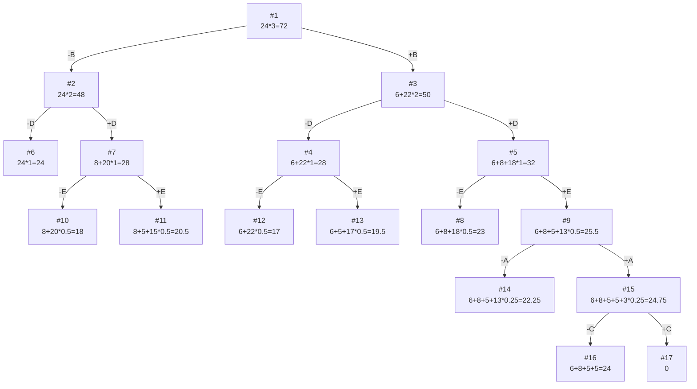


## Задание №19  
## Задача о рюкзаке (Knapsack problem)  
## Постановка задачи  
Задача о рюкзаке (англ. Knapsack problem) — дано N предметов, ni предмет имеет массу wi > 0 и стоимость pi > 0. Необходимо выбрать из этих предметов такой набор, чтобы суммарная масса не превосходила заданной величины W (вместимость рюкзака), а суммарная стоимость была максимальна.
## Условия задачи
### Вариант 9:  
  
| Предметы  |  A  | B  | C | D | E |
|:----------|:---:|:--:|:-:|:-:|:-:|
| Стоимость |  5  | 6  | 3 | 8 | 5 |
| Вес       | 10  | 2 | 12 | 4 | 5 |

Ограничение вместимости: 24

## Решение
### 1. Рассчитаем ценность каждого предмета
| Предметы  |  A  | B  | C | D | E |
|:----------|:---:|:--:|:-:|:-:|:-:|
| Стоимость |  5  | 6  | 3 | 8 | 5 |
| Вес       | 10  | 2 | 12 | 4 | 5 |
| Ценность  |  1/2  | 3 | 1/4 | 2 |  1  |

### 2. Отсортируем предметы по убыванию ценности
| Предметы  |  B  |  D  |  E  |  A  |  C  |
|:----------|:---:|:---:|:---:|:---:|:---:|
| Стоимость |  6 |  8  |  5  |  5  |  3  |
| Вес       |  2  |  4  |  5  | 10  | 12  |
| Ценность  |  3  |  2  |  1  | 1/2 | 1/4 |

### 3. Рассчитаем оценку сверху для пустого рюкзака

Свободное место в рюкзаке: 24

Наибольшая ценность предмета: 3

Оценка сверху для пустого рюкзака: 24 * 3 = 72

### 4. Найдем решение задачи с использованием метода ветвей и границ

### Ответ
- Наибольшая стоимость предметов в рюкзаке 24.
- Набор предметов, обеспечивающих максимальную стоимость, B, D, E, A общим весом 21.
- Свободное место в рюкзаке 3.
