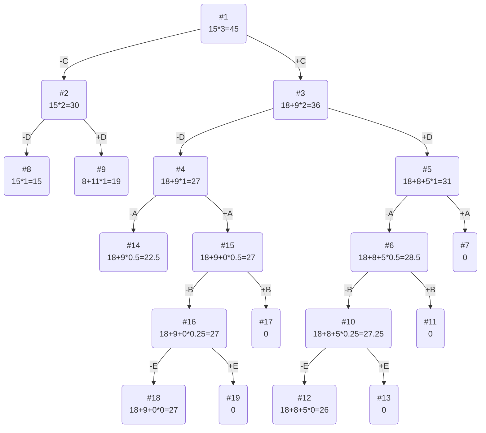

# Задача о рюкзаке (Knapsack problem)
Для каждого варианта представлены условия задачи, в соответствии с которыми необходимо: 
1. Решить задачу о рюкзаке с применением метода ветвей и границ.
2. Оформить решение задачи по шагам с подробными комментариями, таблицами и диаграммами.
3. В ответе указать:
   - максимально возможную стоимость предметов в рюкзаке,
   - набор предметов, обеспечивающих максимальную стоимость,
   - общий вес предметов в рюкзаке,
   - свободное место в рюкзаке.

## Условие задачи

### Вариант 7:

| Предметы  | A | B  | C  | D | E  |
|:----------|:-:|:--:|:--:|:-:|:--:|
| Стоимость | 9 | 5  | 18 | 8 | 3  |
| Вес       | 9 | 10 | 6  | 4 | 12 |

Ограничение вместимости: 15

# Решение

## Шаг I - Найдём ценность каждого предмета, для этого необходимо разделить стоимость каждого предмета на его вес

### Получаем следующую таблицу с ценностями:

| Предметы  | A |  B  | C  | D |  E  |
|:----------|:-:|:---:|:--:|:-:|:---:|
| Стоимость | 9 |  5  | 18 | 8 |  3  |
| Вес       | 9 | 10  | 6  | 4 | 12  |
| Ценность  | 1 | 1/2 | 3  | 2 | 1/4 |

## Шаг II - Отсортируем таблицу по убыванию ценности

### Получаем изменённую таблицу

| Предметы  | C  | D | A |  B  |  E  |
|:----------|:--:|:-:|:-:|:---:|:---:|
| Стоимость | 18 | 8 | 9 |  5  |  3  |
| Вес       | 6  | 4 | 9 | 10  | 12  |
| Ценность  | 3  | 2 | 1 | 1/2 | 1/4 |

## Шаг III - Рассчитаем оценку сверху для пустого рюкзака

### Для этого необходимо свободное место в рюкзаке (15) умножить на наибольшую ценность предмета (3), тогда получим, что оценка сверху: 15*3 = 45

## Шаг IV - Решим задачу с помощью метода ветвей и границ

### Тогда получим следующее дерево

### Ответ
- Наибольшая стоимость предметов в рюкзаке 27.
- Набор предметов, обеспечивающих максимальную стоимость, C, A, общим весом 15.
- Свободное место в рюкзаке 0.
