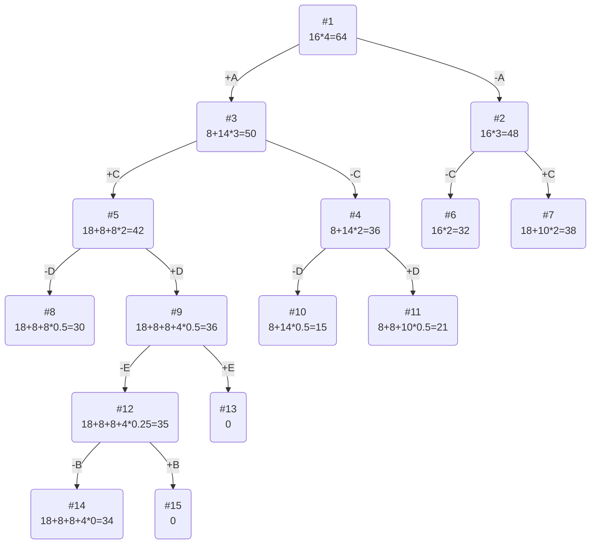

# Задание №19
# Задача о рюкзаке (Knapsack problem)

## Задание
Для каждого варианта представлены условия задачи, в соответствии с которыми необходимо: 
1. Решить задачу о рюкзаке с применением метода ветвей и границ.
2. Оформить решение задачи по шагам с подробными комментариями, таблицами и диаграммами.
3. В ответе указать:
   - максимально возможную стоимость предметов в рюкзаке,
   - набор предметов, обеспечивающих максимальную стоимость,
   - общий вес предметов в рюкзаке,
   - свободное место в рюкзаке.

## Постановка задачи
Задача о рюкзаке (англ. Knapsack problem) — дано N предметов, ni предмет имеет массу wi > 0 и стоимость pi > 0. Необходимо выбрать из этих предметов такой набор, чтобы суммарная масса не превосходила заданной величины W (вместимость рюкзака), а суммарная стоимость была максимальна. 

## Пример решения задачи о рюкзаке
## Условия задачи - вариант 6
| Предметы  | A | B  | C  | D | E  |
|:----------|:-:|:--:|:--:|:-:|:--:|
| Стоимость | 8 | 3  | 18 | 8 | 5  |
| Вес       | 2 | 12 | 6  | 4 | 10 |

Ограничение вместимости: 16

## Решение
### 1. Рассчитаем ценность каждого предмета
| Предметы  | A |  B  | C  | D |  E  |
|:----------|:-:|:---:|:--:|:-:|:---:|
| Стоимость | 8 |  3  | 18 | 8 |  5  |
| Вес       | 2 | 12  | 6  | 4 | 10  |
| Ценность  | 4 | 1/4 | 3  | 2 | 1/2 |

### 2. Отсортируем предметы по убыванию ценности
| Предметы  | A | C  | D |  E  |  B  |
|:----------|:-:|:--:|:-:|:---:|:---:|
| Стоимость | 8 | 18 | 8 |  5  |  3  |
| Вес       | 2 | 6  | 4 | 10  | 12  |
| Ценность  | 4 | 3  | 2 | 1/2 | 1/4 |

### 3. Рассчитаем оценку сверху для пустого рюкзака

Свободное место в рюкзаке: 16

Наибольшая ценность предмета: 4

Оценка сверху для пустого рюкзака: 16 * 4 = 64

### 4. Найдем решение задачи с использованием метода ветвей и границ

### Ответ
- Наибольшая стоимость предметов в рюкзаке 34.
- Набор предметов, обеспечивающих максимальную стоимость, A, C, D, общим весом 12.
- Свободное место в рюкзаке 4.

