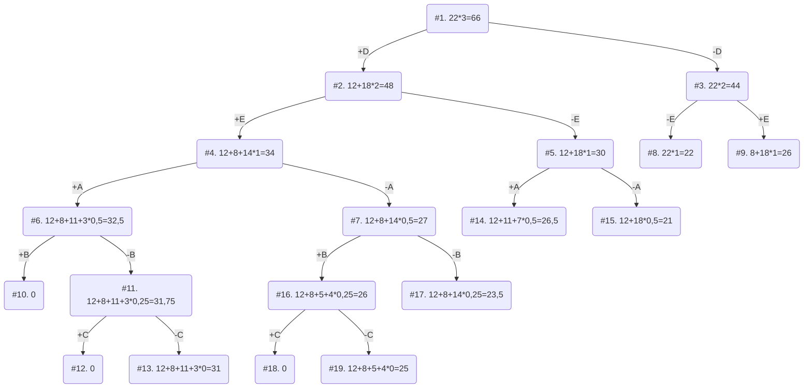

# Задача о рюкзаке

Для каждого варианта представлены условия задачи, в соответствии с которыми необходимо:

1. Решить задачу о рюкзаке с применением метода ветвей и границ.

2. Оформить решение задачи по шагам с подробными комментариями, таблицами и диаграммами.

3. В ответе указать:
- максимально возможную стоимость предметов в рюкзаке,

- набор предметов, обеспечивающих максимальную стоимость,

- общий вес предметов в рюкзаке,

- свободное место в рюкзаке.
### Вариант 3:

| Предмет  | A  | B | C | D  | E |
|----------|----|---|---|----|---|
| Стоимость| 11 | 5 | 3 | 12 | 8 |
|    Вес   | 11 | 10| 12| 4  | 4 |

Ограничение вместимости: 22
# Решение

## 1. Расчитаем ценность каждого предмета

### Таблица ценностей:

| Предмет  | A |  B  |  C  | D | E |
|----------|---|-----|-----|---|---|
| Ценность | 1 | 1/2 | 1/4 | 3 | 2 |

  

## 2. Отсортируем предметы по убыванию ценности

### Получаем  таблицу

| Предмет  | D  | E | A  |  B  |  C  |
|----------|----|---|----|-----|-----|
| Стоимость| 12 | 8 | 11 | 5   | 3   |
|    Вес   | 4  | 4 | 11 | 10  | 12  |
| Ценность | 3  | 2 | 1  | 1/2 | 1/4 |
  

## 3. Рассчитаем оценку сверху для пустого рюкзака

Свободное место в рюкзаке: **22**
Наибольшая ценность предмета: **3**
Оценка сверху для пустого рюкзака: **22 * 3 = 66**

## 4. Найдем решение задачи с помощью метода ветвей и границ

### Получим следующее дерево

## Ответ
 - Наибольшая стоимость предметов в рюкзаке: **31**
 - Набор предметов обемпечивающих максимальную стоимость, D, E, A, общим весом: **19**
 - Свободное место в рюкзаке: **3**

