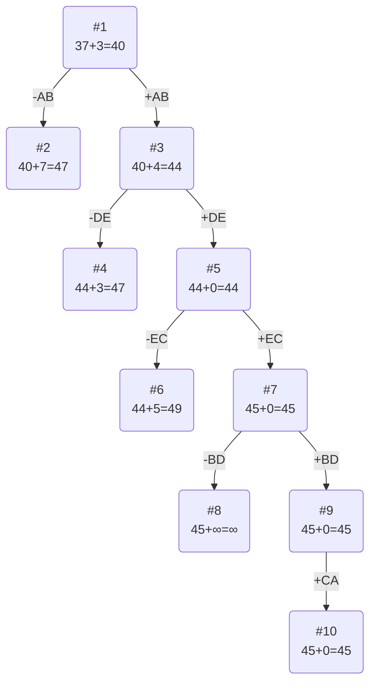

# Задание №20
## Задание
Для каждого варианта представлены условия задачи, в соответствии с которыми необходимо: 
1. Решить задачу коммивояжера с применением метода ветвей и границ.
2. Оформить решение задачи по шагам с подробными комментариями, таблицами и диаграммами.
3. В ответе указать:
   - найденный маршрут,
   - длину найденного маршрута.

## Постановка задачи
Имеется N городов, связанных дорогами. Расстояния между городами известны. Коммивояжер (бродячий торговец) должен выйти из первого города, посетить по одному разу в некотором порядке города 2,3..n и вернуться в первый город. В каком порядке следует посещать города, чтобы замкнутый путь коммивояжера имел кратчайшее расстояние?

### Вариант 1:

Матрица расстояний:

|         | **A** | **B** | **C** | **D** | **E** |
|:--------|:-----:|:-----:|:-----:|:-----:|:-----:|
| **A**   | **∞** |   7   |  15   |  15   |  21   |
| **B**   |   6   | **∞** |  15   |   9   |  12   |
| **C**   |   9   |  19   | **∞** |   7   |  12   |
| **D**   |  18   |   7   |  10   | **∞** |   9   |
| **E**   |  11   |  10   |  11   |  13   | **∞** |

## Решение
### 1. Проведем редукцию строк матрицы

|         | **A** | **B** | **C** | **D** | **E** | **Min** |
|:--------|:-----:|:-----:|:-----:|:-----:|:-----:|:-------:|
| **A**   | **∞** |   7   |  15   |  15   |  21   |    7    |
| **B**   |   6   | **∞** |  15   |   9   |  12   |    6    |
| **C**   |   9   |  19   | **∞** |   7   |  12   |    7    |
| **D**   |  18   |   7   |  10   | **∞** |   9   |    7    |
| **E**   |  11   |  10   |  11   |  13   | **∞** |   10    |
| **Sum** |       |       |       |       |       |   37    |

Сумма констант редукции по строкам 37

Марица после редукции строк:

|       | **A** | **B** | **C** | **D** | **E** |
|:------|:-----:|:-----:|:-----:|:-----:|:-----:|
| **A** | **∞** |   0   |   8   |   8   |  14   |
| **B** |   0   | **∞** |   9   |   3   |   6   |
| **C** |   2   |  10   | **∞** |   0   |   5   |
| **D** |  11   |   0   |   3   | **∞** |   2   |
| **E** |   1   |   0   |   1   |   3   | **∞** |

### 2. Проведем редукцию столбцов матрицы

|          | **A** | **B** | **C** | **D** | **E** | **Sum** |
|:---------|:-----:|:-----:|:-----:|:-----:|:-----:|:-------:|
| **A**    | **∞** |   0   |   8   |   8   |  14   |         |
| **B**    |   0   | **∞** |   9   |   3   |   6   |         |
| **C**    |   2   |  10   | **∞** |   0   |   5   |         |
| **D**    |  11   |   0   |   3   | **∞** |   2   |         |
| **E**    |   1   |   0   |   1   |   3   | **∞** |         |
| **Min**  |   0   |   0   |   1   |   0   |   2   |    3    |

Сумма констант редукции по столбцам 3

Марица после редукции столбцов:

|          | **A** | **B** | **C** | **D** | **E** |
|:---------|:-----:|:-----:|:-----:|:-----:|:-----:|
| **A**    | **∞** |   0   |   7   |   8   |  12   |
| **B**    |   0   | **∞** |   8   |   3   |   4   |
| **C**    |   2   |  10   | **∞** |   0   |   3   |
| **D**    |  11   |   0   |   2   | **∞** |   0   |
| **E**    |   1   |   0   |   0   |   3   | **∞** |

### 3. Оценка длины маршрута

Оценка длины маршрута снизу соответствует сумме констант редукции по строкам и по столбцам

37 + 3 = 40

### 4. Найдем решение задачи с использованием метода ветвей и границ

Чтобы определить ребро, по которому будет произведено ветвление из корневого узла рассчитаем штрафы для ребер с нулевой оценкой:

|        | **Штраф** |
|:-------|:---------:|
| **AB** |     7     |
| **BA** |     4     |
| **CD** |     5     |
| **DB** |     0     |
| **DE** |     3     |
| **EB** |     0     |
| **EC** |     2     |

Максимальный штраф 7, выберем ребро AB

#### Узел №2
Узел №2 с исключением ребра AB имеет оценку 40 + 7 (штраф) = 47

#### Узел №3
Для получения оценки узла 3 необходимо рассчитать сумму констант редукции для матрицы с учетом включения ребра AB, для этого в матрице:
- удалим строку A,
- удалим столбец B,
- Заменим на бесконечность значение BA.

|         | **A** | **C** | **D** | **E** | **Min** |
|:--------|:-----:|:-----:|:-----:|:-----:|:-------:|
| **B**   | **∞** |   8   |   3   |   4   |    3    |
| **C**   |   2   | **∞** |   0   |   3   |         |
| **D**   |  11   |   2   | **∞** |   0   |         |
| **E**   |   1   |   0   |   3   | **∞** |         |
| **Sum** |   1   |       |       |       |    4    |

Сумма констант редукции 4

Матрица после редукции:

|         | **A** | **C** | **D** | **E** |
|:--------|:-----:|:-----:|:-----:|:-----:|
| **B**   | **∞** |   5   |   0   |   1   |
| **C**   |   1   | **∞** |   0   |   3   |
| **D**   |  10   |   2   | **∞** |   0   |
| **E**   |   0   |   0   |   3   | **∞** |

Оценка узла 3 = 40 + 4 (редукция) = 44

Продолжим поиск из узла 3

#### Выбор ребра
Чтобы определить ребро, по которому будет произведено ветвление из узла 3 рассчитаем штрафы для ребер с нулевой оценкой:

|        | **Штраф** |
|:-------|:---------:|
| **BD** |     1     |
| **CD** |     1     |
| **DE** |     3     |
| **EA** |     1     |
| **EC** |     2     |

Максимальный штраф 3, выберем ребро DE

#### Узел №4
Узел №4 с исключением ребра DE имеет оценку 44 + 3 (штраф) = 47

#### Узел №5
Для получения оценки узла 5 необходимо рассчитать сумму констант редукции для матрицы с учетом включения ребра DE, для этого в матрице:
- удалим строку D,
- удалим столбец E,
- Заменим на бесконечность значение ED.

|         | **A** | **C** | **D** | **Min** |
|:--------|:-----:|:-----:|:-----:|:-------:|
| **B**   | **∞** |   5   |   0   |         |
| **C**   |   1   | **∞** |   0   |         |
| **E**   |   0   |   0   | **∞** |         |
| **Sum** |       |       |       |    0    |

Cумма редукции равна 0, потому что в каждом столбце и строке уже есть хотя бы один 0

Оценка узла 5 = 44 + 0 (редукция) = 44

Продолжим поиск из узла 5

#### Выбор ребра
Чтобы определить ребро, по которому будет произведено ветвление из узла 5 рассчитаем штрафы для ребер с нулевой оценкой:

|        | **Штраф** |
|:-------|:---------:|
| **BD** |     5     |
| **CD** |     1     |
| **EA** |     1     |
| **EC** |     5     |

Максимальный штраф 5, выберем ребро EC, как одно из ребер с максимальным штрафом.

#### Узел №7
Для получения оценки узла 7 необходимо рассчитать сумму констант редукции для матрицы с учетом включения ребра EC, для этого в матрице:
- удалим строку E,
- удалим столбец C,
- Заменим на бесконечность значение CE.

|         | **A** |  **D**   | **Min** |
|:--------|:-----:|:--------:|:-------:|
| **B**   | **∞** |    0     |         |
| **C**   |   1   |   **∞**  |         |
| **Sum** |   1   |          |    1    |

Сумма констант редукции 1

Матрица после редукции:

|         | **A** |  **D**   |
|:--------|:-----:|:--------:|
| **B**   | **∞** |    0     |
| **C**   |   0   |   **∞**  |

Оценка узла 7 = 44 + 1 (редукция) = 45

Продолжим поиск из узла 7

#### Выбор ребра

|        | **Штраф** |
|:-------|:---------:|
| **BD** |   **∞**   |
| **CA** |   **∞**   |

Максимальный штраф = **∞**, берем ребро  BD.

#### Узел №8
Узел №8 с исключением ребра BD имеет оценку 45 + **∞** (штраф) = **∞**

#### Узел №9
Для получения оценки узла 9 необходимо рассчитать сумму констант редукции для матрицы с учетом включения ребра BD, для этого в матрице:
- удалим строку B,
- удалим столбец D,
- Заменим на бесконечность значение DB.

|       | **A** | 
|:------|:-----:|
| **C** |   0   |

Константа редукции равна **∞**

Оценка узла 9 = 45+0=45

Продолжим поиск из узла 9.

#### Выбор ребра
Альтернатив у ребра CA нет

#### Узел №14
Ребро CA включается в маршрут, длина которого составляет 45

### Ответ
- Кратчайший маршрут ABDECA.
- Длина маршрута 45.