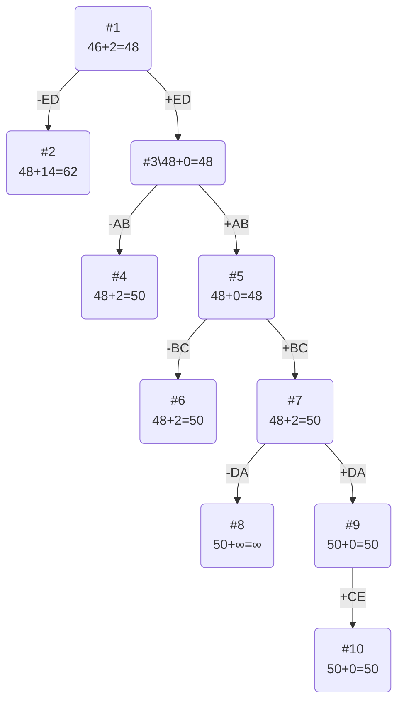

# Задание №20

### Вариант 8: 

Матрица расстояний:

|       | **A** | **B** | **C** | **D** | **E** |
|:------|:-----:|:-----:|:-----:|:-----:|:-----:|
| **A** | **∞** |   15  |   16  |   17  |   18  |
| **B** |   19  | **∞** |   5   |   6   |   7   |
| **C** |   9   |   10  | **∞** |   12  |   13  |
| **D** |   13  |   14  |   15  | **∞** |   17  |
| **E** |   17  |   18  |   19  |   4   | **∞** |

## Решение
### 1. Проведем редукцию строк матрицы

|       | **A** | **B** | **C** | **D** | **E** | Min |
|:------|:-----:|:-----:|:-----:|:-----:|:-----:|:---:|
| **A** | **∞** |   15  |   16  |   17  |   18  |  15 |
| **B** |   19  | **∞** |   5   |   6   |   7   |  5  |
| **C** |   9   |   10  | **∞** |   12  |   13  |  9  |
| **D** |   13  |   14  |   15  | **∞** |   17  |  13 |
| **E** |   17  |   18  |   19  |   4   | **∞** |  4  |
|  Sum  |       |       |       |       |       |  46 |

Сумма констант редукции по строкам 46

Марица после редукции строк:

|       | **A** | **B** | **C** | **D** | **E** |
|:------|:-----:|:-----:|:-----:|:-----:|:-----:|
| **A** | **∞** |   0   |   1   |   2   |   3   |
| **B** |   14  | **∞** |   0   |   1   |   2   |
| **C** |   0   |   1   | **∞** |   3   |   4   |
| **D** |   0   |   1   |   2   | **∞** |   4   |
| **E** |   13  |   14  |   15  |   0   | **∞** |

### 2. Проведем редукцию столбцов матрицы

|       | **A** | **B** | **C** | **D** | **E** | Sum |
|:------|:-----:|:-----:|:-----:|:-----:|:-----:|:---:|
| **A** | **∞** |   0   |   1   |   2   |   3   |     |
| **B** |   14  | **∞** |   0   |   1   |   2   |     |
| **C** |   0   |   1   | **∞** |   3   |   4   |     |
| **D** |   0   |   1   |   2   | **∞** |   4   |     |
| **E** |   13  |   14  |   15  |   0   | **∞** |     |
|  Min  |   0   |   0   |   0   |   0   |   2   |  2  |

Сумма констант редукции по столбцам 2

Марица после редукции столбцов:

|       | **A** | **B** | **C** | **D** | **E** |
|:------|:-----:|:-----:|:-----:|:-----:|:-----:|
| **A** | **∞** |   0   |   1   |   2   |   1   |
| **B** |   14  | **∞** |   0   |   1   |   0   |
| **C** |   0   |   1   | **∞** |   3   |   2   |
| **D** |   0   |   1   |   2   | **∞** |   2   |
| **E** |   13  |   14  |   15  |   0   | **∞** |

### 3. Оценка длины маршрута

Оценка длины маршрута снизу соответствует сумме констант редукции по строкам и по столбцам

46 + 2 = 48

### 4. Найдем решение задачи с использованием метода ветвей и границ

Чтобы определить ребро, по которому будет произведено ветвление из корневого узла рассчитаем штрафы для ребер с нулевой оценкой:

|        | **Штраф** |
|:-------|:---------:|
| **AB** |     2     |
| **BC** |     1     |
| **BE** |     1     |
| **CA** |     1     |
| **DA** |     1     |
| **ED** |     14    |

Максимальный штраф 14, выберем ребро ED, как одно из ребер с максимальным штрафом.

#### Узел №2
Узел №2 с исключением ребра ED имеет оценку 48 + 14 (штраф) = 62

#### Узел №3
Для получения оценки узла 3 необходимо рассчитать сумму констант редукции для матрицы с учетом включения ребра AE, для этого в матрице:
- удалим строку E,
- удалим столбец D,
- Заменим на бесконечность значение DE.

Матрица после редукции (сумма редукции равна 0, потому что в каждом столбце и строке уже есть хотя бы один 0):

|       | **A** | **B** | **C** | **E** |
|:------|:-----:|:-----:|:-----:|:-----:|
| **A** | **∞** |   0   |   1   |   1   |
| **B** |   14  | **∞** |   0   |   0   |
| **C** |   0   |   1   | **∞** |   2   |
| **D** |   0   |   1   |   2   | **∞** |

Сумма констант редукции 0

Оценка узла 3 = 48 + 0 (редукция) = 48

Продолжим поиск из узла 3

#### Выбор ребра
Чтобы определить ребро, по которому будет произведено ветвление из узла 3 рассчитаем штрафы для ребер с нулевой оценкой:

|        | **Штраф** |
|:-------|:---------:|
| **AB** |     2     |
| **BC** |     1     |
| **BE** |     1     |
| **CA** |     1     |
| **DA** |     1     |

Максимальный штраф 2, выберем ребро AB, как ребро с максимальным штрафом.

#### Узел №4
Узел №4 с исключением ребра AB имеет оценку 48 + 2 (штраф) = 50

#### Узел №5
Для получения оценки узла 5 необходимо рассчитать сумму констант редукции для матрицы с учетом включения ребра AB, для этого в матрице:
- удалим строку A,
- удалим столбец B,
- Заменим на бесконечность значение BA.

Матрица после редукции (сумма редукции равна 0, потому что в каждом столбце и строке уже есть хотя бы один 0):

|       | **A** | **C** | **E** |
|:------|:-----:|:-----:|:-----:|
| **B** | **∞** |   0   |   0   |
| **C** |   0   | **∞** |   2   |
| **D** |   0   |   2   | **∞** |

Сумма констант редукции 0

Оценка узла 5 = 48 + 0 (редукция) = 48

Продолжим поиск из узла 5

#### Выбор ребра

|       | **A** | **C** | **E** |
|:------|:-----:|:-----:|:-----:|
| **B** | **∞** |   0   |   0   |
| **C** |   0   | **∞** |   2   |
| **D** |   0   |   2   | **∞** |

Чтобы определить ребро, по которому будет произведено ветвление из узла 5 рассчитаем штрафы для ребер с нулевой оценкой:

|        | **Штраф** |
|:-------|:---------:|
| **BC** |     2     |
| **BE** |     2     |
| **CA** |     2     |
| **DA** |     2     |

Максимальный штраф 2, выберем ребро BC, как одно из ребер с максимальным штрафом.

#### Узел №6
Узел №6 с исключением ребра BC имеет оценку 48 + 2 (штраф) = 50

#### Узел №7
Для получения оценки узла 7 необходимо рассчитать сумму констант редукции для матрицы с учетом включения ребра BD, для этого в матрице:
- удалим строку B,
- удалим столбец C,
- Заменим на бесконечность значение CB.

|       | **A** | **E** |
|:------|:-----:|:-----:|
| **C** | **∞** |   2   |
| **D** |   0   | **∞** |

Матрица после редукции:

|       | **A** | **E** |
|:------|:-----:|:-----:|
| **C** | **∞** |   0   |
| **D** |   0   | **∞** |

Сумма констант редукции 2

Оценка узла 7 = 48 + 2 (редукция) = 50

Продолжим поиск из узла 7

#### Выбор ребра
Чтобы определить ребро, по которому будет произведено ветвление из узла 7 рассчитаем штрафы для ребер с нулевой оценкой:

|        | **Штраф** |
|:-------|:---------:|
| **DA** |   **∞**   |
| **CE** |   **∞**   |

Максимальный штраф **∞**, выберем ребро DA.

#### Узел №8
Узел №8 с исключением ребра DA имеет оценку 50 + **∞** (штраф) = **∞**

#### Узел №9
Для получения оценки узла 9 необходимо рассчитать сумму констант редукции для матрицы с учетом включения ребра DC, для этого в матрице:
- удалим строку D,
- удалим столбец A,
- Заменим на бесконечность значение AD.

|       | **E** |
|:------|:-----:|
| **C** |   0   |

Сумма констант редукции 0, следовательно, оценка узла 9 = 50 + 0 = 50

Продолжим поиск из узла 9

#### Выбор ребра
Альтернатив у ребра CE нет

#### Узел №10
Ребро CE включается в маршрут, длина которого составляет 50

### Ответ
- Кратчайший маршрут EDABCE.
- Длина маршрута 50.

