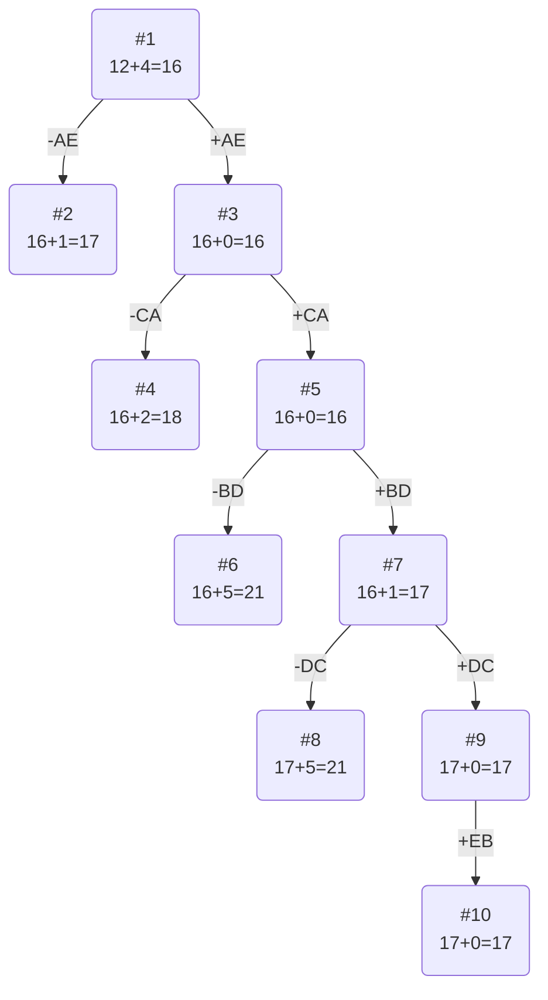

# Задание №20

### Вариант 5: 

Матрица расстояний:

|       | **A** | **B** | **C** | **D** | **E** |
|:------|:-----:|:-----:|:-----:|:-----:|:-----:|
| **A** | **∞** |   6   |   4   |   2   |   4   |
| **B** |   6   | **∞** |   3   |   2   |   6   |
| **C** |   3   |   4   | **∞** |   1   |   4   |
| **D** |   7   |   2   |   3   | **∞** |   5   |
| **E** |   7   |   5   |   5   |   9   | **∞** |

## Решение
### 1. Проведем редукцию строк матрицы

|       | **A** | **B** | **C** | **D** | **E** | Min |
|:------|:-----:|:-----:|:-----:|:-----:|:-----:|:---:|
| **A** | **∞** |   6   |   4   |   2   |   4   |  2  |
| **B** |   6   | **∞** |   3   |   2   |   6   |  2  |
| **C** |   3   |   4   | **∞** |   1   |   4   |  1  |
| **D** |   7   |   2   |   3   | **∞** |   5   |  2  |
| **E** |   7   |   5   |   5   |   9   | **∞** |  5  |
| Sum   |       |       |       |       |       | 12  |

Сумма констант редукции по строкам 12

Марица после редукции строк:

|       | **A** | **B** | **C** | **D** | **E** |
|:------|:-----:|:-----:|:-----:|:-----:|:-----:|
| **A** | **∞** |   4   |   2   |   0   |   2   |
| **B** |   4   | **∞** |   1   |  0   |   4   |
| **C** |   2   |   3   | **∞** |   0   |   3   |
| **D** |   5   |   0   |   1   | **∞** |   3   |
| **E** |   2   |   0   |   0   |   4   | **∞** |

### 2. Проведем редукцию столбцов матрицы

|       | **A** | **B** | **C** | **D** | **E** | Sum |
|:------|:-----:|:-----:|:-----:|:-----:|:-----:|:---:|
| **A** | **∞** |   4   |   2   |   0   |   2   |     |
| **B** |   4   | **∞** |   1   |  0   |   4   |     |
| **C** |   2   |   3   | **∞** |   0   |   3   |     |
| **D** |   5   |   0   |   1   | **∞** |   3   |     |
| **E** |   2   |   0   |   0   |   4   | **∞** |     |
| Min   |   2   |   0   |   0   |   0   |   2   | 4  |

Сумма констант редукции по столбцам 4

Марица после редукции столбцов:

|       | **A** | **B** | **C** | **D** | **E** |
|:------|:-----:|:-----:|:-----:|:-----:|:-----:|
| **A** | **∞** |   4   |   2   |   0   |   0   |
| **B** |   2   | **∞** |   1   |  0   |   2   |
| **C** |   0   |   3   | **∞** |   0   |   1   |
| **D** |   3   |   0   |   1   | **∞** |   1   |
| **E** |   0   |   0   |   0   |   4   | **∞** |

### 3. Оценка длины маршрута

Оценка длины маршрута снизу соответствует сумме констант редукции по строкам и по столбцам

12 + 4 = 16

### 4. Найдем решение задачи с использованием метода ветвей и границ

Чтобы определить ребро, по которому будет произведено ветвление из корневого узла рассчитаем штрафы для ребер с нулевой оценкой:

|        | **Штраф** |
|:-------|:---------:|
| **AD** |     0     |
| **AE** |     1     |
| **BD** |     1     |
| **CA** |     0     |
| **CD** |     0     |
| **DB** |     1     |
| **EA** |     0     |
| **EB** |     0     |
| **EC** |     1     |

Максимальный штраф 1, выберем ребро AE, как одно из ребер с максимальным штрафом.

#### Узел №2
Узел №2 с исключением ребра AE имеет оценку 16 + 1 (штраф) = 17

#### Узел №3
Для получения оценки узла 3 необходимо рассчитать сумму констант редукции для матрицы с учетом включения ребра AE, для этого в матрице:
- удалим строку A,
- удалим столбец E,
- Заменим на бесконечность значение EA.

Матрица после редукции (сумма редукции равна 0, потому что в каждом столбце и строке уже есть хотя бы один 0):

|       | **A** | **B** | **C** | **D** |
|:------|:-----:|:-----:|:-----:|:-----:|
| **B** |   2   | **∞** |   1   |  0   |
| **C** |   0   |   3   | **∞** |   0   |
| **D** |   3   |   0   |   1   | **∞** |
| **E** | **∞** |   0   |   0   |   4   |

Сумма констант редукции 0

Оценка узла 3 = 16 + 0 (редукция) = 16

Продолжим поиск из узла 3

#### Выбор ребра
Чтобы определить ребро, по которому будет произведено ветвление из узла 3 рассчитаем штрафы для ребер с нулевой оценкой:

|        | **Штраф** |
|:-------|:---------:|
| **BD** |     1     |
| **CA** |    2     |
| **DB** |     1     |
| **EB** |     0     |
| **EC** |     1     |

Максимальный штраф 2, выберем ребро CA, как ребро с максимальным штрафом.

#### Узел №4
Узел №4 с исключением ребра CA имеет оценку 16 + 2 (штраф) = 18

#### Узел №5
Для получения оценки узла 5 необходимо рассчитать сумму констант редукции для матрицы с учетом включения ребра CA, для этого в матрице:
- удалим строку С,
- удалим столбец A,
- Заменим на бесконечность значение AC.

Матрица после редукции (сумма редукции равна 0, потому что в каждом столбце и строке уже есть хотя бы один 0):

|       | **B** | **C** | **D** |
|:------|:-----:|:-----:|:-----:|
| **B** | **∞** |   1   |  0   |
| **D** |   0   |   1   | **∞** |
| **E** |   0   |   0   |   4   |

Сумма констант редукции 0

Оценка узла 5 = 16 + 0 (редукция) = 0

Продолжим поиск из узла 5

#### Выбор ребра

Если пойти по EC, то будет цикл => заменим EC на бесконечность.

|       | **B** | **C** | **D** |
|:------|:-----:|:-----:|:-----:|
| **B** | **∞** |   1   |  0   |
| **D** |   0   |   1   | **∞** |
| **E** |   0   | **∞** |   4   |

Чтобы определить ребро, по которому будет произведено ветвление из узла 5 рассчитаем штрафы для ребер с нулевой оценкой:

|        | **Штраф** |
|:-------|:---------:|
| **BD** |     5     |
| **DB** |     1     |
| **EB** |     4     |

Максимальный штраф 5, выберем ребро BD, как одно из ребер с максимальным штрафом.

#### Узел №6
Узел №6 с исключением ребра BD имеет оценку 16 + 5 (штраф) = 21

#### Узел №7
Для получения оценки узла 7 необходимо рассчитать сумму констант редукции для матрицы с учетом включения ребра BD, для этого в матрице:
- удалим строку B,
- удалим столбец D,
- Заменим на бесконечность значение DB.

|       | **B** | **C** |  Min |
|:------|:-----:|:-----:|:----:|
| **D** | **∞** |   1   |   1  |
| **E** |   0   | **∞** |      |
| Sum   |       |       |   1  | 

Матрица после редукции:

|       | **B** | **C** |
|:------|:-----:|:-----:|
| **D** | **∞** |   0   |
| **E** |   0   | **∞** |

Сумма констант редукции 1

Оценка узла 7 = 16 + 1 (редукция) = 17

Продолжим поиск из узла 7

#### Выбор ребра
Чтобы определить ребро, по которому будет произведено ветвление из узла 7 рассчитаем штрафы для ребер с нулевой оценкой:

|        | **Штраф** |
|:-------|:---------:|
| **DC** |   **∞**   |
| **EB** |   **∞**   |

Максимальный штраф **∞**, выберем ребро DC.

#### Узел №8
Узел №8 с исключением ребра DC имеет оценку 17 + **∞** (штраф) = **∞**

#### Узел №9
Для получения оценки узла 9 необходимо рассчитать сумму констант редукции для матрицы с учетом включения ребра DC, для этого в матрице:
- удалим строку D,
- удалим столбец C,
- Заменим на бесконечность значение CD.

|       | **B** |
|:------|:-----:|
| **E** |   0   |

Сумма констант редукции 0, следовательно, оценка узла 9 = 17 + 0 = 17

Продолжим поиск из узла 9

#### Выбор ребра
Альтернатив у ребра EB нет

#### Узел №14
Ребро EB включается в маршрут, длина которого составляет 17

### Ответ
- Кратчайший маршрут AEBDCA.
- Длина маршрута 17.

