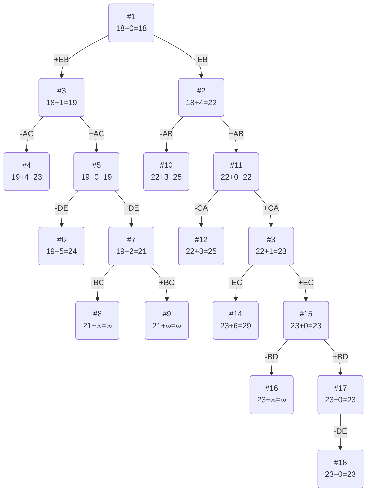

# Задание №20
# Задача коммивояжера (Travelling salesman problem)
## Постановка задачи
Имеется N городов, связанных дорогами. Расстояния между городами известны. Коммивояжер (бродячий торговец) должен выйти из первого города, посетить по одному разу в некотором порядке города 2,3..n и вернуться в первый город. В каком порядке следует посещать города, чтобы замкнутый путь коммивояжера имел кратчайшее расстояние?

 ## Условия задачи
### Вариант 2: 
Матрица расстояний:  
  
|       | **A** | **B** | **C** | **D** | **E** |  
|:------|:-----:|:-----:|:-----:|:-----:|:-----:|  
| **A** | **∞** |   4   |   6   |   7   |   5   |  
| **B** |   8   | **∞** |   6   |   6   |   6   |  
| **C** |   4   |   6   | **∞** |  10   |   7   |  
| **D** |   3   |   5   |   7   | **∞** |   2   |  
| **E** |   6   |   2   |   7   |   8   | **∞** |

## Решение
### 1. Проведем редукцию строк матрицы

|       | **A** | **B** | **C** | **D** | **E** | Min |
|:------|:-----:|:-----:|:-----:|:-----:|:-----:|:---:|
| **A** | **∞** |   4   |   6   |   7   |   5   |  4  |
| **B** |   8   | **∞** |   6   |   6   |   6   |  6  |
| **C** |   4   |   6   | **∞** |  10   |   7   |  4  |
| **D** |   3   |   5   |   7   | **∞** |   2   |  2  |
| **E** |   6   |   2   |   7   |   8   | **∞** |  2  |
| Sum   |       |       |       |       |       | 18  |

Сумма констант редукции по строкам 18

Матрица после редукции строк:

|       | **A** | **B** | **C** | **D** | **E** |
|:------|:-----:|:-----:|:-----:|:-----:|:-----:|
| **A** | **∞** |   0   |   2   |   3   |   1   |
| **B** |   2   | **∞** |   0   |   0   |   0   |
| **C** |   0   |   2   | **∞** |   6   |   3   |
| **D** |   1   |   3   |   5   | **∞** |   0   |
| **E** |   4   |   0   |   5   |   6   | **∞** |

### 2. Проведем редукцию столбцов матрицы

|       | **A** | **B** | **C** | **D** | **E** | Sum |
|:------|:-----:|:-----:|:-----:|:-----:|:-----:|:---:|
| **A** | **∞** |   0   |   2   |   3   |   1   |     |
| **B** |   2   | **∞** |   0   |   0   |   0   |     |
| **C** |   0   |   2   | **∞** |   6   |   3   |     |
| **D** |   1   |   3   |   5   | **∞** |   0   |     |
| **E** |   4   |   0   |   5   |   6   | **∞** |     |
| Min   |   0   |   0   |   0   |   0   |   0   |  0  |

Сумма констант редукции по столбцам 0

### 3. Оценка длины маршрута

Оценка длины маршрута снизу соответствует сумме констант редукции по строкам и по столбцам: 18 + 0 = 18
### 4. Найдем решение задачи с использованием метода ветвей и границ

Чтобы определить ребро, по которому будет произведено ветвление из корневого узла рассчитаем штрафы для ребер с нулевой оценкой:

|        | **Штраф** |
|:-------|:---------:|
| **AB** |     1     |
| **BC** |     2     |
| **BD** |     3     |
| **BE** |     1     |
| **CA** |     3     |
| **DE** |     1     |
| **EB** |     4     |

Максимальный штраф 4, выберем ребро EB.

#### Узел №2
Узел №2 с исключением ребра EB имеет оценку 18 + 4 (штраф) = 22

#### Узел №3
Для получения оценки узла 3 необходимо рассчитать сумму констант редукции для матрицы с учетом включения ребра EB, для этого в матрице:
- удалим строку E,
- удалим столбец B,
- Заменим на бесконечность значение BE.

|       | **A** | **C** | **D** | **E** | Min |
|:------|:-----:|:-----:|:-----:|:-----:|-----|
| **A** | **∞** |   2   |   3   |   1   |  1  |
| **B** |   2   |   0   |   0   | **∞** |     |
| **C** |   0   | **∞** |   6   |   3   |     |
| **D** |   1   |   5   | **∞** |   0   |     |
| Sum   |       |       |       |       |  1  |

Матрица после редукции, редукция по столбцам не требуется:

|       | **A** | **C** | **D** | **E** |
|:------|:-----:|:-----:|:-----:|:-----:|
| **A** | **∞** |   1   |   2   |   0   |
| **B** |   2   |   0   |   0   | **∞** |
| **C** |   0   | **∞** |   6   |   3   |
| **D** |   1   |   5   | **∞** |   0   |

Сумма констант редукции 1

Оценка узла 3 = 18 + 1 (редукция) = 19

Продолжим поиск из узла 3

#### Выбор ребра
Чтобы определить ребро, по которому будет произведено ветвление из узла 3 рассчитаем штрафы для ребер с нулевой оценкой:

|        | **Штраф** |
|:-------|:---------:|
| **AE** |     1     |
| **BC** |     1     |
| **BD** |     2     |
| **CA** |     4     |
| **DE** |     1     |

Максимальный штраф 4, выберем ребро CA, как ребро с максимальным штрафом.

#### Узел №4
Узел №4 с исключением ребра CA имеет оценку 19 + 4 (штраф) = 23

#### Узел №5
Для получения оценки узла 5 необходимо рассчитать сумму констант редукции для матрицы с учетом включения ребра CD, для этого в матрице:
- удалим строку С,
- удалим столбец A,
- Заменим на бесконечность значение AC.

|       | **C** | **D** | **E** |
|:------|:-----:|:-----:|:-----:|
| **A** | **∞** |   2   |   0   |
| **B** |   0   |   0   | **∞** |
| **D** |   5   | **∞** |   0   |

Редукция по столбцам и строкам не требуется. Сумма констант редукции 0.

Оценка узла 5 = 19 + 9 (редукция) = 19

Продолжим поиск из узла 5

#### Выбор ребра
Чтобы определить ребро, по которому будет произведено ветвление из узла 5, рассчитаем штрафы для ребер с нулевой оценкой:

|        | **Штраф** |
|:-------|:---------:|
| **AE** |     2     |
| **BC** |     5     |
| **BD** |     2     |
| **DE** |     5     |

Нельзя брать ребро BC, так как в таком случае мы закроем цикл.
Максимальный штраф 5, выберем ребро DE.

#### Узел №6
Узел №6 с исключением ребра DE имеет оценку 19 + 5 (штраф) =24

#### Узел №7
Для получения оценки узла 7 необходимо рассчитать сумму констант редукции для матрицы с учетом включения ребра DE, для этого в матрице:
- удалим строку D,
- удалим столбец E,
- Заменим на бесконечность значение ED.

|       | **C** | **D** | Min |
|:------|:-----:|:-----:|-----|
| **A** | **∞** |   2   |  2  |
| **B** |   0   | **∞** |     |
| Sum   |       |       |  2  |

Матрица после редукции:

|       | **C** | **D** |
|:------|:-----:|:-----:|
| **A** | **∞** |   0   |
| **B** |   0   | **∞** |

Сумма констант редукции 2

Оценка узла 7 = 19 + 2 (редукция) = 21

Продолжим поиск из узла 7

#### Выбор ребра

|        | **Штраф** |
|:-------|:---------:|
| **AD** |   **∞**   |
| **BC** |   **∞**   |

Максимальный штраф = **∞**, берем ребро  AD.

#### Узел №8
Узел №8 с исключением ребра AD имеет оценку 21 + **∞** (штраф) =**∞**

#### Узел №9
Для получения оценки узла 9 необходимо рассчитать сумму констант редукции для матрицы с учетом включения ребра AD, для этого в матрице:
- удалим строку A,
- удалим столбец D,
- Заменим на бесконечность значение DA.

|       | **C** | 
|:------|:-----:|
| **B** | **∞** |

Выбрать путь BC нельзя, та как цикл сломается. Константа редукции равна **∞**

Оценка узла 9 =21+**∞**=**∞**

Продолжим поиск из узла 2.

#### Выбор ребра
Для узла 2 необходимо преобразовать матрицу:
- Заменить значение EB на бесконечность,
- Провести редукцию матрицы (сумма констант уже учтена в штрафе).

|       | **A** | **B** | **C** | **D** | **E** | Min |
|:------|:-----:|:-----:|:-----:|:-----:|:-----:|:----|
| **A** | **∞** |   0   |   2   |   3   |   1   |     |
| **B** |   2   | **∞** |   0   |   0   |   0   |     |
| **C** |   0   |   2   | **∞** |   6   |   3   |     |
| **D** |   1   |   3   |   5   | **∞** |   0   |     |
| **E** |   4   | **∞** |   5   |   6   | **∞** |  4  |
| Sum   |       |       |       |       |       |  4  |

Матрица после редукции:

|       | **A** | **B** | **C** | **D** | **E** |
|:------|:-----:|:-----:|:-----:|:-----:|:-----:|
| **A** | **∞** |   0   |   2   |   3   |   1   |
| **B** |   2   | **∞** |   0   |   0   |   0   |
| **C** |   0   |   2   | **∞** |   6   |   3   | 
| **D** |   1   |   3   |   5   | **∞** |   0   |
| **E** |   0   | **∞** |   1   |   2   | **∞** |

Чтобы определить ребро, по которому будет произведено ветвление из узла 2 рассчитаем штрафы для ребер с нулевой оценкой:

|        | **Штраф** |
|:-------|:---------:|
| **AB** |     3     |
| **BC** |     1     |
| **BD** |     2     |
| **BE** |     0     |
| **CA** |     2     |
| **DE** |     1     |
| **EA** |     1     |

Максимальный штраф 3, выберем ребро AB, как одно из ребер с максимальным штрафом.

#### Узел №10
Узел №10 с исключением ребра AB имеет оценку 22 + 3 (штраф) = 25

#### Узел №11
Для получения оценки узла 11 необходимо рассчитать сумму констант редукции для матрицы с учетом включения ребра AB, для этого в матрице:
- удалим строку A,
- удалим столбец B,
- Заменим на бесконечность значение BA.

|       | **A** | **C** | **D** | **E** | 
|:------|:-----:|:-----:|:-----:|:-----:|
| **B** | **∞** |   0   |   0   |   0   |
| **C** |   0   | **∞** |   6   |   3   | 
| **D** |   1   |   5   | **∞** |   0   | 
| **E** |   0   |   1   |   2   | **∞** | 

Редукция не нужна

Оценка узла 11 = 22 + 0 (редукция) = 22

Продолжим поиск из узла 11

#### Выбор ребра
Чтобы определить ребро, по которому будет произведено ветвление из узла 11 рассчитаем штрафы для ребер с нулевой оценкой:

|        | **Штраф** |
|:-------|:---------:|
| **BC** |     1     |
| **BD** |     2     |
| **BE** |     0     |
| **CA** |     3     |
| **DE** |     1     |
| **EA** |     1     |

Максимальный штраф 3, выберем ребро CA, как ребро с максимальным штрафом.

#### Узел №12
Узел №12 с исключением ребра CA имеет оценку 22 + 3 (штраф) = 25

#### Узел №13
Для получения оценки узла 13 необходимо рассчитать сумму констант редукции для матрицы с учетом включения ребра CA, для этого в матрице:
- удалим строку C,
- удалим столбец A,
- Заменим на бесконечность значение AC.

|       | **C** | **D** | **E** | Min |
|:------|:-----:|:-----:|:-----:|:----|
| **B** | **∞** |   0   |   0   |     |
| **D** |   5   | **∞** |   0   |     |   
| **E** |   1   |   2   | **∞** |  1  |
| Sum   |       |       |       |  1  |

Матрица после редукции:

|       | **C** | **D** | **E** |
|:------|:-----:|:-----:|:-----:|
| **B** | **∞** |   0   |   0   |
| **D** |   5   | **∞** |   0   |  
| **E** |   0   |   2   | **∞** |

Сумма констант редукции 1

Оценка узла 13 = 22 + 1 (редукция) = 23

Продолжим поиск из узла 13

#### Выбор ребра
Чтобы определить ребро, по которому будет произведено ветвление из узла 13 рассчитаем штрафы для ребер с нулевой оценкой:

|        | **Штраф** |
|:-------|:---------:|
| **BD** |     1     |
| **BE** |     0     |
| **DE** |     5     |
| **EC** |     6     |

Максимальный штраф 6, выберем ребро EC, как одно из ребер с максимальным штрафом.

#### Узел №14
Узел №10 с исключением ребра EC имеет оценку 23 + 6 (штраф) = 29

#### Узел №15
Для получения оценки узла 15 необходимо рассчитать сумму констант редукции для матрицы с учетом включения ребра EC, для этого в матрице:
- удалим строку E,
- удалим столбец C,
- Заменим на бесконечность значение CE
- Чтобы не закрылся цикл, заменяем BE на бесконечность

|       | **D** | **E** |
|:------|:-----:|:-----:|
| **B** |   0   | **∞** |
| **D** | **∞** |   0   |

Оценка узла 15 = 23 + 0 (редукция) = 23

Продолжим поиск из узла 15

#### Выбор ребра
Чтобы определить ребро, по которому будет произведено ветвление из узла 15 рассчитаем штрафы для ребер с нулевой оценкой:

|        | **Штраф** |
|:-------|:---------:|
| **BD** |   **∞**   |
| **DE** |   **∞**   |

Максимальный штраф бесконечность, выберем ребро BD, как одно из ребер с максимальным штрафом.

#### Узел №16
Узел №16 с исключением ребра BD имеет оценку 23 + **∞** (штраф) = **∞**

#### Узел №17
Для получения оценки узла 17 необходимо рассчитать сумму констант редукции для матрицы с учетом включения ребра BD, для этого в матрице:
- удалим строку B,
- удалим столбец D,
- Заменим на бесконечность значение DB,

|       | **E** |
|:------|:-----:|
| **D** |   0   |

Сумма констант редукции 0, следовательно, оценка узла 17 = 23 + 0 = 23

Продолжим поиск из узла 17

#### Выбор ребра
Альтернатив у ребра DE нет

#### Узел №14
Ребро DE включается в маршрут, длина которого составляет 23

### Ответ
- Кратчайший маршрут ABDECA.
- Длина маршрута 23.