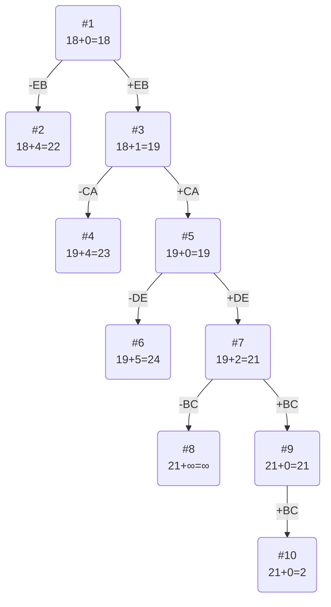

# Задание №20
# Задача коммивояжера (Travelling salesman problem)
## Постановка задачи
Имеется N городов, связанных дорогами. Расстояния между городами известны. Коммивояжер (бродячий торговец) должен выйти из первого города, посетить по одному разу в некотором порядке города 2,3..n и вернуться в первый город. В каком порядке следует посещать города, чтобы замкнутый путь коммивояжера имел кратчайшее расстояние?

 ## Условия задачи
### Вариант 2: 
Матрица расстояний:  
  
|       | **A** | **B** | **C** | **D** | **E** |  
|:------|:-----:|:-----:|:-----:|:-----:|:-----:|  
| **A** | **∞** |   4   |   6   |   7   |   5   |  
| **B** |   8   | **∞** |   6   |   6   |   6   |  
| **C** |   4   |   6   | **∞** |  10   |   7   |  
| **D** |   3   |   5   |   7   | **∞** |   2   |  
| **E** |   6   |   2   |   7   |   8   | **∞** |

## Решение
### 1. Проведем редукцию строк матрицы

|       | **A** | **B** | **C** | **D** | **E** | Min |
|:------|:-----:|:-----:|:-----:|:-----:|:-----:|:---:|
| **A** | **∞** |   4   |   6   |   7   |   5   |  4  |
| **B** |   8   | **∞** |   6   |   6   |   6   |  6  |
| **C** |   4   |   6   | **∞** |  10   |   7   |  4  |
| **D** |   3   |   5   |   7   | **∞** |   2   |  2  |
| **E** |   6   |   2   |   7   |   8   | **∞** |  2  |
| Sum   |       |       |       |       |       | 18  |

Сумма констант редукции по строкам 18

Матрица после редукции строк:

|       | **A** | **B** | **C** | **D** | **E** |
|:------|:-----:|:-----:|:-----:|:-----:|:-----:|
| **A** | **∞** |   0   |   2   |   3   |   1   |
| **B** |   2   | **∞** |   0   |   0   |   0   |
| **C** |   0   |   2   | **∞** |   6   |   3   |
| **D** |   1   |   3   |   5   | **∞** |   0   |
| **E** |   4   |   0   |   5   |   6   | **∞** |

### 2. Проведем редукцию столбцов матрицы

|       | **A** | **B** | **C** | **D** | **E** | Sum |
|:------|:-----:|:-----:|:-----:|:-----:|:-----:|:---:|
| **A** | **∞** |   0   |   2   |   3   |   1   |     |
| **B** |   2   | **∞** |   0   |   0   |   0   |     |
| **C** |   0   |   2   | **∞** |   6   |   3   |     |
| **D** |   1   |   3   |   5   | **∞** |   0   |     |
| **E** |   4   |   0   |   5   |   6   | **∞** |     |
| Min   |   0   |   0   |   0   |   0   |   0   |  0  |

Сумма констант редукции по столбцам 0

### 3. Оценка длины маршрута

Оценка длины маршрута снизу соответствует сумме констант редукции по строкам и по столбцам: 18 + 0 = 18
### 4. Найдем решение задачи с использованием метода ветвей и границ

Чтобы определить ребро, по которому будет произведено ветвление из корневого узла рассчитаем штрафы для ребер с нулевой оценкой:

|        | **Штраф** |
|:-------|:---------:|
| **AB** |     1     |
| **BC** |     2     |
| **BD** |     3     |
| **BE** |     1     |
| **CA** |     3     |
| **DE** |     1     |
| **EB** |     4     |

Максимальный штраф 4, выберем ребро EB.

#### Узел №2
Узел №2 с исключением ребра EB имеет оценку 18 + 4 (штраф) = 22

#### Узел №3
Для получения оценки узла 3 необходимо рассчитать сумму констант редукции для матрицы с учетом включения ребра EB, для этого в матрице:
- удалим строку E,
- удалим столбец B,
- Заменим на бесконечность значение BE.

|       | **A** | **C** | **D** | **E** | Min |
|:------|:-----:|:-----:|:-----:|:-----:|-----|
| **A** | **∞** |   2   |   3   |   1   |  1  |
| **B** |   2   |   0   |   0   | **∞** |     |
| **C** |   0   | **∞** |   6   |   3   |     |
| **D** |   1   |   5   | **∞** |   0   |     |
| Sum   |       |       |       |       |  1  |

Матрица после редукции, редукция по столбцам не требуется:

|       | **A** | **C** | **D** | **E** |
|:------|:-----:|:-----:|:-----:|:-----:|
| **A** | **∞** |   1   |   2   |   0   |
| **B** |   2   |   0   |   0   | **∞** |
| **C** |   0   | **∞** |   6   |   3   |
| **D** |   1   |   5   | **∞** |   0   |

Сумма констант редукции 1

Оценка узла 3 = 18 + 1 (редукция) = 19

Продолжим поиск из узла 3

#### Выбор ребра
Чтобы определить ребро, по которому будет произведено ветвление из узла 3 рассчитаем штрафы для ребер с нулевой оценкой:

|        | **Штраф** |
|:-------|:---------:|
| **AE** |     1     |
| **BC** |     1     |
| **BD** |     2     |
| **CA** |     4     |
| **DE** |     1     |

Максимальный штраф 4, выберем ребро CA, как ребро с максимальным штрафом.

#### Узел №4
Узел №4 с исключением ребра CA имеет оценку 19 + 4 (штраф) = 23

#### Узел №5
Для получения оценки узла 5 необходимо рассчитать сумму констант редукции для матрицы с учетом включения ребра CD, для этого в матрице:
- удалим строку С,
- удалим столбец A,
- Заменим на бесконечность значение AC.

|       | **C** | **D** | **E** |
|:------|:-----:|:-----:|:-----:|
| **A** | **∞** |   2   |   0   |
| **B** |   0   |   0   | **∞** |
| **D** |   5   | **∞** |   0   |

Редукция по столбцам и строкам не требуется. Сумма констант редукции 0.

Оценка узла 5 = 19 + 0 (редукция) = 19

Продолжим поиск из узла 5

#### Выбор ребра
Чтобы определить ребро, по которому будет произведено ветвление из узла 5, рассчитаем штрафы для ребер с нулевой оценкой:

|        | **Штраф** |
|:-------|:---------:|
| **AE** |     2     |
| **BC** |     5     |
| **BD** |     2     |
| **DE** |     5     |

Максимальный штраф 5, выберем ребро DE.

#### Узел №6
Узел №6 с исключением ребра DE имеет оценку 19 + 5 (штраф) =24

#### Узел №7
Для получения оценки узла 7 необходимо рассчитать сумму констант редукции для матрицы с учетом включения ребра DE, для этого в матрице:
- удалим строку D,
- удалим столбец E,
- Заменим на бесконечность значение ED.
Не можем идти в BD, так как цикл замкнется.

|       | **C** | **D** | Min |
|:------|:-----:|:-----:|-----|
| **A** | **∞** |   2   |  2  |
| **B** |   0   | **∞** |     |
| Sum   |       |       |  2  |

Матрица после редукции:

|       | **C** | **D** |
|:------|:-----:|:-----:|
| **A** | **∞** |   0   |
| **B** |   0   | **∞** |

Сумма констант редукции 2

Оценка узла 7 = 19 + 2 (редукция) = 21

Продолжим поиск из узла 7

#### Выбор ребра

|        | **Штраф** |
|:-------|:---------:|
| **AD** |   **∞**   |
| **BC** |   **∞**   |

Максимальный штраф = **∞**, берем ребро  AD.

#### Узел №8
Узел №8 с исключением ребра AD имеет оценку 21 + **∞** (штраф) =**∞**

#### Узел №9
Для получения оценки узла 9 необходимо рассчитать сумму констант редукции для матрицы с учетом включения ребра AD, для этого в матрице:
- удалим строку A,
- удалим столбец D,
- Заменим на бесконечность значение DA.

|       | **C** | 
|:------|:-----:|
| **B** |   0   |

Константа редукции равна **∞**

Оценка узла 9 =21+0=21

Продолжим поиск из узла 9.

#### Выбор ребра
Альтернатив у ребра BC нет

#### Узел №14
Ребро BC включается в маршрут, длина которого составляет 21

### Ответ
- Кратчайший маршрут EBCADE.
- Длина маршрута 21.