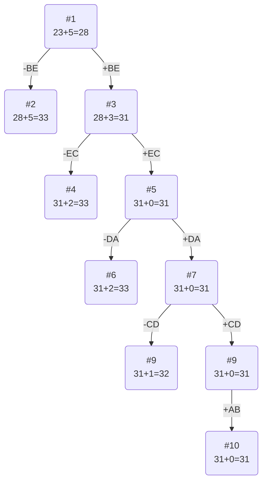

# Задание №20

### Вариант 3:

Матрица расстояний:

|       | **A** | **B** | **C** | **D** | **E** |
|:------|:-----:|:-----:|:-----:|:-----:|:-----:|
| **A** | **∞** |   5   |   8   |   9   |  12   |
| **B** |   8   | **∞** |   9   |  16   |   6   |
| **C** |   9   |   4   | **∞** |   7   |   9   |
| **D** |   8   |   5   |   4   | **∞** |   9   |
| **E** |  10   |   4   |   5   |  10   | **∞** |

## Решение
### 1. Проведем редукцию строк матрицы

|       | **A** | **B** | **C** | **D** | **E** | Min |
|:------|:-----:|:-----:|:-----:|:-----:|:-----:|:---:|
| **A** | **∞** |   0   |   3   |   4   |   7   |  5  |
| **B** |   2   | **∞** |   3   |  10   |   0   |  6  |
| **C** |   5   |   0   | **∞** |   3   |   5   |  4  |
| **D** |   4   |   1   |   0   | **∞** |   5   |  4  |
| **E** |   6   |   0   |   1   |   6   | **∞** |  4  |
| Sum   |       |       |       |       |       | 23  |

Сумма констант редукции по строкам 23

### 2. Проведем редукцию столбцов матрицы

|       | **A** | **B** | **C** | **D** | **E** | Min |
|:------|:-----:|:-----:|:-----:|:-----:|:-----:|:---:|
| **A** | **∞** |   0   |   3   |   4   |   7   |  5  |
| **B** |   2   | **∞** |   3   |  10   |   0   |  6  |
| **C** |   5   |   0   | **∞** |   3   |   5   |  4  |
| **D** |   4   |   1   |   0   | **∞** |   5   |  4  |
| **E** |   6   |   0   |   1   |   6   | **∞** |  4  |
| Sum   |       |       |       |       |       | 23  |

Сумма констант редукции по столбцам 4

Матрица после редукции столбцов:

|       | **A** | **B** | **C** | **D** | **E** |
|:------|:-----:|:-----:|:-----:|:-----:|:-----:|
| **A** | **∞** |   0   |   3   |   1   |   7   |
| **B** |   0   | **∞** |   3   |   7   |   0   |
| **C** |   3   |   0   | **∞** |   0   |   5   |
| **D** |   2   |   1   |   0   | **∞** |   5   |
| **E** |   4   |   0   |   1   |   3   | **∞** |
| Min | 5 |

### 3. Оценка длины маршрута

Оценка длины маршрута снизу соответствует сумме констант редукции по строкам и по столбцам

23 + 5 = 28

### 4. Найдем решение задачи с использованием метода ветвей и границ

Чтобы определить ребро, по которому будет произведено ветвление из корневого узла рассчитаем штрафы для ребер с нулевой оценкой:

|        | **Штраф** |
|:-------|:---------:|
| **AB** |     1     |
| **BA** |     2     |
| **CB** |     0     |
| **CD** |     1     |
| **BE** |     5     |
| **DC** |     2     |
| **EB** |     1     |

Максимальный штраф 2, выберем ребро BE, как ребро с максимальным штрафом.

#### Узел №2
Узел №2 с исключением ребра BE имеет оценку 28 + 5 (штраф) = 33

#### Узел №3
Для получения оценки узла 3 необходимо рассчитать сумму констант редукции для матрицы с учетом включения ребра BE, для этого в матрице:
- удалим строку B,
- удалим столбец E,
- заменим на бесконечность значение EB,

|       | **A** | **B** | **C** | **D** |  
|:------|:-----:|:-----:|:-----:|:-----:|
| **A** | **∞** |   0   |   3   |   1   |  
| **C** |   3   |   0   | **∞** |   0   |  
| **D** |   2   |   1   |   0   | **∞** |  
| **E** |   4   |   **∞**   |   1   |   3   |  

Матрица после редукции:

|       | **A** | **B** | **C** | **D** |  
|:------|:-----:|:-----:|:-----:|:-----:|
| **A** | **∞** |   0   |   3   |   1   |  
| **C** |   1   |   0   | **∞** |   0   |  
| **D** |   0   |   1   |   0   | **∞** |  
| **E** |   2   |   **∞**   |   0   |   2   |  

Сумма констант редукции 3

Оценка узла 3 = 28 + 3 (редукция) = 31

Продолжим поиск из узла 3

#### Выбор ребра
Чтобы определить ребро, по которому будет произведено ветвление из узла 3 рассчитаем штрафы для ребер с нулевой оценкой:

|        | **Штраф** |
|:-------|:---------:|
| **AB** |     1     |
| **CB** |     0     |
| **CD** |     1     |
| **DA** |     1     |
| **DC** |     0     |
| **EC** |     2     |

Максимальный штраф 2, выберем ребро EC, как ребро с максимальным штрафом. 

#### Узел №4
Узел №4 с исключением ребра EC имеет оценку 31 + 2 (штраф) = 33

#### Узел №5
Для получения оценки узла 5 необходимо рассчитать сумму констант редукции для матрицы с учетом включения ребра EC, для этого в матрице:
- удалим строку E,
- удалим столбец C,
- исключим CB

|       | **A** | **B** |  **D** |  
|:------|:-----:|:-----:|:-----:|
| **A** | **∞** |   0   |    1   |  
| **C** |   1   | **∞** |    0   |  
| **D** |   0   |   1   |   **∞** |  

Сумма констант редукции 0

Оценка узла 5 = 31 + 0 (редукция) = 31

Продолжим поиск из узла 5

#### Выбор ребра
Чтобы определить ребро, по которому будет произведено ветвление из узла 5 рассчитаем штрафы для ребер с нулевой оценкой:

|        | **Штраф** |
|:-------|:---------:|
| **AB** |     2     |
| **CD** |     2     |
| **DA** |     2     |

Максимальный штраф 2, выберем ребро DA (случайно (штрафы равны)). 

#### Узел №6
Узел №6 с исключением ребра DA имеет оценку 31 + 2 (штраф) = 33

#### Узел №7
Для получения оценки узла 7 необходимо рассчитать сумму констант редукции для матрицы с учетом включения ребра DA, для этого в матрице:
- удалим строку D,
- удалим столбец A,
- исключим AD

|       | **B**  |  **D**  |  
|:------|:------:|:-------:|
| **A** |   0    |  **∞**  |  
| **C** | **∞**  |    0    |  

Сумма констант редукции 0

Оценка узла 7 = 31 + 0 (редукция) = 31

Продолжим поиск из узла 7

#### Выбор ребра
Чтобы определить ребро, по которому будет произведено ветвление из узла 7 рассчитаем штрафы для ребер с нулевой оценкой:

|        | **Штраф** |
|:-------|:---------:|
| **AB** |   **∞**   |
| **CD** |   **∞**   |

Максимальный штраф **∞** , выберем ребро CD, (случайно (одинаковый штраф)). 

#### Узел №8
Узел №8 с исключением ребра CD имеет оценку 31 + **∞**  (штраф) = **∞** 

#### Узел №9
Для получения оценки узла 9 необходимо рассчитать сумму констант редукции для матрицы с учетом включения ребра CD, для этого в матрице:
- удалим строку C,
- удалим столбец D,

|       | **B** |  
|:------|:-----:|
| **A** |   0   |   

Сумма констант редукции 0

Оценка узла 9 = 31 + 0 (редукция) = 31

Продолжим поиск из узла 9

#### Выбор ребра
Альтернатив у ребра AB нет

#### Узел №14
Ребро AB включается в маршрут, длина которого составляет 31

### Ответ
- Кратчайший маршрут ABECDA.
- Длина маршрута 31.
