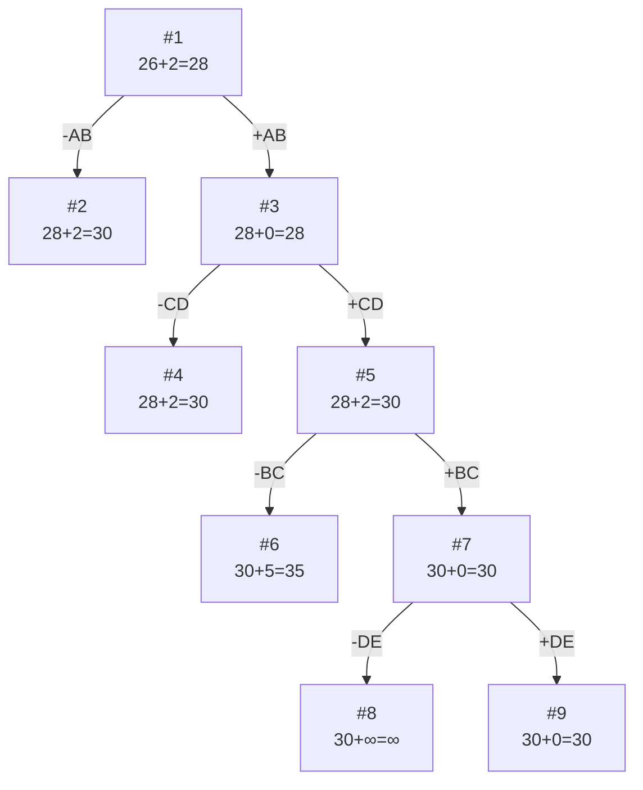

# Задание №20

### Вариант 9: 

Матрица расстояний:

|       | **A** | **B** | **C** | **D** | **E** |
|:------|:-----:|:-----:|:-----:|:-----:|:-----:|
| **A** | **∞** |   5   |   5   |  10   |   7   |
| **B** |   7   | **∞** |   9   |  13   |   9   |
| **C** |   4   |   4   | **∞** |   2   |  11   |
| **D** |   7   |   8   |   4   | **∞** |   6   |
| **E** |   8   |  10   |  15   |   8   | **∞** | 

## Решение
### 1. Проведем редукцию строк матрицы

|       | **A** | **B** | **C** | **D** | **E** | **Min** |
|:------|:-----:|:-----:|:-----:|:-----:|:-----:|:-----:|
| **A** | **∞** |   5   |   5   |  10   |   7   |  5  |
| **B** |   7   | **∞** |   9   |  13   |   9   |  7  |
| **C** |   4   |   4   | **∞** |   2   |  11   |  2  |
| **D** |   7   |   8   |   4   | **∞** |   6   |  4  |
| **E** |   8   |  10   |  15   |   8   | **∞** |  8  |
|**Sum**|       |       |       |       |       |  26 |

Сумма констант редукции по строкам 26

Матрица после редукции строк:

|       | **A** | **B** | **C** | **D** | **E** |
|:------|:-----:|:-----:|:-----:|:-----:|:-----:|
| **A** | **∞** |   0   |   0   |   5   |   2   |
| **B** |   0   | **∞** |   2   |  6   |   2   |
| **C** |   2   |   2   | **∞** |   0   |   9   |
| **D** |   3   |   4   |   0   | **∞** |   2   |
| **E** |   0   |   2   |   7   |   0   | **∞** |

### 2. Проведем редукцию столбцов матрицы

|       | **A** | **B** | **C** | **D** | **E** | Sum |
|:------|:-----:|:-----:|:-----:|:-----:|:-----:|:---:|
| **A** | **∞** |   0   |   0   |   5   |   2   |     |
| **B** |   0   | **∞** |   2   |  6   |   2   |     |
| **C** |   2   |   2   | **∞** |   0   |   9   |     |
| **D** |   3   |   4   |   0   | **∞** |   2   |     |
| **E** |   0   |   2   |   7   |   0   | **∞** |     |
| Min   |   0   |   0   |   0   |   0   |   2   | 2  |

Сумма констант редукции по столбцам 2

Матрица после редукции столбцов:

|       | **A** | **B** | **C** | **D** | **E** |
|:------|:-----:|:-----:|:-----:|:-----:|:-----:|
| **A** | **∞** |   0   |   0   |   5   |   0   | 
| **B** |   0   | **∞** |   2   |   6   |   0   |
| **C** |   2   |   2   | **∞** |   0   |   7   |
| **D** |   3   |   4   |   0   | **∞** |   0   |
| **E** |   0   |   2   |   7   |   0   | **∞** |

### 3. Оценка длины маршрута

Оценка длины маршрута снизу соответствует сумме констант редукции по строкам и по столбцам

26 + 2 = 28

### 4. Найдем решение задачи с использованием метода ветвей и границ

Чтобы определить ребро, по которому будет произведено ветвление из корневого узла рассчитаем штрафы для ребер с нулевой оценкой:

|        | **Штраф** |
|:-------|:---------:|
| **AB** |     2     |
| **AC** |     0     |
| **AE** |     0     |
| **BA** |     0     |
| **BE** |     0     |
| **CD** |     2     |
| **DC** |     0     |
| **DE** |     0     |
| **EA** |     0     |
| **ED** |     0     |

Максимальный штраф 1, выберем ребро AB, как одно из ребер с максимальным штрафом.

#### Узел №2
Узел №2 с исключением ребра AB имеет оценку 28 + 2 (штраф) = 30

#### Узел №3
Для получения оценки узла 3 необходимо рассчитать сумму констант редукции для матрицы с учетом включения ребра AB, для этого в матрице:
- удалим строку A,
- удалим столбец B,
- Заменим на бесконечность значение BA.

Матрица после редукции (сумма редукции равна 0, потому что в каждом столбце и строке уже есть хотя бы один 0):

|       | **A** | **C** | **D** | **E** |
|:------|:-----:|:-----:|:-----:|:-----:|
| **B** | **∞** |   2   |   6   |   0   |
| **C** |   2   | **∞** |   0   |   7   |
| **D** |   3   |   0   | **∞** |   0   |
| **E** |   0   |   7   |   0   | **∞** |

Сумма констант редукции 0

Оценка узла 3 = 28 + 0 (редукция) = 28

Продолжим поиск из узла 3

#### Выбор ребра
Чтобы определить ребро, по которому будет произведено ветвление из узла 3 рассчитаем штрафы для ребер с нулевой оценкой:

|        | **Штраф** |
|:-------|:---------:|
| **BE** |     2     |
| **CD** |     2     |
| **DC** |     2     |
| **DE** |     0     |
| **EA** |     2     |
| **ED** |     0     |

Максимальный штраф 2, выберем ребро CD, как ребро с максимальным штрафом.

#### Узел №4
Узел №4 с исключением ребра CD имеет оценку 28 + 2 (штраф) = 30

#### Узел №5
Для получения оценки узла 5 необходимо рассчитать сумму констант редукции для матрицы с учетом включения ребра CD, для этого в матрице:
- удалим строку С,
- удалим столбец D,
- Заменим на бесконечность значение DC.

|       | **A** | **C** | **E** |**Sum**|
|:------|:-----:|:-----:|:-----:|:-----:|
| **B** | **∞** |   2   |   0   |       |
| **D** |   3   | **∞** |   0   |       |
| **E** |   0   |   7   | **∞** |       |
|**Min**|   0   |   2   |       |   2   |
Матрица после редукции

|       | **A** | **C** | **E** |
|:------|:-----:|:-----:|:-----:|
| **B** | **∞** |   0   |   0   |
| **D** |   3   | **∞** |   0   |
| **E** |   0   |   5   | **∞** |

Сумма констант редукции 2

Оценка узла 5 = 28 + 2 (редукция) = 30

Продолжим поиск из узла 5

#### Выбор ребра

Чтобы определить ребро, по которому будет произведено ветвление из узла 5 рассчитаем штрафы для ребер с нулевой оценкой:

|        | **Штраф** |
|:-------|:---------:|
| **BC** |     5     |
| **BE** |     0     |
| **DE** |     3     |
| **EA** |     3     |

Максимальный штраф 5, выберем ребро BC, как ребро с максимальным штрафом.

#### Узел №6
Узел №6 с исключением ребра BC имеет оценку 30 + 5 (штраф) = 35

#### Узел №7
Для получения оценки узла 7 необходимо рассчитать сумму констант редукции для матрицы с учетом включения ребра BC, для этого в матрице:
- удалим строку B,
- удалим столбец C,
- Заменим на бесконечность значение CB.

|       | **A** | **E** |
|:------|:-----:|:-----:|
| **D** | **∞** |   0   |
| **E** |   0   | **∞** | 

Сумма констант редукции 0

Оценка узла 7 = 30 + 0 (редукция) = 30

Продолжим поиск из узла 7

#### Выбор ребра
Чтобы определить ребро, по которому будет произведено ветвление из узла 7 рассчитаем штрафы для ребер с нулевой оценкой:

|        | **Штраф** |
|:-------|:---------:|
| **DE** |   **∞**   |
| **EA** |   **∞**   |

Максимальный штраф **∞**, выберем ребро DE.

#### Узел №8
Узел №8 с исключением ребра DE имеет оценку 30 + **∞** (штраф) = **∞**

#### Узел №9
Для получения оценки узла 9 необходимо рассчитать сумму констант редукции для матрицы с учетом включения ребра DE, для этого в матрице:
- удалим строку D,
- удалим столбец E,
- Заменим на бесконечность значение ED.

|       | **A** |
|:------|:-----:|
| **E** |   0   |

Сумма констант редукции 0, следовательно, оценка узла 9 = 30 + 0 = 30

Продолжим поиск из узла 9

#### Выбор ребра
Альтернатив у ребра EA нет

#### Узел №14
Ребро EB включается в маршрут, длина которого составляет 30

### Ответ
- Кратчайший маршрут ABCDEA.
- Длина маршрута 30.
