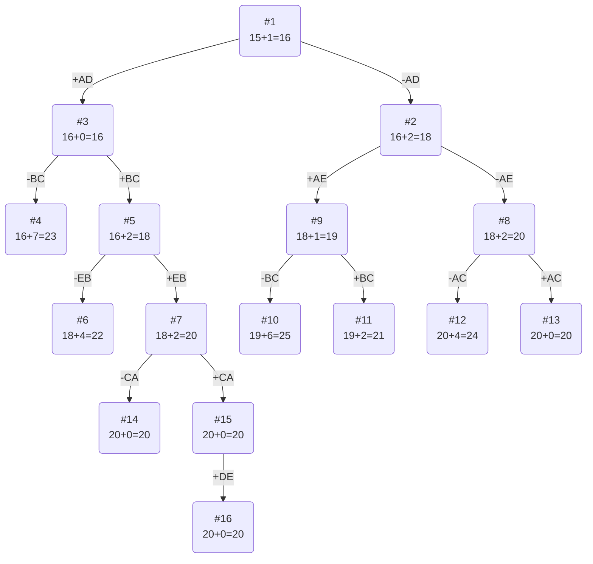

# Задача коммивояжера (Travelling salesman problem)
Для каждого варианта представлены условия задачи, в соответствии с которыми необходимо: 
1. Решить задачу коммивояжера с применением метода ветвей и границ.
2. Оформить решение задачи по шагам с подробными комментариями, таблицами и диаграммами.
3. В ответе указать:
   - найденный маршрут,
   - длину найденного маршрута.

## Условие задачи:
### Вариант 6:

Матрица расстояний:

|       | **A** | **B** | **C** | **D** | **E** |
|:------|:-----:|:-----:|:-----:|:-----:|:-----:|
| **A** | **∞** |  10   |   6   |   4   |   4   |
| **B** |   4   | **∞** |   3   |  11   |   8   |
| **C** |   7   |   4   | **∞** |   8   |   6   |
| **D** |   8   |   3   |   9   | **∞** |   2   |
| **E** |   6   |   2   |   9   |   4   | **∞** |

## Решение

### 1. Проведем редукцию строк матрицы

|       | **A** | **B** | **C** | **D** | **E** | Min |
|:------|:-----:|:-----:|:-----:|:-----:|:-----:|:---:|
| **A** | **∞** |   10  |   6   |   4   |   4   |  4  |
| **B** |   4   | **∞** |   3   |  11   |   8   |  3  |
| **C** |   7   |   4   | **∞** |   8   |   6   |  4  |
| **D** |   8   |   3   |   9   | **∞** |   2   |  2  |
| **E** |   6   |   2   |   9   |   4   | **∞** |  2  |
| Sum   |       |       |       |       |       | 15  |

Сумма констант редукции по строкам 15

Матрица после редукции строк:

|       | **A** | **B** | **C** | **D** | **E** |
|:------|:-----:|:-----:|:-----:|:-----:|:-----:|
| **A** | **∞** |   6   |   2   |   0   |   0   |
| **B** |   1   | **∞** |   0   |   8   |   5   |
| **C** |   3   |   0   | **∞** |   4   |   2   |
| **D** |   6   |   1   |   7   | **∞** |   0   |
| **E** |   4   |   0   |   7   |   2   | **∞** |

### 2. Проведем редукцию столбцов матрицы

|       | **A** | **B** | **C** | **D** | **E** | Sum |
|:------|:-----:|:-----:|:-----:|:-----:|:-----:|:---:|
| **A** | **∞** |   6   |   2   |   0   |   0   |     |
| **B** |   1   | **∞** |   0   |   8   |   5   |     |
| **C** |   3   |   0   | **∞** |   4   |   2   |     |
| **D** |   6   |   1   |   7   | **∞** |   0   |     |
| **E** |   4   |   0   |   7   |   2   | **∞** |     |
| Min   |   1   |   0   |   0   |   0   |   0   |  1  |

Сумма констант редукции по столбцам 1

Матрица после редукции столбцов:

|       | **A** | **B** | **C** | **D** | **E** |
|:------|:-----:|:-----:|:-----:|:-----:|:-----:|
| **A** | **∞** |   6   |   2   |   0   |   0   |
| **B** |   0   | **∞** |   0   |   8   |   5   |
| **C** |   2   |   0   | **∞** |   4   |   2   |
| **D** |   5   |   1   |   7   | **∞** |   0   |
| **E** |   3   |   0   |   7   |   2   | **∞** |

### 3. Оценка длины маршрута

Оценка длины маршрута снизу соответствует сумме констант редукции по строкам и по столбцам

15 + 1 = 16

### 4. Найдем решение задачи с использованием метода ветвей и границ

Чтобы определить ребро, по которому будет произведено ветвление из корневого узла рассчитаем штрафы для ребер с нулевой оценкой:

|        | **Штраф** |
|:-------|:---------:|
| **AD** |     2     |
| **AE** |     0     |
| **BA** |     2     |
| **BC** |     2     |
| **CB** |     2     |
| **DE** |     1     |
| **EB** |     2     |

Максимальный штраф 2, выберем ребро AD, как одно из ребер с максимальным штрафом.

#### Узел №2
Узел №2 с исключением ребра AD имеет оценку 16 + 2 (штраф) = 18

#### Узел №3
Для получения оценки узла 3 необходимо рассчитать сумму констант редукции для матрицы с учетом включения ребра AD, для этого в матрице:
- удалим строку A,
- удалим столбец D,
- Заменим на бесконечность значение DA.

|       | **A** | **B** | **C** | **E** | Min |
|:------|:-----:|:-----:|:-----:|:-----:|-----|
| **B** |   0   | **∞** |   0   |   5   |     |
| **C** |   2   |   0   | **∞** |   2   |     |
| **D** | **∞** |   1   |   7   |   0   |     |
| **E** |   3   |   0   |   7   | **∞** |     |
| Sum   |       |       |       |       | 0   |

Матрица никак не изменяется

Сумма констант редукции 0

Оценка узла 3 = 16 + 0 (редукция) = 16

Продолжим поиск из узла 3

#### Выбор ребра
Чтобы определить ребро, по которому будет произведено ветвление из узла 3 рассчитаем штрафы для ребер с нулевой оценкой:

|        | **Штраф** |
|:-------|:---------:|
| **BA** |     3     |
| **BC** |     7     |
| **CB** |     2     |
| **DE** |     3     |
| **EB** |     3     |

Максимальный штраф 7, выберем ребро BC, как ребро с максимальным штрафом.

#### Узел №4
Узел №4 с исключением ребра BC имеет оценку 16 + 7 (штраф) = 23

#### Узел №5
Для получения оценки узла 5 необходимо рассчитать сумму констант редукции для матрицы с учетом включения ребра BC, для этого в матрице:
- удалим строку B,
- удалим столбец C,
- Заменим на бесконечность значение CB.

|       | **A** | **B** | **E** | Min |
|:------|:-----:|:-----:|:-----:|-----|
| **C** |   2   | **∞** |   2   |  2  |
| **D** | **∞** |   1   |   0   |     |
| **E** |   3   |   0   | **∞** |     |
| Sum   |       |       |       |  2  |

Матрица после редукции:

|       | **A** | **B** | **E** |
|:------|:-----:|:-----:|:-----:|
| **C** |   0   | **∞** |   0   |
| **D** | **∞** |   1   |   0   |
| **E** |   3   |   0   | **∞** |

Сумма констант редукции 2

Оценка узла 5 = 16 + 2 (редукция) = 18

Продолжим поиск из узла 5

#### Выбор ребра
Чтобы определить ребро, по которому будет произведено ветвление из узла 5 рассчитаем штрафы для ребер с нулевой оценкой:

|        | **Штраф** |
|:-------|:---------:|
| **CA** |     3     |
| **CE** |     0     |
| **DE** |     1     |
| **EB** |     4     |

Максимальный штраф 4, выберем ребро EB, как ребро с максимальным штрафом.

#### Узел №6
Узел №6 с исключением ребра EB имеет оценку 18 + 4 (штраф) = 22

#### Узел №7
Для получения оценки узла 7 необходимо рассчитать сумму констант редукции для матрицы с учетом включения ребра EB, для этого в матрице:
- удалим строку E,
- удалим столбец B,
- Заменим на бесконечность значение BE.

|       | **A** | **E** | Min |
|:------|:-----:|:-----:|-----|
| **C** |   2   |   2   |  2  |
| **D** | **∞** |   0   |     |
| Sum   |       |       |  2  |

Матрица после редукции:

|       | **A** | **E** |
|:------|:-----:|:-----:|
| **C** |   0   |   0   |
| **D** | **∞** |   0   |

Сумма констант редукции 2

Оценка узла 7 = 18 + 2 (редукция) = 20

Продолжим поиск из узла 2

#### Выбор ребра
Для узла 2 необходимо преобразовать матрицу:
- Заменить значение AD на бесконечность,
- Провести редукцию матрицы (сумма констант уже учтена в штрафе).

|       | **A** | **B** | **C** | **D** | **E** | Sum |
|:------|:-----:|:-----:|:-----:|:-----:|:-----:|:---:|
| **A** | **∞** |   6   |   2   | **∞** |   0   |     |
| **B** |   0   | **∞** |   0   |   8   |   5   |     |
| **C** |   2   |   0   | **∞** |   4   |   2   |     |
| **D** |   5   |   1   |   7   | **∞** |   0   |     |
| **E** |   3   |   0   |   7   |   2   | **∞** |     |
| Min   |       |       |       |   2   |       |  2  |

Матрица после редукции:

|       | **A** | **B** | **C** | **D** | **E** |
|:------|:-----:|:-----:|:-----:|:-----:|:-----:|
| **A** | **∞** |   6   |   2   | **∞** |   0   |
| **B** |   0   | **∞** |   0   |   6   |   5   |
| **C** |   2   |   0   | **∞** |   2   |   2   |
| **D** |   5   |   1   |   7   | **∞** |   0   |
| **E** |   3   |   0   |   7   |   0   | **∞** |

Чтобы определить ребро, по которому будет произведено ветвление из узла 2 рассчитаем штрафы для ребер с нулевой оценкой:

|        | **Штраф** |
|:-------|:---------:|
| **AE** |     2     |
| **BA** |     2     |
| **BC** |     2     |
| **CB** |     2     |
| **DE** |     1     |
| **ED** |     2     |

Максимальный штраф 2, выберем ребро AE, как одно из ребер с максимальным штрафом.

#### Узел №8
Узел №8 с исключением ребра AE имеет оценку 18 + 2 (штраф) = 20

#### Узел №9
Для получения оценки узла 9 необходимо рассчитать сумму констант редукции для матрицы с учетом включения ребра AE, для этого в матрице:
- удалим строку A,
- удалим столбец E,
- Заменим на бесконечность значение EA.

|       | **A** | **B** | **C** | **D** | Min   |
|:------|:-----:|:-----:|:-----:|:-----:|:-----:|
| **B** |   0   | **∞** |   0   |   6   |       |
| **C** |   2   |   0   | **∞** |   2   |       |
| **D** |   5   |   1   |   7   | **∞** |   1   |
| **E** | **∞** |   0   |   7   |   0   |       |
| Sum   |       |       |       |   2   |       |

Матрица после редукции:

|       | **A** | **B** | **C** | **D** |
|:------|:-----:|:-----:|:-----:|:-----:|
| **B** |   0   | **∞** |   0   |   6   |
| **C** |   2   |   0   | **∞** |   2   |
| **D** |   4   |   0   |   6   | **∞** |
| **E** | **∞** |   0   |   7   |   0   |

Сумма констант редукции 0, следовательно, оценка узла 9 = 18 + 1 = 19

Продолжим поиск из узла 9

#### Выбор ребра
Чтобы определить ребро, по которому будет произведено ветвление из узла 9 рассчитаем штрафы для ребер с нулевой оценкой:

|        | **Штраф** |
|:-------|:---------:|
| **BA** |     2     |
| **BC** |     6     |
| **CB** |     2     |
| **DB** |     4     |
| **EB** |     0     |

Максимальный штраф 6, выберем ребро BC, как ребро с максимальным штрафом.

#### Узел №10
Узел №10 с исключением ребра BC имеет оценку 19 + 6 (штраф) = 25

#### Узел №11
Для получения оценки узла 11 необходимо рассчитать сумму констант редукции для матрицы с учетом включения ребра BC, для этого в матрице:
- удалим строку B,
- удалим столбец C,
- Заменим на бесконечность значение CB.

|       | **A** | **B** | **D** |  Min  |
|:------|:-----:|:-----:|:-----:|:-----:|
| **C** |   2   | **∞** |   2   |   2   |
| **D** |   4   |   0   | **∞** |       |
| **E** | **∞** |   0   |   0   |       |
| Sum   |       |       |       |   2   |

Матрица после редукции:

|       | **A** | **B** | **D** |
|:------|:-----:|:-----:|:-----:|
| **C** |   0   | **∞** |   0   |
| **D** |   4   |   0   | **∞** |
| **E** | **∞** |   0   |   0   |

Сумма констант редукции 2, следовательно, оценка узла 11 = 19 + 2 = 21

Продолжим поиск из узла 8

#### Выбор ребра
Для узла 8 необходимо преобразовать матрицу:
- Заменить значение AE на бесконечность,
- Провести редукцию матрицы (сумма констант уже учтена в штрафе).

|       | **A** | **B** | **C** | **D** | **E** | Sum |
|:------|:-----:|:-----:|:-----:|:-----:|:-----:|:---:|
| **A** | **∞** |   6   |   2   | **∞** | **∞** |  2  |
| **B** |   0   | **∞** |   0   |   6   |   5   |     |
| **C** |   2   |   0   | **∞** |   2   |   2   |     |
| **D** |   5   |   1   |   7   | **∞** |   0   |     |
| **E** |   3   |   0   |   7   |   0   | **∞** |     |
| Min   |       |       |       |       |       |  2  |

Матрица после редукции:

|       | **A** | **B** | **C** | **D** | **E** |
|:------|:-----:|:-----:|:-----:|:-----:|:-----:|
| **A** | **∞** |   4   |   0   | **∞** | **∞** |
| **B** |   0   | **∞** |   0   |   6   |   5   |
| **C** |   2   |   0   | **∞** |   2   |   2   |
| **D** |   5   |   1   |   7   | **∞** |   0   |
| **E** |   3   |   0   |   7   |   0   | **∞** |

Чтобы определить ребро, по которому будет произведено ветвление из узла 8 рассчитаем штрафы для ребер с нулевой оценкой:

|        | **Штраф** |
|:-------|:---------:|
| **AC** |     4     |
| **BA** |     2     |
| **BC** |     0     |
| **CB** |     3     |
| **DE** |     1     |
| **EB** |     0     |
| **ED** |     2     |

Максимальный штраф 4, выберем ребро AC, как одно из ребер с максимальным штрафом.

#### Узел №12
Узел №12 с исключением ребра AC имеет оценку 20 + 4 (штраф) = 24

#### Узел №13
Для получения оценки узла 13 необходимо рассчитать сумму констант редукции для матрицы с учетом включения ребра AC, для этого в матрице:
- удалим строку A,
- удалим столбец C,
- Заменим на бесконечность значение CA.

|       | **A** | **B** | **D** | **E** | Sum |
|:------|:-----:|:-----:|:-----:|:-----:|:---:|
| **B** |   0   | **∞** |   6   |   5   |     |
| **C** | **∞** |   0   |   2   |   2   |     |
| **D** |   5   |   1   | **∞** |   0   |     |
| **E** |   3   |   0   |   0   | **∞** |     |
| Min   |       |       |       |       |  0  |

Матрица после редукции:

|       | **A** | **B** | **D** | **E** |
|:------|:-----:|:-----:|:-----:|:-----:|
| **B** |   0   | **∞** |   6   |   5   |
| **C** | **∞** |   0   |   2   |   2   |
| **D** |   5   |   1   | **∞** |   0   |
| **E** |   3   |   0   |   0   | **∞** |

Сумма констант редукции 2, следовательно, оценка узла 13 = 20 + 0 = 20

Продолжим поиск из узла 7.

#### Выбор ребра
Чтобы определить ребро, по которому будет произведено ветвление из узла 7 рассчитаем штрафы для ребер с нулевой оценкой:

|        | **Штраф** |
|:-------|:---------:|
| **CA** |     0     |
| **CE** |     0     |
| **DE** |     0     |

Максимальный штраф 0, выберем ребро CA, как одно из ребер с максимальным штрафом.

#### Узел №14
Узел №14 с исключением ребра CA имеет оценку 20 + 0 (штраф) = 20

#### Узел №15
Для получения оценки узла 15 необходимо рассчитать сумму констант редукции для матрицы с учетом включения ребра CA, для этого в матрице:
- удалим строку C,
- удалим столбец A,
- Заменим на бесконечность значение AC.

|       | **E** |
|:------|:-----:|
| **D** |   0   |

Сумма констант редукции 0, следовательно, оценка узла 15 = 20 + 0
Заканчиваем алгоритм

## Ответ
Путь найден – ADEBCA, длина маршрута – 20. Использована рёбра AD, BC, EB, CA, DE

