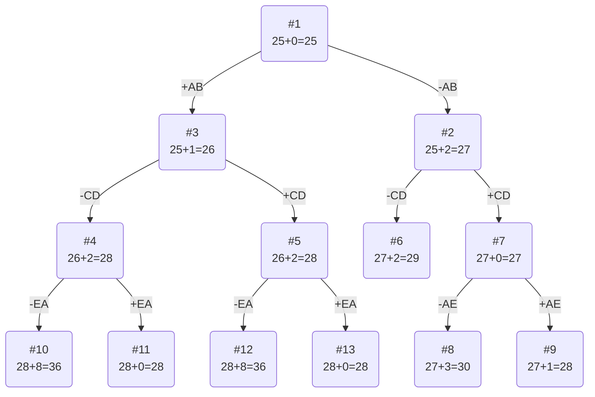

# Задание №20
# Задача коммивояжера (Travelling salesman problem)

## Задание
Для каждого варианта представлены условия задачи, в соответствии с которыми необходимо: 
1. Решить задачу коммивояжера с применением метода ветвей и границ.
2. Оформить решение задачи по шагам с подробными комментариями, таблицами и диаграммами.
3. В ответе указать:
   - найденный маршрут,
   - длину найденного маршрута.

## Постановка задачи
Имеется N городов, связанных дорогами. Расстояния между городами известны. Коммивояжер (бродячий торговец) должен выйти из первого города, посетить по одному разу в некотором порядке города 2,3..n и вернуться в первый город. В каком порядке следует посещать города, чтобы замкнутый путь коммивояжера имел кратчайшее расстояние?

## Математическая модель
Для моделирования задачи можно использовать теорию графов. Города можно перенумеровать и представить в виде вершин графа, а рёбра (*i*, *j*) между вершинами *i* и *j* будут соответствовать пути между этими городами. Каждому ребру (*i*, *j*) можно сопоставить расстояние между городами Сij ⩾ 0. Таким образом, задачу можно сформулировать так: 

Дан полный граф с n вершинами, длина ребра (i,j)= Сij. Найти гамильтонов цикл минимальной длины.

Гамильтоновым циклом называется маршрут, включающий ровно по одному разу каждую вершину графа.

## Пример решения задачи коммивояжера
## Условия задачи

### Вариант 4: 

Матрица расстояний:

|       | **A** | **B** | **C** | **D** | **E** |
|:------|:-----:|:-----:|:-----:|:-----:|:-----:|
| **A** | **∞** |   6   |   6   |  11   |   6   |
| **B** |   6   | **∞** |   9   |  13   |   7   |
| **C** |   3   |   4   | **∞** |   2   |   9   |
| **D** |   6   |   8   |   4   | **∞** |   4   |
| **E** |   7   |  10   |  15   |   8   | **∞** | 

## Решение
### 1. Проведем редукцию строк матрицы

|       | **A** | **B** | **C** | **D** | **E** | Min |
|:------|:-----:|:-----:|:-----:|:-----:|:-----:|:---:|
| **A** | **∞** |   6   |   6   |  11   |   6   |  6  |
| **B** |   6   | **∞** |   9   |  13   |   7   |  6  |
| **C** |   3   |   4   | **∞** |   2   |   9   |  2  |
| **D** |   6   |   8   |   4   | **∞** |   4   |  4  |
| **E** |   7   |  10   |  15   |   8   | **∞** |  7  |
| Sum   |       |       |       |       |       | 25  |

Сумма констант редукции по строкам 25

Марица после редукции строк:

|       | **A** | **B** | **C** | **D** | **E** |
|:------|:-----:|:-----:|:-----:|:-----:|:-----:|
| **A** | **∞** |   0   |   0   |   5   |   0   |
| **B** |   0   | **∞** |   3   |   7   |   1   |
| **C** |   1   |   2   | **∞** |   0   |   7   |
| **D** |   2   |   4   |   0   | **∞** |   0   |
| **E** |   0   |   3   |   8   |   1   | **∞** | 

### 2. Проведем редукцию столбцов матрицы

|       | **A** | **B** | **C** | **D** | **E** | Sum |
|:------|:-----:|:-----:|:-----:|:-----:|:-----:|:---:|
| **A** | **∞** |   0   |   0   |   5   |   0   |
| **B** |   0   | **∞** |   3   |   7   |   1   |
| **C** |   1   |   2   | **∞** |   0   |   7   |
| **D** |   2   |   4   |   0   | **∞** |   0   |
| **E** |   0   |   3   |   8   |   1   | **∞** | 
| Min   |   0   |   0   |   0   |   0   |   0   |  0  |

Сумма констант редукции по столбцам 0

### 3. Оценка длины маршрута

Оценка длины маршрута снизу соответствует сумме констант редукции по строкам и по столбцам

25 + 0 = 25

### 4. Найдем решение задачи с использованием метода ветвей и границ

Чтобы определить ребро, по которому будет произведено ветвление из корневого узла рассчитаем штрафы для ребер с нулевой оценкой:

|        | **Штраф** |
|:-------|:---------:|
| **AB** |     2     |
| **AC** |     0     |
| **AE** |     0     |
| **BA** |     1     |
| **CD** |     2     |
| **DC** |     0     |
| **DE** |     0     |
| **EA** |     1     |

Максимальный штраф 2, выберем ребро AB, как одно из ребер с максимальным штрафом.

#### Узел №2
Узел №2 с исключением ребра AB имеет оценку 25 + 2 (штраф) = 27

#### Узел №3
Для получения оценки узла 3 необходимо рассчитать сумму констант редукции для матрицы с учетом включения ребра AB, для этого в матрице:
- удалим строку A,
- удалим столбец B,
- Заменим на бесконечность значение BA.

|       | **A** | **C** | **D** | **E** | Min |
|:------|:-----:|:-----:|:-----:|:-----:|:---:|
| **B** | **∞** |   3   |   7   |   1   |  1  |
| **C** |   1   | **∞** |   0   |   7   |
| **D** |   2   |   0   | **∞** |   0   |
| **E** |   0   |   8   |   1   | **∞** | 
| Sum   |       |       |       |       |  1  |

Матрица после редукции:

|       | **A** | **C** | **D** | **E** |
|:------|:-----:|:-----:|:-----:|:-----:|
| **B** | **∞** |   2   |   6   |   0   |
| **C** |   1   | **∞** |   0   |   7   |
| **D** |   2   |   0   | **∞** |   0   |
| **E** |   0   |   8   |   1   | **∞** | 

Сумма констант редукции 1

Оценка узла 3 = 25 + 1 (редукция) = 26

Продолжим поиск из узла 3

#### Выбор ребра
Чтобы определить ребро, по которому будет произведено ветвление из узла 3 рассчитаем штрафы для ребер с нулевой оценкой:

|        | **Штраф** |
|:-------|:---------:|
| **BE** |     2     |
| **CD** |     2     |
| **DC** |     2     |
| **DE** |     0     |
| **EA** |     2     |

Максимальный штраф 2, выберем ребро CD, как ребро с максимальным штрафом.

#### Узел №4
Узел №4 с исключением ребра CD имеет оценку 26 + 2 (штраф) = 28

#### Узел №5
Для получения оценки узла 5 необходимо рассчитать сумму констант редукции для матрицы с учетом включения ребра CD, для этого в матрице:
- удалим строку C,
- удалим столбец D,
- Заменим на бесконечность значение CD.

|       | **A** | **C** | **E** | Sum |
|:------|:-----:|:-----:|:-----:|-----|
| **B** | **∞** |   2   |   0   |     |
| **D** |   2   | **∞** |   0   |     |
| **E** |   0   |   8   | **∞** |     | 
| Min   |       |   2   |       | 2   |

Матрица после редукции:

|       | **A** | **C** | **E** |
|:------|:-----:|:-----:|:-----:|
| **B** | **∞** |   0   |   0   |
| **D** |   2   | **∞** |   0   |
| **E** |   0   |   6   | **∞** | 

Сумма констант редукции 2

Оценка узла 5 = 26 + 2 (редукция) = 28

Продолжим поиск из узла 2

#### Выбор ребра
Для узла 2 необходимо преобразовать матрицу:
- Заменить значение AB на бесконечность,
- Провести редукцию матрицы (сумма констант уже учтена в штрафе).

|       | **A** |  **B**  | **C** | **D** | **E** | Min  |
|:------|:-----:|:-------:|:-----:|:-----:|:-----:|:----:|
| **A** | **∞** |  **∞**  |   0   |   5   |   0   |   
| **B** |   0   |  **∞**  |   3   |   7   |   1   |   
| **C** |   1   |    2    | **∞** |   0   |   7   |   
| **D** |   2   |    4    |   0   | **∞** |   0   |   
| **E** |   0   |    3    |   8   |   1   | **∞** |

Матрица после редукции:

|       | **A** |  **B**  | **C** | **D** | **E** |
|:------|:-----:|:-------:|:-----:|:-----:|:-----:|
| **A** | **∞** |  **∞**  |   0   |   5   |   0   |   
| **B** |   0   |  **∞**  |   3   |   7   |   1   |   
| **C** |   1   |    2    | **∞** |   0   |   7   |   
| **D** |   2   |    4    |   0   | **∞** |   0   |   
| **E** |   0   |    3    |   8   |   1   | **∞** |

Чтобы определить ребро, по которому будет произведено ветвление из узла 2 рассчитаем штрафы для ребер с нулевой оценкой:

|        | **Штраф** |
|:-------|:---------:|
| **AC** |     0     |
| **AE** |     0     |
| **BA** |     1     |
| **CD** |     2     |
| **DE** |     0     |
| **DC** |     0     |
| **EA** |     1     |

Максимальный штраф 2, выберем ребро CD, как одно из ребер с максимальным штрафом.

#### Узел №6
Узел №6 с исключением ребра CD имеет оценку 27 + 2 (штраф) = 29

#### Узел №7
Для получения оценки узла 7 необходимо рассчитать сумму констант редукции для матрицы с учетом включения ребра BA, для этого в матрице:
- удалим строку C,
- удалим столбец D,
- Заменим на бесконечность значение CD.

|       | **A** |  **B**  |  **C**  | **E** | Min |
|:------|:-----:|:-------:|:-------:|:-----:|-----|
| **A** | **∞** |  **∞**  |    0    |   0   |     |   
| **B** |   0   |  **∞**  |    3    |   1   |     |   
| **D** |   2   |    4    |  **∞**  |   0   |     |   
| **E** |   0   |    3    |    8    | **∞** |     |

Матрица после редукции:

|       | **A** |  **B**  |  **C**  | **E** |
|:------|:-----:|:-------:|:-------:|:-----:|
| **A** | **∞** |  **∞**  |    0    |   0   |   
| **B** |   0   |  **∞**  |    3    |   1   |   
| **D** |   2   |    4    |  **∞**  |   0   |   
| **E** |   0   |    3    |    8    | **∞** |

Сумма констант редукции 0

Оценка узла 7 = 27 + 0 (редукция) = 27

Продолжим поиск из узла 7

#### Выбор ребра
Чтобы определить ребро, по которому будет произведено ветвление из узла 7 рассчитаем штрафы для ребер с нулевой оценкой:

|        | **Штраф** |
|:-------|:---------:|
| **AC** |     3     |
| **AE** |     0     |
| **BA** |     1     |
| **DE** |     2     |
| **EA** |     3     |

Максимальный штраф 3, выберем ребро EA, как ребро с максимальным штрафом.

#### Узел №8
Узел №8 с исключением ребра EA имеет оценку 27 + 3 (штраф) = 30

#### Узел №9
Для получения оценки узла 9 необходимо рассчитать сумму констант редукции для матрицы с учетом включения ребра DE, для этого в матрице:
- удалим строку E,
- удалим столбец A,
- Заменим на бесконечность значение EA.

|       |  **B**  |  **C**  | **E**  | Min |
|:------|:-------:|:-------:|:------:|-----|
| **A** |  **∞**  |    0    | **∞**  |     |   
| **B** |  **∞**  |    3    |   1    | 1   |   
| **D** |    4    |  **∞**  |   0    |     |

Матрица после редукции:

|       |  **B**  | **C** | **E** |
|:------|:-------:|:-----:|:-----:|
| **A** |  **∞**  |   0   | **∞** |   
| **B** |  **∞**  |   2   |   0   |   
| **D** |    4    | **∞** |   0   |

Сумма констант редукции 1, следовательно, оценка узла 9 = 27 + 1 = 28

Продолжим поиск из узла 4

#### Выбор ребра
Чтобы определить ребро, по которому будет произведено ветвление из узла 4 рассчитаем штрафы для ребер с нулевой оценкой:

|        | **Штраф** |
|:-------|:---------:|
| **BC** |     6     |
| **BE** |     0     |
| **DE** |     2     |
| **EA** |     8     |

Максимальный штраф 8, выберем ребро EA, как ребро с максимальным штрафом.

#### Узел №10
Узел №10 с исключением ребра EA имеет оценку 28 + 8 (штраф) = 36

#### Узел №11
Для получения оценки узла 11 необходимо рассчитать сумму констант редукции для матрицы с учетом включения ребра CD, для этого в матрице:
- удалим строку E,
- удалим столбец A,

|       | **C** | **E** |
|:------|:-----:|:-----:|
| **B** |   0   |   0   |
| **D** | **∞** |   0   |

Сумма констант редукции 0, следовательно, оценка узла 11 = 28 + 0 = 28

Продолжим поиск из узла 5

#### Выбор ребра
Чтобы определить ребро, по которому будет произведено ветвление из узла 4 рассчитаем штрафы для ребер с нулевой оценкой:

|        | **Штраф** |
|:-------|:---------:|
| **BC** |     6     |
| **BE** |     0     |
| **DE** |     2     |
| **EA** |     8     |

Максимальный штраф 8, выберем ребро EA, как ребро с максимальным штрафом.
#### Узел №12
Узел №12 с исключением ребра EA имеет оценку 28 + 8 (штраф) = 36

#### Узел №13
Для получения оценки узла 13 необходимо рассчитать сумму констант редукции для матрицы с учетом включения ребра CD, для этого в матрице:
- удалим строку E,
- удалим столбец A,
- Заменим на бесконечность значение EA,
- **Ребро CD исходит из ранее задействованной вершины C, то есть у нас есть часть маршрута BACD, чтобы избежать преждевременного замыкания цикла, ребро DB (при наличии) также следует заменить на бесконечность.**

|       | **C** | **E** |
|:------|:-----:|:-----:|
| **B** |   0   |   0   |
| **D** | **∞** |   0   |

Сумма констант редукции 0, следовательно, оценка узла 13 = 28 + 0 = 28

Т.к. уже есть маршрут с длиной 28, включающий в себя все вершины, он будет кратчайшим.
### Ответ
- Кратчайший маршрут ABCDEA.
- Длина маршрута 28.

