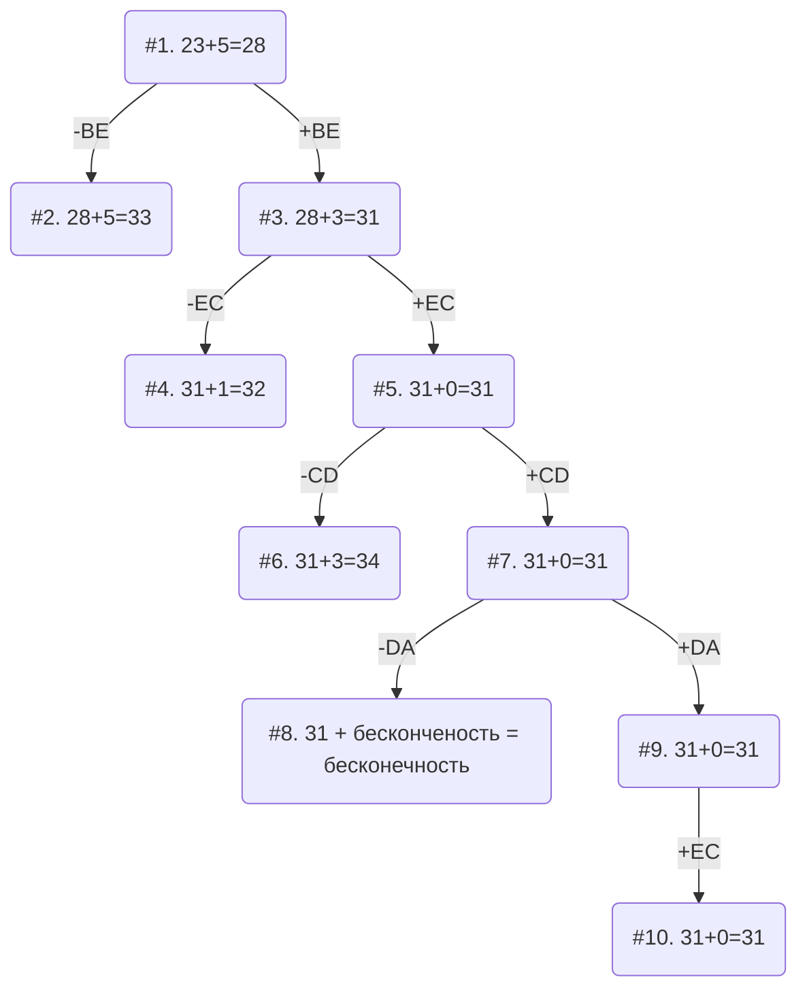

# Задание №20
## Задание
Для каждого варианта представлены условия задачи, в соответствии с которыми необходимо: 
1. Решить задачу коммивояжера с применением метода ветвей и границ.
2. Оформить решение задачи по шагам с подробными комментариями, таблицами и диаграммами.
3. В ответе указать:
   - найденный маршрут,
   - длину найденного маршрута.

## Постановка задачи
Имеется N городов, связанных дорогами. Расстояния между городами известны. Коммивояжер (бродячий торговец) должен выйти из первого города, посетить по одному разу в некотором порядке города 2,3..n и вернуться в первый город. В каком порядке следует посещать города, чтобы замкнутый путь коммивояжера имел кратчайшее расстояние?
### Вариант 3:
Матрица расстояний:

|       | **A** | **B** | **C** | **D** | **E** |
|:------|:-----:|:-----:|:-----:|:-----:|:-----:|
| **A** | **∞** |   5   |   8   |   9   |  12   |
| **B** |   8   | **∞** |   9   |  16   |   6   |
| **C** |   9   |   4   | **∞** |   7   |   9   |
| **D** |   8   |   5   |   4   | **∞** |   9   |
| **E** |  10   |   4   |   5   |  10   | **∞** |

## Решение
### 1. Проведем редукцию строк матрицы

|       | **A** | **B** | **C** | **D** | **E** | Min |
|:------|:-----:|:-----:|:-----:|:-----:|:-----:|:---:|
| **A** | **∞** |   5   |   8   |   9   |  12   |  5  |
| **B** |   8   | **∞** |   9   |  16   |   6   |  6  |
| **C** |   9   |   4   | **∞** |   7   |   9   |  4  |
| **D** |   8   |   5   |   4   | **∞** |   9   |  4  |
| **E** |  10   |   4   |   5   |  10   | **∞** |  4  |
| Sum   |       |       |       |       |       | 23  |

Сумма констант редукции по строкам: **23**

Марица после редукции строк:

|       | **A** | **B** | **C** | **D** | **E** |
|:------|:-----:|:-----:|:-----:|:-----:|:-----:|
| **A** | **∞** |   0   |   3   |   4   |   7   |
| **B** |   2   | **∞** |   3   |  10   |   0   |
| **C** |   5   |   0   | **∞** |   3   |   5   |
| **D** |   4   |   1   |   0   | **∞** |   5   |
| **E** |   6   |   0   |   1   |   6   | **∞** |

### 2. Проведем редукцию столбцов матрицы

|       | **A** | **B** | **C** | **D** | **E** | Sum |
|:------|:-----:|:-----:|:-----:|:-----:|:-----:|:---:|
| **A** | **∞** |   0   |   3   |   4   |   7   |     |
| **B** |   2   | **∞** |   3   |  10   |   0   |     |
| **C** |   5   |   0   | **∞** |   3   |   5   |     |
| **D** |   4   |   1   |   0   | **∞** |   5   |     |
| **E** |   6   |   0   |   1   |   6   | **∞** |     |
| Min   |   0   |   0   |   1   |   3   |   0   |  5  |
Сумма констант редукции по столбцам: **5**

Матрица после редукции столбцов:

|       | **A** | **B** | **C** | **D** | **E** |
|:------|:-----:|:-----:|:-----:|:-----:|:-----:|
| **A** | **∞** |   0   |   3   |   1   |   7   |
| **B** |   0   | **∞** |   3   |   7   |   0   |
| **C** |   3   |   0   | **∞** |   0   |   5   |
| **D** |   2   |   1   |   0   | **∞** |   5   |
| **E** |   4   |   0   |   1   |   3   | **∞** |

### 3. Оценка длины маршрута

Оценка длины маршрута снизу соответствует сумме констант редукции по строкам и по столбцам:
**23 + 5 = 28**

### 4. Найдем решение задачи с использованием метода ветвей и границ

Чтобы определить ребро, по которому будет произведено ветвление из корневого узла рассчитаем штрафы для ребер с нулевой оценкой:

|        | **Штраф** |
|:-------|:---------:|
| **AB** |     1     |
| **BA** |     2     |
| **BE** |     5     |
| **CB** |     0     |
| **CD** |     1     |
| **DC** |     2     |
| **EB** |     1     |

Максимальный штраф 5, выберем ребро BE, как одно из ребер с максимальным штрафом.

#### Узел №2
Узел №2 с исключением ребра BE имеет оценку 28 + 5 (штраф) = 33

#### Узел №3
Для получения оценки узла 3 необходимо рассчитать сумму констант редукции для матрицы с учетом включения ребра BE, для этого в матрице:
- удалим строку B,
- удалим столбец E,
- Заменим на бесконечность значение EB.

|       | **A** | **B** | **C** | **D** |  Min |
|:------|:-----:|:-----:|:-----:|:-----:|:----:|
| **A** | **∞** |   0   |   3   |   1   |      |
| **C** |   3   |   0   | **∞** |   0   |      |
| **D** |   2   |   1   |   0   | **∞** |      |
| **E** |   4   | **∞** |   1   |   3   |   1  |
| Sum   |   2   |       |       |       |   3  |

Матрица после редукции:

|       | **A** | **B** | **C** | **D** |  
|:------|:-----:|:-----:|:-----:|:-----:|
| **A** | **∞** |   0   |   3   |   1   |      
| **C** |   1   |   0   | **∞** |   0   |      
| **D** |   0   |   1   |   0   | **∞** |      
| **E** |   1   | **∞** |   0   |   2   | 

Сумма констант редукции: 3

Оценка узла 3 = 28 + 3 (редукция) = 31

Продолжим поиск из узла 3

#### Выбор ребра
Чтобы определить ребро, по которому будет произведено ветвление из узла 3 рассчитаем штрафы для ребер с нулевой оценкой:

|        | **Штраф** |
|:-------|:---------:|
| **AB** |     1     |
| **CB** |     0     |
| **CD** |     1     |
| **DA** |     1     |
| **DC** |     0     |
| **CE** |     1     |
Максимальный штраф 1, выберем ребро AB, как ребро с максимальным штрафом.

#### Узел №4
Узел №4 с исключением ребра AB имеет оценку 31 + 1 (штраф) = 32

#### Узел №5
Для получения оценки узла 5 необходимо рассчитать сумму констант редукции для матрицы с учетом включения ребра AB, для этого в матрице:
- удалим строку A,
- удалим столбец B,
- Заменим на бесконечность значение EA.

|       | **A** | **C** | **E** | Sum |
|:------|:-----:|:-----:|:-----:|-----|
| **B** | **∞** |   2   |   0   |     |
| **D** |   5   | **∞** |   0   |     |
| **E** |   0   |   2   | **∞** |     |
| Min   |       |   2   |       | 2   |

Матрица после редукции:

|       | **A** | **C** | **D** |
|:------|:-----:|:-----:|:-----:|
| **C** |   1   | **∞** |   0   |
| **D** |   0   |   0   | **∞** |
| **E** | **∞** |   0   |   2   |
В каждом столбце и в каждой строке матрицы есть хоятбы один 0.
Сумма констант редукции 2

Оценка узла 5 = 31 + 0 (редукция) = 31

Продолжим поиск из узла 5

#### Выбор ребра
Расчитаем шрафы для ребер с нулевой оценкой

|        | **Штраф** |
|:-------|:---------:|
| **CD** |     3     |
| **DA** |     1     |
| **DC** |     0     |
| **EC** |     2     |
Выбираем ребро CD как ребро с максимальным штрафом.

#### Узел №6
Узел №6 с исключением ребра CD имеет оценку 31 + 3(штраф) = 34

#### Узел №7
Для получения оценки узла 7 необходимо рассчитать сумму констант редукции для матрицы с учетом включения ребра BA, для этого в матрице:
- удалим строку C,
- удалим столбец D,
- Заменим на бесконечность значение DC.

|       | **A** | **C** |  
|:------|:-----:|:-----:|
| **D** |   0   |**∞**  | 
| **E** | **∞** |   0   |  

Сумма констант редукции: 0

Оценка узла 7 = 31 + 0 (редукция) = 31

Продолжим поиск из узла 7

#### Выбор ребра
Чтобы определить ребро, по которому будет произведено ветвление из узла 7 рассчитаем штрафы для ребер с нулевой оценкой:

|        | **Штраф** |
|:-------|:---------:|
| **DA** |   **∞**   |
| **EC** |   **∞**   |
Максимальный штраф **∞**, выберем ребро DA, как одно из ребер с максимальным штрафом.

#### Узел №8
Узел №8 с исключением ребра DA имеет оценку 21 + **∞** (штраф) = **∞**

#### Узел №9
Для получения оценки узла 9 необходимо рассчитать сумму констант редукции для матрицы с учетом включения ребра DA, для этого в матрице:
- удалим строку D,
- удалим столбец A,
- Заменим на бесконечность значение AD.

|        | **C** |
|:------ |:-----:|
| **E**  |   0   |

Сумма констант редукции 0, следовательно, оценка узла 9 = 31 + 0 = 31

#### Выбор ребра
Альтернатив у ребра EC нет

#### Узел №10
Ребро EC включается в маршрут, длина которого составляет 31

### Ответ
- Кратчайший маршрут ECDABE.
- Длина маршрута 31.
