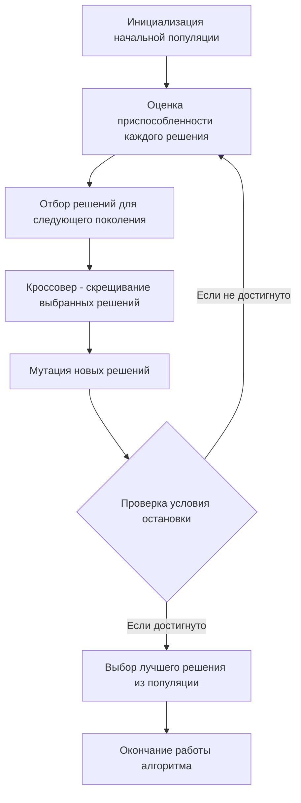

# Задание №22
# Генетический алгоритм для решения задачи коммивояжера и задачи о рюкзаке

## Задание
Для каждого варианта представлены условия задачи, в соответствии с которыми необходимо: 
1. Решить задачу коммивояжера либо задачу о рюкзаке с применением генетического алгоритма согласно заданным условиям.
2. Оформить решение задачи по шагам с подробными комментариями, таблицами и диаграммами.
3. В ответе для задачи коммивояжера указать:
   - найденный маршрут,
   - длину найденного маршрута.
4. В ответе для задачи о рюкзаке указать:
   - найденную максимально возможную стоимость предметов в рюкзаке,
   - набор предметов, обеспечивающих найденную максимальную стоимость,
   - общий вес предметов в рюкзаке,
   - свободное место в рюкзаке.

Условия для каждого варианта расположены в файле task_22/task.md в ветке main репозитория manual_tasks. 

Решение задачи нужно оформить в формате Markdown в отдельном файле с названием <название_команды>.md, который добавить в каталог task_22 данного репозитория.

## Для выполнения задания необходимо:
1. Обновить ветку main в локальном репозитории (git pull).
2. От ветки main создать ветвь с названием <название_команды>_task_22.
3. В созданной ветке в каталог task_22 добавить файл с решением задачи с названием <название_команды>.md.
4. Зафиксировать изменения на ветке (git commit).
5. Отравить ветку с изменениями в репозиторий на Github (git push).
6. Создать на Github запрос на слияние (pull request), указав в качестве base-ветки main, в качестве compare-ветки <название_команды>_task_22.

## Постановка задачи о рюкзаке
Задача о рюкзаке (англ. Knapsack problem) — дано N предметов, ni предмет имеет массу wi > 0 и стоимость pi > 0. Необходимо выбрать из этих предметов такой набор, чтобы суммарная масса не превосходила заданной величины W (вместимость рюкзака), а суммарная стоимость была максимальна.

### Оценка сложности задачи о рюкзаке
Задача о рюкзаке является NP-полной задачей. Это означает, что не существует известного алгоритма, который мог бы решить эту задачу за полиномиальное время.

Полный перебор для решения задачи о рюкзаке имеет экспоненциальную сложность. Это связано с тем, что для каждого предмета есть два варианта - включить его в рюкзак или нет. Таким образом, для n предметов количество возможных комбинаций будет 2n, что делает полный перебор непрактичным для больших значений n.

Метод ветвей и границ может значительно сократить количество рассматриваемых решений по сравнению с полным перебором, он все равно может быть довольно затратным в плане времени и памяти, особенно для больших задач. В худшем случае метод ветвей и границ может привести к полному перебору всех возможных комбинаций, что дает экспоненциальную сложность O(2n), где n - количество предметов. Это происходит, когда невозможно отсечь ни одну ветвь и приходится исследовать все возможные подмножества предметов.

## Постановка задачи коммивояжера (Travelling salesman problem)
Имеется N городов, связанных дорогами. Расстояния между городами известны. Коммивояжер (бродячий торговец) должен выйти из первого города, посетить по одному разу в некотором порядке города 2,3..n и вернуться в первый город. В каком порядке следует посещать города, чтобы замкнутый путь коммивояжера имел кратчайшее расстояние?

### Математическая модель
Для моделирования задачи можно использовать теорию графов. Города можно перенумеровать и представить в виде вершин графа, а рёбра (*i*, *j*) между вершинами *i* и *j* будут соответствовать пути между этими городами. Каждому ребру (*i*, *j*) можно сопоставить расстояние между городами Сij ⩾ 0. Таким образом, задачу можно сформулировать так: 

Дан полный граф с n вершинами, длина ребра (i,j)= Сij. Найти гамильтонов цикл минимальной длины.

Гамильтоновым циклом называется маршрут, включающий ровно по одному разу каждую вершину графа.

### Оценка сложности задачи коммивояжера
Задача коммивояжера является NP-трудной задачей. Это означает, что не существует известного алгоритма, который мог бы решить эту задачу за полиномиальное время.

Самый простой алгоритм для решения задачи коммивояжера — это полный перебор всех возможных маршрутов, который имеет факториальную сложность O(N!), где N — количество городов. Это делает его непрактичным даже для относительно небольших графов.

Метод ветвей и границ может быть использован для решения задачи коммивояжера. Этот метод является стратегией поиска для решения комбинаторных задач оптимизации и может быть более эффективным, чем простой полный перебор. В худшем случае метод ветвей и границ имеет экспоненциальную сложность, аналогичную полному перебору. Это происходит, когда невозможно отсечь ни одного подмножества пространства решений, и поэтому приходится рассматривать все возможные маршруты.

Эвристические и метаэвристические алгоритмы, такие как генетические алгоритмы или алгоритмы оптимизации на основе муравьиного колониального поиска, могут найти приемлемые решения за полиномиальное время, но они не гарантируют нахождение оптимального решения.

# Генетический алгоритм
Генетический алгоритм — это метод оптимизации и поиска решений, который использует принципы генетики и естественного отбора. Он может быть использован для нахождения приближенного решения задач, для которых нет эффективного алгоритма, в том числе для задачи о рюкзаке и задачи коммивояжера.

Основные шаги генетического алгоритма:
- Инициализация: Создается начальная популяция случайных решений (особей).
- Оценка: Каждое решение оценивается с помощью функции приспособленности (фитнес функция), которая измеряет качество решения.
- Отбор: На основе оценки приспособленности выбираются решения, которые будут использоваться для создания нового поколения. Чем выше приспособленность, тем больше шансов у решения быть выбранным.
- Кроссовер (скрещивание): Выбранные решения комбинируются для создания новых решений. Это может происходить различными способами, но обычно включает в себя обмен частями двух решений.
- Мутация: С небольшой вероятностью некоторые части новых решений случайным образом изменяются для добавления вариативности.
- Новое поколение: Новые решения заменяют старые, и процесс повторяется с шага оценки.

Этот процесс продолжается до тех пор, пока не будет достигнут критерий остановки, например, максимальное количество поколений или достижение достаточно хорошего решения.

