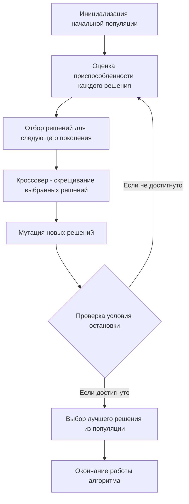

# Задание №22
# Генетический алгоритм для решения задачи коммивояжера и задачи о рюкзаке

## Задание
Для каждого варианта представлены условия задачи, в соответствии с которыми необходимо: 
1. Решить задачу коммивояжера либо задачу о рюкзаке с применением генетического алгоритма согласно заданным условиям.
2. Оформить решение задачи по шагам с подробными комментариями, таблицами и диаграммами.
3. ответе для задачи о рюкзаке указать:
   - найденную максимально возможную стоимость предметов в рюкзаке,
   - набор предметов, обеспечивающих найденную максимальную стоимость,
   - общий вес предметов в рюкзаке,
   - свободное место в рюкзаке.

## Постановка задачи о рюкзаке
Задача о рюкзаке (англ. Knapsack problem) — дано N предметов, ni предмет имеет массу wi > 0 и стоимость pi > 0. Необходимо выбрать из этих предметов такой набор, чтобы суммарная масса не превосходила заданной величины W (вместимость рюкзака), а суммарная стоимость была максимальна.

### Оценка сложности задачи о рюкзаке
Задача о рюкзаке является NP-полной задачей. Это означает, что не существует известного алгоритма, который мог бы решить эту задачу за полиномиальное время.

Полный перебор для решения задачи о рюкзаке имеет экспоненциальную сложность. Это связано с тем, что для каждого предмета есть два варианта - включить его в рюкзак или нет. Таким образом, для n предметов количество возможных комбинаций будет 2n, что делает полный перебор непрактичным для больших значений n.

Метод ветвей и границ может значительно сократить количество рассматриваемых решений по сравнению с полным перебором, он все равно может быть довольно затратным в плане времени и памяти, особенно для больших задач. В худшем случае метод ветвей и границ может привести к полному перебору всех возможных комбинаций, что дает экспоненциальную сложность O(2n), где n - количество предметов. Это происходит, когда невозможно отсечь ни одну ветвь и приходится исследовать все возможные подмножества предметов.

# Генетический алгоритм
Генетический алгоритм — это метод оптимизации и поиска решений, который использует принципы генетики и естественного отбора. Он может быть использован для нахождения приближенного решения задач, для которых нет эффективного алгоритма, в том числе для задачи о рюкзаке и задачи коммивояжера.

Основные шаги генетического алгоритма:
- Инициализация: Создается начальная популяция случайных решений (особей).
- Оценка: Каждое решение оценивается с помощью функции приспособленности (фитнес функция), которая измеряет качество решения.
- Отбор: На основе оценки приспособленности выбираются решения, которые будут использоваться для создания нового поколения. Чем выше приспособленность, тем больше шансов у решения быть выбранным.
- Кроссовер (скрещивание): Выбранные решения комбинируются для создания новых решений. Это может происходить различными способами, но обычно включает в себя обмен частями двух решений.
- Мутация: С небольшой вероятностью некоторые части новых решений случайным образом изменяются для добавления вариативности.
- Новое поколение: Новые решения заменяют старые, и процесс повторяется с шага оценки.

Этот процесс продолжается до тех пор, пока не будет достигнут критерий остановки, например, максимальное количество поколений или достижение достаточно хорошего решения.

### Вариант 4: 

1. Решить задачу о рюкзаке с применением генетического алгоритма, с учетом следующих требований:
   - Придумать условия задачи с количеством предметов не менее 6.
   - Численность популяции не менее 4 особей, в скрещивании участвует половина популяции. 
   - Для скрещивания выбираются особи по принципу рулетки, скрещивание – равномерное.
   - До выполнения алгоритма сформулировать стратегию применения оператора мутации.
   - Сформировать не менее 3 поколений, не считая первоначального.
2. Для условий 4 варианта задания 20:
   - Сгенерировать 2 особи (случайных решения) в виде перестановки номеров городов, которая всегда начинается с единицы.
   - Рассчитать фитнес-функцию для особей.
   - Закодировать их с применением альтернативной кодировки с пошаговыми комментариями.
   - Декодировать альтернативную кодировку с пошаговыми комментариями.

## Пример решения задачи о рюкзаке
## Условия задачи
| Предметы  | A  | B  | C  | D  | E  | F  | G  |
|:----------|:--:|:--:|:--:|:--:|:--:|----|----|
| Стоимость | 15 | 30 | 20 | 25 | 10 | 40 | 35 |
| Вес       | 3  | 4  | 2  | 5  | 1  | 5  | 3  |

Ограничение вместимости: 12

## Решение

Считаем суммарный вес предметов:

**3+4+2+5+1+5+3 = 23**

Суммарный вес превосходит вместимость, поэтому воспользуемся генетическим алгоритмом.

**Условие завершения работы ГА - 5 поколений**

### 1. Пусть каждое поколение состоит из 4х особей. Сгенерируем особи случайным образом.

- **x1 (1001100), вес 9, f(x1) = 15+25+10=50**
- **x2 (1010010), вес 10, f(x2) = 15+20+40=75**
- x3 (0110011), вес 14 - **вес превышает вместимость, особь нежизнеспособна**
- **x3 (0110001), вес 9, f(x3) = 30+20+35=85**
- **x4 (1011100), вес 11, f(x4) = 15+20+25+10=70**

### Суммарная приспособленность 1 поколения равна 50+75+85+70 = 280

Проведем скрещивание:

Пусть в скрещивании участвуют 50% особей - **самые приспособленные x2, x3.**

Точка разрыва - между 3 и 4

**x2 (1010010) => x5 (1010001), f(x5) = 15+20+35 = 70, вес 8** 

**x3 (0110001) => x6 (0110010), f(x6) = 30+20+40 = 90, вес 11**

x5 менее приспособлен, чем родительские особи

x6 более приспособлен, чем родительские особи

#### Применим мутацию к особи х5

x5 (1010(*1*)01), f(x5) = 15+20+30+10 = 80, вес 9

Мутация потомка привела к его усилению.

### 2.Формируем новую популяцию

Пусть 50% лучших особей из 1 поколения гарантированно переходит во 2 поколение

- **x2 (1010010), вес 10, f(x2) = 15+20+40=75**
- **x3 (0110001), вес 9, f(x3) = 30+20+35=85**
- **x5 (1010101), вес 9, f(x5) = 15+20+30+10=80**
- **x6 (0110010), вес 11, f(x6) = 30+20+40=90**

### Суммарная приспособленность 2 поколения равна 75+85+80+90 = 330

#### 280 < 330, наблюдается эволюция

Принципом рулетки выбираем особей для скрещивания - шанс для каждой особи пропорционален значению фитнес-функции

Пусть шансы реализовались у x3 и x5.

**Проведем скрещивание:**

Точка разрыва - между 2 и 3, 5 и 6

**x3 (0110001) => x7 (0110101), f(x7) = 30+20+35+10 = 95, вес 10** 

**x5 (1010101) => x8 (1010001), f(x8) = 15+20+35 = 70, вес 8**

x7 более приспособлен, чем родительские особи

x8 менее приспособлен, чем родительские особи

#### Применим мутацию к особи х8

x8 ((*0*)010001), f(x8) = 20+35 = 55, вес 5

Мутация потомка привела к ослаблению.

### 3.Формируем новую популяцию

Пусть 50% лучших особей из 2 поколения гарантированно переходит во 3 поколение

- **x3 (0110001), вес 9, f(x3) = 30+20+35=85**
- **x6 (0110010), вес 11, f(x6) = 30+20+40=90**
- **x7 (0110101), вес 10, f(x7) = 30+20+35+10 = 95** 
- **x8 (0010001),вес 5, f(x8) = 20+35 = 55**

### Суммарная приспособленность 3 поколения равна 85+90+95+55 = 325

#### 325 < 330, эволюция отсутствует

Пусть в скрещивании участвуют 50% особей - **самые приспособленные x6, x7.**

Точка разрыва - между 5 и 6

**x6 (0110010) => x9 (0110001), f(x9) = 30+20+35 = 85, вес 9** 

**x7 (0110101) => x10 (0110110), f(x10) = 30+20+10+40 = 100, вес 12**

x9 менее приспособлен, чем родительские особи

x10 более приспособлен, чем родительские особи

### 4.Формируем новую популяцию

Пусть 50% лучших особей из 3 поколения гарантированно переходит в 4 поколение

- **x6 (0110010), вес 11, f(x6) = 30+20+40=90**
- **x7 (0110101), вес 10, f(x7) = 30+20+35+10 = 95** 
- **x9 (0110001), вес 9, f(x9) = 30+20+35 = 85**
- **x10 (0110110), вес 12, f(x10) = 30+20+10+40 = 100** 

### Суммарная приспособленность 4 поколения равна 90+95+85+100 = 370

#### 325 < 370, наблюдается эволюция

Принципом рулетки выбираем особей для скрещивания - шанс для каждой особи пропорционален значению фитнес-функции

Пусть шансы реализовались у x7 и x9.

**Проведем скрещивание:**

Точка разрыва - между 3 и 4, 6 и 7

**x7 (0110101) => x11 (0110001), f(x11) = 30+20+35 = 85, вес 9** 

**x9 (0110001) => x12 (0110101), f(x12) = 30+20+10+35 = 95, вес 10**

x11 менее приспособлен, чем родительские особи

x12 более приспособлен, чем родительские особи

#### Применим мутацию к особи х11

x11 (01(*0*)0001), f(x11) = 30+35 = 65, вес 7

Мутация потомка привела к ослаблению.

### 5.Формируем новую популяцию

Пусть 50% лучших особей из 4 поколения гарантированно переходит в 5 поколение

- **x7 (0110101), вес 10, f(x7) = 30+20+35+10 = 95** 
- **x10 (0110110), вес 12, f(x10) = 30+20+10+40 = 100** 
- **x11 (0100001), вес 7, f(x11) = 30+35 = 65**
- **x12 (0110101), вес 10, f(x12) = 30+20+10+35 = 95**

### Суммарная приспособленность 3 поколения равна 95+100+65+95 = 355

#### 355 < 370, эволюция отсутствует

Наилучшая особь 5 поколения - x10, которая кодирует набор предметов с номерами 2,3,5,6.

## Стоимость рюкзака = 100, вес рюкзака - 12.

Выполнено условие завершения алгоритма, получена наилучшая особь 5го поколения.

# Ответ:
Правильный ответ:

Стоимость = 105, предметы - 2,6,7