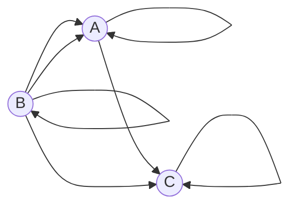

# Задача на взаимную рекурсию (маршруты в треугольнике)

## Задание для вариантов 6 - 8
В условиях задачи для каждого варианта указан граф с тремя вершинами. Для решения задачи требуется:
1. Составить систему из 3 рекуррентных соотношений для предложенного графа.
2. Методом исключения свести систему к одному рекуррентному соотношению.
3. Составить и решить характеристическое уравнение.

### Вариант 8:

Допустимые маршруты:  
- A --> C  
- A --> A  
- B --> A  
- B --> C  
- B --> B  
- C --> C  
- B --> A  
  
## Система рекуррентных соотношений
### Соотношения для каждого узла задаются как:

$$
a_n = a_{n-1} + c_{n-3}
$$
$$
b_n = b_{n-1} + a_{n-3}
$$
$$
c_n = c_{n-1} + b_{n-3}
$$

## Сведение системы к одному соотношению
### Для сведения системы к одному рекуррентному соотношению, выражаем \(c_{n-3}\) и \(b_{n-3}\) через \(a\):

$$
c_{n-3} = c_{n-4} + b_{n-6}
$$
$$
b_{n-3} = b_{n-4} + a_{n-6}
$$

### Затем подставляем эти выражения в первое уравнение:

$$
a_n = a_{n-1} + (c_{n-4} + b_{n-6})
$$

### Дальнейшая замена \(c_{n-4}\) и \(b_{n-6}\):

$$
c_{n-4} = c_{n-5} + b_{n-7}
$$
$$
b_{n-6} = b_{n-7} + a_{n-9}
$$

### Получаем рекуррентное соотношение для \(a_n\):

$$
a_n = a_{n-1} + ((c_{n-5} + b_{n-7}) + (b_{n-7} + a_{n-9}))
$$