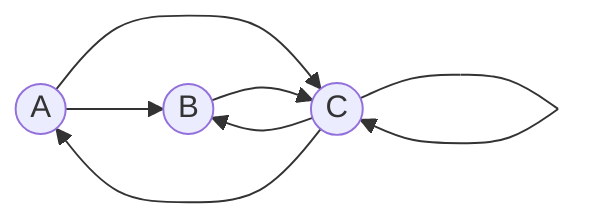

# Задача на взаимную рекурсию (маршруты в треугольнике)

### Вариант 8:

Необходимо:

1. Придумать граф с допустимыми маршрутами для рекуррентного соотношения третьего порядка.

2. Составить систему из 3 рекуррентных соотношений для предложенного графа.

3. Методом исключения свести систему к одному рекуррентному соотношению третьего порядка.

  

### 1. Граф:

  

**Маршруты:**

- A --> B
- A --> C
- B --> C
- C --> B
- C --> A
- C --> C
  

## 2. Система из 3х рекуррентных соотношений:

**(1) Система:**
$$\begin{cases}
A_{n} = C_{n-1} \\
C_{n} = A_{n-1} + B_{n-1} + C_{n-1} \\
B_{n} = A_{n-1} + C_{n-1}
\end{cases}$$

## 3. Сводим к одному рекуррентному соотношению 3 порядка:

  **1) Система:**
$$\begin{cases}
A_{n} = C_{n-1} \\
C_{n} = A_{n-1} + B_{n-1} + C_{n-1} \\
B_{n} = A_{n-1} + C_{n-1}
\end{cases}$$

**2) Выразим *B_{n-1}***

$$B_{n-1} = A_{n-2} + C_{n-2}$$

 **3) Подставим B_{n-1} в C_n**

$$C_n = C_{n-1} + A{n-1} + C_{n-2} + A_{n-2}$$ 

**4) Убавим A_n на 1**

$$A_{n-1} = C{n-2}$$

**5) Перенесем полученные значения**

  $$C_n = C_{n-1} + C{n-2} + C_{n-2} + C_{n-3}$$

  **Сложим и получим ответ**

  $$C_n = C_{n-1} + 2C_{n-2} + C_{n-3}$$
