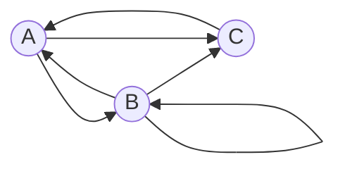

### Вариант 4:

Допустимые маршруты:
- A --> B
- B --> A
- B --> B
- B --> C
- C --> A
- A --> C

Найти формулу расчета количества маршрутов, начинающихся в вершине A и заканчивающихся в вершине B. 

# Решение
## 1. Составим систему из 3 рекуррентных соотношений:

$$ \begin{cases}  
a_n =b_{n-1} + c_{n-1}\\  
b_n = a_{n-1} + b_{n-1}\\  
c_n = a_{n-1} + b_{n-1} 
\end{cases} $$

## 2. Методом исключения сведем систему к одному рекуррентному соотношению
### Из 2 и 3 уравнений: $b_n=c_n$

### Значит $b_{n-1}=c_{n-1}$
### Подставим в первое уравнение $a_n =b_{n-1} + c_{n-1}$ вместо $c_{n-1}$  слагаемое $b_{n-1}$:

$$
a_n = b_{n-1}+ b_{n-1}=2 \cdot b_{n-1}
$$

### Подставим во второе уравнение $b_n = a_{n-1} + b_{n-1}$ вместо $a_{n-1}$ слагаемое $(2 \cdot b_{n-2})$:

$$
b_n =2 \cdot b_{n-2}+b_{n-1}
$$

### Получили линейное однородное рекуррентное соотношение
## 3. Составим и решим характеристическое уравнение

$$
\lambda^n = 2\lambda^{n-2} + \lambda^{n-1} 
$$

$$
\lambda^2 -\lambda -2 =0
$$

### Найдем корни уравнения:

$$
\lambda_{1} =2 
$$

$$
\lambda_{2} =-1
$$

## 4. Выведем формулу общего решения
### Так как $\lambda_{1} \neq \lambda_{2}$, то подставляем их в рекуррентное соотношение:

$$
b_n =  C_1\cdot(2)^n+C_2\cdot(-1)^n
$$

### Находим $b$ при $n$ равном 1 и 2:

$$
n=1 \longrightarrow b_1 = 1\\
$$

$$
n=2 \longrightarrow b_2 = 1\\
$$

### Составим систему:

$$ \begin{cases}
1=2 \cdot C_1- C_2\\
1=4\cdot C_1+ C_2
\end{cases} $$

### Из системы получаем

$$
C_1=\frac13;  C_2=-\frac13 
$$

### Подставим константы в формулу общего решения.

$$
b_n =  \frac13\cdot(2)^n-\frac13\cdot(-1)^n
$$

### В итоге получили формулу для вычисления $b_n$,  формула расчета количества маршрутов, начинающихся в вершине A и заканчивающихся в вершине B