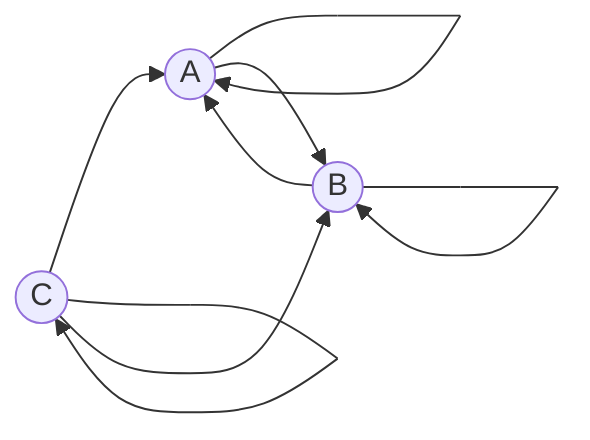

# Задача на взаимную рекурсию (маршруты в треугольнике)  
  
## Задание для вариантов 1 - 4  
В условиях задачи для каждого варианта указан граф с тремя вершинами. Для решения задачи требуется:   
1. Составить систему из 3 рекуррентных соотношений для предложенного графа.  
2. Методом исключения свести систему к одному рекуррентному соотношению.  
3. Составить и решить характеристическое уравнение.  
4. Вывести формулу общего решения.  
  
### Вариант 3:  

Допустимые маршруты:
- A --> A
- A --> B
- B --> A
- B --> B
- C --> A
- C --> C
- C --> B

Найти формулу расчета количества маршрутов, начинающихся в вершине C и заканчивающихся в вершине B. 

### 1 шаг. Составим систему из 3х рекуррентных соотношений 
$$ \begin{cases}  
а_n =a_{n-1}+b_{n-1} + c_{n-1}\\  
b_n = a_{n-1} + b_{n-1} + c_{n-1}\\  
c_n = c_{n-1}
\end{cases} $$ 
### 2 шаг. Приведение к одному рекуррентному соотношению.
Из системы видим, что $а_{n}$ = $b_{n}$, тогда: $$b_{n} = 2b_{n-1} + c_{n-1}$$, тогда:
$с_{n-1} = b_{n} - 2b_{n-1}\\
c_{n}= b_{n+1} - 2b_{n}\\
b_{n+1} - 2b_{n} = b_{n} - 2b_{n-1} \longrightarrow b_{n+1} = 3b_{n} - 2b_{n-1}\\
b_{n} = 3b_{n-1} - 2b_{n-2}$

### 3 шаг. Составляем характеристическое уравнение.
$\lambda^2-\lambda+2=0\\
D=9-8 = 1\\
\lambda_{1}=2, \lambda_{2}=1$
### 4 шаг. 
### Так как $\lambda_{1} \neq \lambda_{2}$, то подставляем их в рекуррентное соотношение:

$$
b_n =  C_1\cdot(2)^n+C_2\cdot(1)^n
$$
### Находим $b$ при $n$ равном 1 и 2:

$$
n=1 \longrightarrow b_1 = 1\\
$$

$$
n=2 \longrightarrow b_2 = 2\\
$$
### Составим систему:

$$ \begin{cases}
1=2 \cdot C_1+ C_2\\
2=4\cdot C_1+ C_2
\end{cases} $$

### Из системы получаем

$$
C_1=\frac12;  C_2= 0 
$$

### Подставим константы в формулу общего решения.

$$
b_n =  \frac12\cdot(2)^n
$$

### В итоге получили формулу для вычисления $b_n$,  формула расчета количества маршрутов, начинающихся в вершине C и заканчивающихся в вершине B

