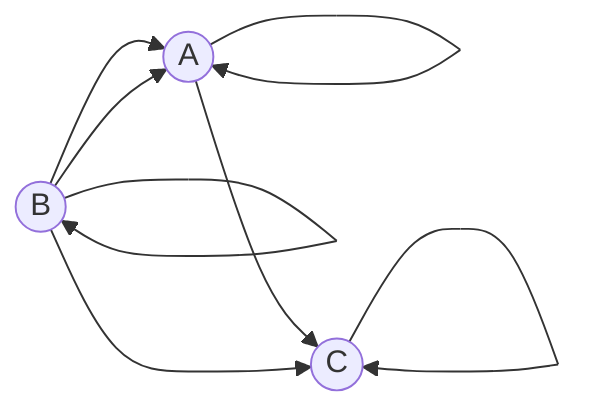

# Задача на взаимную рекурсию (маршруты в треугольнике)  
  
## Задание для вариантов 1 - 4  
В условиях задачи для каждого варианта указан граф с тремя вершинами. Для решения задачи требуется:   
1. Составить систему из 3 рекуррентных соотношений для предложенного графа.  
2. Методом исключения свести систему к одному рекуррентному соотношению.  
3. Составить и решить характеристическое уравнение.  
4. Вывести формулу общего решения.  
  
### Вариант 2:  
  

Допустимые маршруты:  
- A --> C  
- A --> A  
- B --> A  
- B --> C  
- B --> B  
- C --> C  
- B --> A  
  
Найти формулу расчета количества маршрутов, начинающихся в вершине A и заканчивающихся в вершине A.   
# I Шаг
### Составляем систему:
$$ \begin{cases}  
a_n =a_{n-1} + b_{n-1}\\  
b_n = b_{n-1} + a_{n-1}\\  
c_n = a_{n-1} + b_{n-1} + c_{n-1}  
\end{cases} $$

### Выражаем $b_{n-1}$ через второе уравнение:
$$
b_{n-1} = b_n - a_{n-1}
$$

### Подставляем $b_{n-1}$ в первое уравнение:
$$
a_n = a_{n-1} + b_n-a_{n-1} \\
a_n=b_n\rightarrow \bold {a_{n-1} = b_{n-1}}
$$

### Подставляем новое значение $b_{n-1}$ в первое уравнение:
$$
a_n = 2a_{n-1}
$$

# II Шаг

### Выражаем $a_{n-1}$ во втором уравнении:
$$
a_{n-1} = b_n - b_{n-1}
$$

### Подставляем вместо $a_n$ и $a_{n-1}$ в последнее уравнение первого шага и приводим к обычному виду:

$$
b_{n+1} - b_n = 2b_n - 2b_{n-1} \\
b_{n+1} - 3b_n + 2b_{n-1} = 0 \\
b_n - 3b_{n-1} + 2b_{n-2} = 0
$$

### Составляем характеристическое уравнение:
$$
\lambda^2 - 3\lambda + 2 = 0
$$

### Найдём корни уравнения:
$$
D = (-3)^2 - 4*1*2  = 9 -8 = 1^2
$$

$$
\lambda_1 = \frac{3+1}{2} = \frac{4}{2} = 2
$$

$$
\lambda_2 = \frac{3-1}{2} = \frac{2}{2} = 1
$$

### Сравниваем $\lambda_1$ и $\lambda_2$ и выбираем первую формулу:

$$
\lambda_1 \ne \lambda_2 \longrightarrow a_n = k_1*2^n + k_2*1^n\\
\lambda_1 = \lambda_2 \longrightarrow a_n = n*k_1*2^n + k_2*1^n\\
$$

# III Шаг

### Находим $a$ при $n$ равном 1 и 2:

$$
n=1 \longrightarrow a_1 = 1\\
n=2 \longrightarrow a_2 = 2\\
$$

### Составляем систему:

$$ \begin{cases}
1 =2k_1 + k_2\\  
2 = 4k_1 + k_2
\end{cases} $$

### Вычтем из второго элемента системы первый и найдём $k_1$:

$$
1 = 2k_1 \\
\bold {k_1 = 0,5}
$$

### Подставим $k_1$ в первый элемент системы и найдём $k_2$:

$$
1 = 2*0,5 +k_2 \\
\bold {k_2 = 0}
$$

# IV Шаг

### Находим общую формулу для $a_n$, подставив найденные переменные:

$$
a_n = 0,5*2^n + 0* 1^n
$$

### Упростим:

$$
a_n = 0,5*2^n 
$$