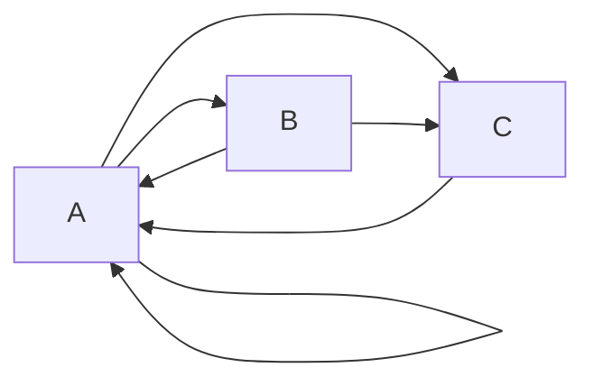

# Задача на взаимную рекурсию (маршруты в треугольнике)
### Вариант 6:
Необходимо:
1. Придумать граф с допустимыми маршрутами для рекуррентного соотношения третьего порядка.
2. Составить систему из 3 рекуррентных соотношений для предложенного графа.
3. Методом исключения свести систему к одному рекуррентному соотношению третьего порядка.

## 1. Граф:

**Маршруты:**
- A --> B
- A --> C
- A --> A
- B --> A
- B --> C
-C --> A
## 2. Система из 3х рекуррентных соотношений:
$$\begin{cases}
B_{n} = A_{n-1} \\
C_{n} = A_{n-1} + B_{n-1}\\
A_{n} = A_{n-1} + B_{n-1}+ C_{n-1} 
\end{cases}$$
## 3. Сводим к одному рекуррентному соотношению 3-го порядка:
**1) Система**
$$\begin{cases}
B_{n} = A_{n-1} \\
C_{n} = A_{n-1} + B_{n-1}\\
A_{n} = A_{n-1} + B_{n-1}+ C_{n-1} 
\end{cases}$$
**2) Выразим $$C_{n-1}$$**
$$C_{n-1} = A_{n-2} + B_{n-2}$$
**3) Заменим $$C_{n-1}$$ и получим:**
$$A_{n} = A_{n-1} + B_{n-1}+  A_{n-2} + B_{n-2}$$
**4) Выразим $$B_{n-1}$$ и $$B_{n-2}$$**
$$B_{n-1} = A_{n-2}$$
$$B_{n-2} = A_{n-3}$$
**5) Подставляем в соотношение и получаем:**
$$A_{n} = A_{n-1} + A_{n-2} +  A_{n-2} + A_{n-3}$$
## Ответ:
$$A_{n} = A_{n-1} + 2 * A_{n-2} + A_{n-3}$$
