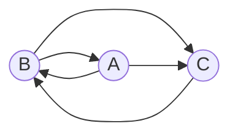

### Вариант 5:

Допустимые маршруты:
- B --> A
- B --> C
- A --> C
- A --> B
- C --> B

Необходимо:
1. Составить систему из 3 рекуррентных соотношений для предложенного графа.
2. Методом исключения свести систему к одному рекуррентному соотношению третьего порядка.

### Шаг 1:

*Составляем систему:*

Нам нужно найти предыдущие пути по которым мы можем прийти в соответствующую точку.

*В а можно попасть из b*

*В b можно попасть из с и из а*

*В c можно попасть из а и из b*

$$\begin{cases}
a_{n} = b_{n-1} \\ 
b_{n} = c_{n-1} + a_{n-1}\\
c_{n} = b_{n-1} + a_{n-1}  
\end{cases} $$
### Шаг 2:
*Пытаемся свести систему к одному рекуррентному соотношению третьего порядка:*\
Перебираем разные вырианты преобраования:\
$c_{n} = a_{n-1} + a_{n} $\
$b_{n} = b_{n-2} + c_{n-1} $\
$c_{n-1} = b{n} + b_{n-2} $\
$b_{n} = a{n-1} + b_{n-2} + b_{n}$\
$a_{n-1} = b{n-2}$\
$b_{n} = a{n-1} + a_{n-2} + a_{n-1}$\
$b_{n} = 2a{n-1} + a_{n-2}$\

